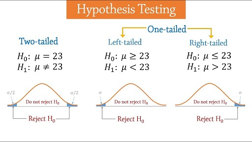

# 假設檢定

## 簡介

假設檢定是推論統計中用於檢驗統計假設的一種方法。目的是討論如何根據估計出的未知參數對未知參數作出適當的推論，未參數的分佈可為已知或未知。

 「統計假設」是可通過觀察一組隨機變數的模型進行檢驗的科學假說。 一旦能估計未知參數，就會希望根據結果對未知的真正參數值做出適當的推論。兩種常見的檢定方法：**實際檢定**與**大樣本檢定**。


統計上對參數的假設，就是對一個或多個參數的論述。
而其中欲檢驗其正確性的為**虛無假設（null hypothesis，H0）**，虛無假設通常由研究者決定，反應研究者對未知參數的看法。

* e.g. 我們想知道均數μ是否為 70 ，則虛無假設可以設為H0:μ=70
* e.g. 若我們想驗證標準差σ是否為 10，則虛無假設為H0:σ=10
* 以上例子中只包含一個特定假設值的假設，稱之為簡單假設 \(simple hypothesis\)。
* 注意假設檢定中，等號只會出現在虛無假設，而不應出現在對立假設。

相對於虛無假設的其他有關參數之論述是**對立假設（alternative hypothesis, H1或Ha）**，它通常反應了執行檢定的研究者對參數可能數值的另一種（對立的）看法（換句話說，對立假設通常才是研究者最想知道的）。

* e.g. 我們想知道均數μ是否為 70 ，則對立假設可以設為H1:μ≠70
* e.g. 若我們想驗證標準差σ是否為 10，則對立假設為H1:σ&gt;10
* 上面兩例中之假設包含一個以上的假設值，稱為複合假設\(composite hypothesis\)。

檢定\(test\)是指以適當的檢定統計量 \(test statistic\)，並根據特定的標準來判斷虛無假設的真偽。

* 一旦判定虛無假設為偽，則拒絕 \(reject\) 虛無假設；若判定虛無假設為真 \(或者並無證據顯示虛無假設為偽\)，則
* 接受\(accept\) 虛無假設\(或者說，不拒絕虛無假設\)。

當虛無假設「被推翻\(拒絕\)」時，「對立假設就會成立」。通常對立假設是我們真正想證實的論點。

## 大樣本檢定

當隨機樣本有未知分佈，或隨機樣本的分佈已知但並非常態分佈時，通常無法得知檢定統計量在虛無假設下的實際分配，所以只能去推導其極限分佈，並以極限分佈所得之臨界值作為實際分佈臨界值的替代品。

優點：不必受限於樣本的常態分佈性質。即使不知道隨機樣本的分佈，大樣本檢定的虛無分佈在極限上仍會非常接近實際分佈。

## 假設檢定流程

假設檢定大致有如下步驟：

1. 最初研究假設為真相不明。
   第一步是提出相關的虛無假設和對立假設。這是很重要的，因為錯誤陳述假設會導致後面的過程變得混亂。
2. 第二步是考慮檢驗中對樣本做出的統計假設；例如，關於獨立性的假設或關於觀測資料的分佈的形式的假設。這個步驟也同樣重要，因為無效的假設將意味著試驗的結果是無效的。
3. 決定哪個檢驗是合適的，並確定相關檢驗統計量 T。
4. 在虛無假設下推導檢驗統計量的分佈。在標準情況下應該會得出一個熟知的結果。比如檢驗統計量可能會符合學生t-分佈或常態分佈。
5. 選擇一個顯著性水準 \(α\)\(significance level\)，若統計量的機率低於這個機率閾值\(臨界值\)，就會拒絕虛無假設。最常用的是10%、5% 和 1%。顯著水準表示檢定者主觀認定統計量出現「極端數值」的機率。
6. 根據在虛無假設成立時的檢驗統計量T的分佈，找到數值最接近的對立假設，且機率為顯著性水平 \(α\)的區域，此區域稱為「拒絕域」，意思是在虛無假設成立的前提下，落在拒絕域的機率只有α。
7. 針對檢驗統計量T，根據樣本計算其估計值t。
8. 若估計值t未落在「拒絕域」，接受\(不拒絕\)虛無假設。若估計值t落在「拒絕域」，拒絕虛無假設，接受對立假設。

依據對立假設的條件，拒絕域可分為單尾\(左側或右側\)與雙尾。

