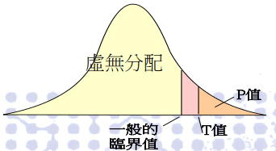

# 假設檢定

## 簡介

假設檢定是推論統計中用於檢驗統計假設的一種方法。目的是討論如何根據估計出的未知參數對未知參數作出適當的推論，未參數的分佈可為已知或未知。

「統計假設」是可通過觀察一組隨機變數的模型進行檢驗的科學假說。 一旦能估計未知參數，就會希望根據結果對未知的真正參數值做出適當的推論。兩種常見的檢定方法：**實際檢定**與**大樣本檢定**。

統計上對參數的假設，就是對一個或多個參數的論述。 而其中欲檢驗其正確性的為**虛無假設（null hypothesis，H0）**，虛無假設通常由研究者決定，反應研究者對未知參數的看法。

* e.g. 我們想知道均數μ是否為 70 ，則虛無假設可以設為H0:μ=70
* e.g. 若我們想驗證標準差σ是否為 10，則虛無假設為H0:σ=10
* 以上例子中只包含一個特定假設值的假設，稱之為簡單假設 (simple hypothesis)。
* 注意假設檢定中，等號只會出現在虛無假設，而不應出現在對立假設。

相對於虛無假設的其他有關參數之論述是**對立假設（alternative hypothesis, H1或Ha）**，它通常反應了執行檢定的研究者對參數可能數值的另一種（對立的）看法（換句話說，對立假設通常才是研究者最想知道的）。

* e.g. 我們想知道均數μ是否為 70 ，則對立假設可以設為H1:μ≠70
* e.g. 若我們想驗證標準差σ是否為 10，則對立假設為H1:σ>10
* 上面兩例中之假設包含一個以上的假設值，稱為複合假設(composite hypothesis)。

檢定(test)是指以適當的檢定統計量 (test statistic)，並根據特定的標準來判斷虛無假設的真偽。

* 一旦判定虛無假設為偽，則拒絕 (reject) 虛無假設；若判定虛無假設為真 (或者並無證據顯示虛無假設為偽)，則
* 接受(accept) 虛無假設(或者說，不拒絕虛無假設)。

當虛無假設「被推翻(拒絕)」時，「對立假設就會成立」。通常對立假設是我們真正想證實的論點。

## 大樣本檢定

當隨機樣本有未知分佈，或隨機樣本的分佈已知但並非常態分佈時，通常無法得知檢定統計量在虛無假設下的實際分配，所以只能去推導其極限分佈，並以極限分佈所得之臨界值作為實際分佈臨界值的替代品。

優點：不必受限於樣本的常態分佈性質。即使不知道隨機樣本的分佈，大樣本檢定的虛無分佈在極限上仍會非常接近實際分佈。

## 假設檢定流程

假設檢定大致有如下步驟：

1.  最初研究假設為真相不明。

    第一步是提出相關的虛無假設和對立假設。這是很重要的，因為錯誤陳述假設會導致後面的過程變得混亂。
2. 第二步是考慮檢驗中對樣本做出的統計假設；例如，關於獨立性的假設或關於觀測資料的分佈的形式的假設。這個步驟也同樣重要，因為無效的假設將意味著試驗的結果是無效的。
3. 決定哪個檢驗是合適的，並確定相關檢驗統計量 T。
4. 在虛無假設下推導檢驗統計量的分佈。在標準情況下應該會得出一個熟知的結果。比如檢驗統計量可能會符合學生t-分佈或常態分佈。
5. 選擇一個顯著性水準 (α)(significance level)，若統計量的機率低於這個機率閾值(臨界值)，就會拒絕虛無假設。最常用的是10%、5% 和 1%。顯著水準表示檢定者主觀認定統計量出現「極端數值」的機率。
6. 根據在虛無假設成立時的檢驗統計量T的分佈，找到數值最接近的對立假設，且機率為顯著性水平 (α)的區域，此區域稱為「拒絕域」，意思是在虛無假設成立的前提下，落在拒絕域的機率只有α。
7. 針對檢驗統計量T，根據樣本計算其估計值t。
8. 若估計值t未落在「拒絕域」，接受(不拒絕)虛無假設。若估計值t落在「拒絕域」，拒絕虛無假設，接受對立假設。

依據對立假設的條件，拒絕域可分為單尾(左側或右側)與雙尾。

## P-value

P值跟檢定假設的關係：

* P 值代表著是「機率」即根據虛無分配算出的統計量之機率。
* 也就是  虛無假設  為「真」時，從樣本資料來作檢定會得到的機率。
* 若P 值小於顯著水準，則統計量之值 T 的絕對值會大於臨界值的絕對值，即位於拒絕域，因此拒絕虛無假設。而 p值若大於顯著水準則接受虛無假設。

P值越小，則「反對」虛無假設的證據越充分。 傳統上，我們認為P值小於5%時，已足以推翻虛無假設(即只有不到5%的機率虛無假設會成立)。

雙尾機率的機率分佈圖，可看到P ＜0.05時，單尾的機率僅有 P/2 ＝ 0.025，我們可以說「在5%的水平之下，足以推翻虛無假設」。

而在P值大於5%時 ，一般認為，沒有足夠的證據推翻虛無假設，即 「在5%的水平之下，沒有充分的證據來推翻虛無假設」。 但這並不意味說「虛無假設為 真 」，只能說我們的證據(資料)不足以讓我們推翻虛無假設」。

5% 純粹是人為指定出來的條件，表示我們犯錯的機率（做出錯誤的判讀）。 該機率指的是，在「虛無假設」為真的狀況時，可能有 5% 的機會，我們「錯誤」地 推翻虛無假設。越小的P 值，意味著「錯誤」的機率越小。

## 決策法則

### 使用拒絕域(rejection region)

* 接受域： 接受H0  (不拒絕H0)&#x20;
* 拒絕域： 接受 Ha
* 臨界點(Critical Point)：接受域與拒絕域的點，稱為臨界點。
  * 臨界值的決定，是根據顯著水準α並利用機率分佈計算而得，分成單尾和雙尾檢定兩種。

#### 單尾檢定(One-tailed test)

* 對於調查之理論方向是十分清楚，我們是應採用要單尾檢定。
* 例如在語句當中有「是否高於？」、「是否低於？」、「是否優於？」、「是否劣於？」等等。
* 對於變數在群體間的變化方向是單方向的，我們應當採取單尾檢定。

#### 雙尾檢定(Two-tailed test)

* 對於理論變化的方向不很清楚，原則上則要採取雙尾檢定。
* 例如：對於男、女性別的不一樣，對於捐血的態度，兩者的看法有什麼區別？凡是在調查語句當中採取兩者（或兩者以上）「有何區別？」、「有何不同」、「有什麼不一樣時」，是採取雙尾檢定&#x20;
* 對於變數之間在群體的變化方向，可能是雙方向的，我們就應採取雙尾檢定。

### 使用P-value

P值是在假設虛無假設為真的前提下，觀察到檢定統計量比取樣得到的值更極端的機率。 P值越小，表示檢定的結果越顯著，越可以拒絕假設檢定中的虛無假設。

* P值越小，H0越不可能為真。(P值為在H0為真的前提下，能得到這批樣本的機率，因此P值越小，棄卻H0的理由越充分)。
* 「顯著水準」是我們在進行檢定時，願意容許第一型錯誤(type I  error)發生的機率上限(第一型錯誤：檢定結果拒絕了真實的H0)。
* P值的定義是：在已知(現有)的抽樣樣本下，能棄卻 H0(虛無假設)的最小顯著水準。
* 以現有的抽樣所進行的推論，可能犯第一型錯誤的機率。
* 或者(倒過來)說(前提)若 H0 為真，則檢定統計量出現的可能性。(若P值越小，表示抽樣樣本越(極端)不可能出現，因此推翻前提，棄卻H0)。

## 假設檢定犯錯機率
