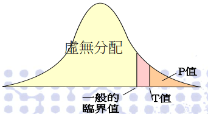
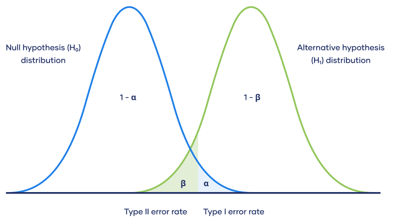

# 假設檢定

## 簡介

假設檢定是推論統計中用於檢驗統計假設的一種方法。<mark style="color:red;">目的是討論如何根據估計出的統計量對未知參數作出適當的推論，未參數的分佈可為已知或未知</mark>。

「統計假設」是可通過觀察一組隨機變數的模型進行檢驗的科學假說。 一旦能估計未知參數，就會希望根據結果對未知的真正參數值做出適當的推論。兩種常見的檢定方法：**實際檢定**與**大樣本檢定**。

統計上對參數的假設，就是對一個或多個參數的論述。 而其中欲檢驗其正確性的為<mark style="background-color:red;">**虛無假設（null hypothesis，H0）**</mark>，虛無假設通常由研究者決定，反應研究者對未知參數的看法。

* 例如我們想知道均數$$\mu$$是否為 70 ，則虛無假設可以設為$$H_0: \mu=70$$
* 例如若我們想驗證標準差$$\sigma$$是否為 10，則虛無假設為$$H_0:\sigma=10$$
* 以上例子中只包含一個特定假設值的假設，稱之為<mark style="color:red;">簡單假設 (simple hypothesis)</mark>。
* 注意假設檢定中，等號只會出現在虛無假設，而不應出現在對立假設。

相對於虛無假設的其他有關參數之論述是<mark style="background-color:red;">**對立假設（alternative hypothesis, H1或Ha）**</mark>，它通常反應了執行檢定的研究者對參數可能數值的另一種（對立的）看法（換句話說，<mark style="color:blue;">對立假設通常才是研究者最想知道的結果</mark>）。

* 例如我們想知道均數$$\mu$$是否為 70 ，則對立假設可以設為$$H_1: \mu \neq 70$$
* 例如若我們想驗證標準差$$\sigma$$是否為 10，則對立假設為$$H_1:\sigma>10$$
* 上面兩例中之假設包含一個以上的假設值，稱為<mark style="color:red;">複合假設(composite hypothesis)</mark>。

檢定(test)是指以適當的檢定統計量 (test statistic)，並根據特定的標準來判斷虛無假設的真偽。

一旦判定虛無假設為偽，則拒絕 (reject) 虛無假設；若判定虛無假設為真 (或者並無證據顯示虛無假設為偽)，則接受(accept) 虛無假設(或者說，不拒絕虛無假設)。

當虛無假設「被推翻(拒絕)」時，「對立假設就會成立」。通常對立假設是我們真正想證實的論點。

## 簡單假設與複合假設

令$$\mathbf{X}=(X_1, X_2, \dots, X_n)$$為由含參數$$\theta$$的母體所取出的隨機樣本。

<mark style="color:red;">若假設</mark>$$H$$<mark style="color:red;">可唯一確定母體的分佈時，稱為簡單假設(simple hypothesis)，否則稱為複合假設(composite hypothesis)</mark>。

例：$$\mathbf{X} \sim \exp(\lambda)$$ i.i.d.

若$$H_0: \lambda=2$$，則可得pdf $$f(y)=\frac{1}{2}e^{-y/2}, ~y>0$$為簡單假設。

而$$H_1: \lambda > 2$$無法唯一確定分佈，因此為複合假設。

例：$$\mathbf{X} \sim N(\mu, \sigma^2)$$ i.i.d.

若$$\sigma^2$$已知且$$H_0: \mu=1$$，則可得pdf $$f(y)=\frac{1}{\sqrt{2 \pi} \sigma}e^{-(y-1)^2/2\sigma^2}$$為簡單假設。

若$$\sigma^2$$壋日且$$H_0: \mu=1$$，則pdf無法唯一確定，因此$$H_0$$為複合假設。

## 大樣本檢定

當隨機樣本有未知分佈，或隨機樣本的分佈已知但並非常態分佈時，通常無法得知檢定統計量在虛無假設下的實際分配，所以只能去推導其極限分佈，並以極限分佈所得之臨界值作為實際分佈臨界值的替代品。

優點：不必受限於樣本的常態分佈性質。即使不知道隨機樣本的分佈，大樣本檢定的虛無分佈在極限上仍會非常接近實際分佈。

## 假設檢定流程

假設檢定大致有如下步驟：

1.  最初研究假設為真相不明。

    第一步是提出相關的虛無假設和對立假設。這是很重要的，因為錯誤陳述假設會導致後面的過程變得混亂。
2. 第二步是考慮檢驗中對樣本做出的統計假設；例如，關於獨立性的假設或關於觀測資料的分佈的形式的假設。這個步驟也同樣重要，因為無效的假設將意味著試驗的結果是無效的。
3. 決定哪個檢驗是合適的，並確定相關檢驗統計量$$T$$。
4. 在虛無假設下推導檢驗統計量的分佈。在標準情況下應該會得出一個熟知的結果。比如檢驗統計量可能會符合學生t-分佈或常態分佈。
5. 選擇一個顯著性水準 $$\alpha$$(significance level)，若統計量的機率低於這個機率閾值(臨界值)，就會拒絕虛無假設。最常用的是10%、5% 和 1%。顯著水準表示檢定者主觀認定統計量出現「極端數值」的機率。
6. 根據在虛無假設成立時的檢驗統計量T的分佈，找到數值最接近的對立假設，且機率為顯著性水平$$\alpha$$的區域，此區域稱為「拒絕域」，意思是在虛無假設成立的前提下，落在拒絕域的機率只有$$\alpha$$。
7. 針對檢驗統計量$$T$$，根據樣本計算其估計值$$t$$。
8. 若估計值$$t$$未落在「拒絕域」，接受(不拒絕)虛無假設。若估計值$$t$$落在「拒絕域」，拒絕虛無假設，接受對立假設。

依據對立假設的條件，拒絕域可分為單尾(左側或右側)與雙尾。

## P-value

P值跟檢定假設的關係：

* P 值代表著是「機率」即根據虛無分配算出的統計量之機率。
* 也就是 虛無假設 為「真」時，從樣本資料來作檢定會得到的機率。
* 若P 值小於顯著水準，則統計量之值 T 的絕對值會大於臨界值的絕對值，即位於拒絕域，因此拒絕虛無假設。而 p值若大於顯著水準則接受虛無假設。

P值越小，則「反對」虛無假設的證據越充分。 傳統上，我們認為P值小於5%時，已足以推翻虛無假設(即只有不到5%的機率虛無假設會成立)。

雙尾機率的機率分佈圖，可看到P ＜0.05時，單尾的機率僅有 P/2 ＝ 0.025，我們可以說「在5%的水平之下，足以推翻虛無假設」。

而在P值大於5%時 ，一般認為，沒有足夠的證據推翻虛無假設，即 「在5%的水平之下，沒有充分的證據來推翻虛無假設」。 但這並不意味說「虛無假設為 真 」，只能說我們的證據(資料)不足以讓我們推翻虛無假設」。

5% 純粹是人為指定出來的條件，表示我們犯錯的機率（做出錯誤的判讀）。 該機率指的是，在「虛無假設」為真的狀況時，可能有 5% 的機會，我們「錯誤」地 推翻虛無假設。越小的P 值，意味著「錯誤」的機率越小。

## 決策法則

### 使用拒絕域(rejection region)

* 接受域： 接受H0 (不拒絕H0)
* 拒絕域： 接受 Ha
* 臨界點(Critical Point)：接受域與拒絕域的點，稱為臨界點。
  * 臨界值的決定，是根據顯著水準α並利用機率分佈計算而得，分成單尾和雙尾檢定兩種。

#### 單尾檢定(One-tailed test)

* 對於調查之理論方向是十分清楚，我們是應採用要單尾檢定。
* 例如在語句當中有「是否高於？」、「是否低於？」、「是否優於？」、「是否劣於？」等等。
* 對於變數在群體間的變化方向是單方向的，我們應當採取單尾檢定。

#### 雙尾檢定(Two-tailed test)

* 對於理論變化的方向不很清楚，原則上則要採取雙尾檢定。
* 例如：對於男、女性別的不一樣，對於捐血的態度，兩者的看法有什麼區別？凡是在調查語句當中採取兩者（或兩者以上）「有何區別？」、「有何不同」、「有什麼不一樣時」，是採取雙尾檢定
* 對於變數之間在群體的變化方向，可能是雙方向的，我們就應採取雙尾檢定。

### 使用P-value

P值是在假設虛無假設為真的前提下，觀察到檢定統計量比取樣得到的值更極端的機率。 <mark style="color:red;">P值越小，表示檢定的結果越顯著，越可以拒絕假設檢定中的虛無假設</mark>。

* P值越小，H0越不可能為真。(P值為在H0為真的前提下，能得到這批樣本的機率，因此P值越小，棄卻H0的理由越充分)。
* 「顯著水準」是我們在進行檢定時，願意容許第一型錯誤(type I error)發生的機率上限(第一型錯誤：檢定結果拒絕了真實的H0)。
* P值的定義是：在已知(現有)的抽樣樣本下，能棄卻 H0(虛無假設)的最小顯著水準。
* 以現有的抽樣所進行的推論，可能犯第一型錯誤的機率。
* 或者(倒過來)說(前提)若 H0 為真，則檢定統計量出現的可能性。(若P值越小，表示抽樣樣本越(極端)不可能出現，因此推翻前提，棄卻H0)。

## 假設檢定犯錯機率

* 若虛無假說事實上為真，但統計檢定的結果拒絕虛無假說（接受對立假說），這種錯誤稱為型一錯誤（棄真錯誤、α錯誤、偽陽性）；即$$\mathrm{P}(\text{reject } H_0 ~|~ H_0 \text{ is true})=\alpha$$
* 若虛無假說事實上不成立，但統計檢定的結果不拒絕虛無假說，這種錯誤稱為型二錯誤（存偽錯誤、β錯誤、偽陰性）；即$$\mathrm{P}{\text{not reject } H_0 ~|~ H_0 \text{ is false}})=\beta$$

檢定時，我們希望犯第一類和第二類錯誤的機率都越小越好(給定固定樣本數$$n$$時)，但是犯第一類錯誤的機率和第二類錯誤的機率是不可能保證同時變小，通常是一個增大，一個減小。

在假設檢定中，我們一般事先規定了犯第一類錯誤的機率$$\leq \alpha$$，這就是<mark style="color:red;">顯著性水準(sigificant level)</mark>。在這個規定下，我們可以構造不同的拒絕域，它們都滿足犯第一類錯誤的機率$$\leq \alpha$$。但是它們犯第二類錯誤的機率怎樣可以達到最小呢？Neyman-Pearson定理就是告訴我們在所有滿足顯著性為$$\alpha$$的拒絕域中，什麼特徵的拒絕域犯第二類錯誤的機率最低。

| 檢定結果\虛無假設 | 虛無假設為真                      | 虛無假設為假                      |
| --------- | --------------------------- | --------------------------- |
| 拒絕虛無假設    | Type I錯誤（FP, 機率為$$\alpha$$) | TN，檢定力，機率為$$1-\beta$$       |
| 不拒絕虛無假設   | TP，機率為$$1-\alpha$$          | type II錯誤(FN, 機率為$$\beta$$) |

