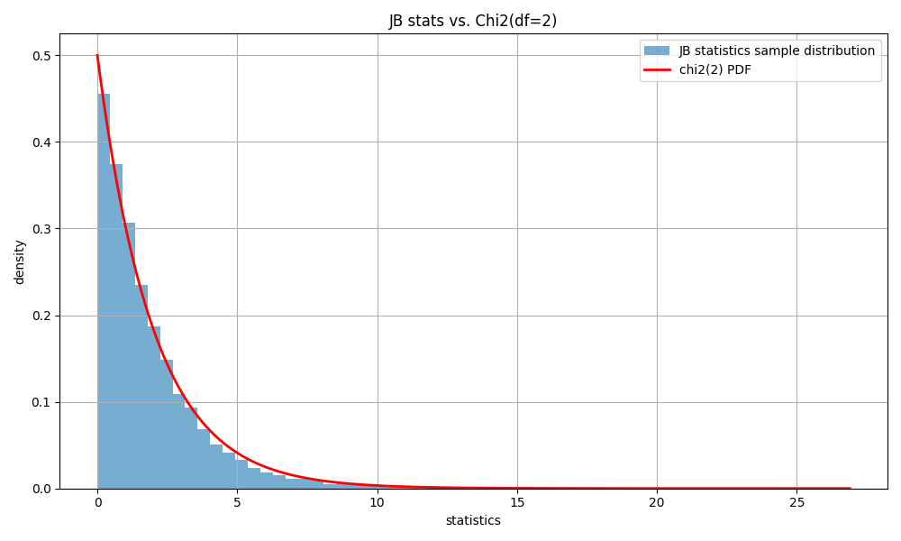

# Jarque-Bera檢定

## 簡介

根據資料的「偏態（Skewness）」與「峰度（Kurtosis）」檢定，於大樣本下適用，因為其檢定統計量依賴於漸近卡方分佈$$\chi^2(2)$$。常見於經濟與金融分析。

Jarque-Bera 檢定的核心思想是比較樣本資料的偏度和峰度與正態分佈的理論值：

* **偏度（Skewness）** ：衡量資料分佈的對稱性。正態分佈的偏度為 0。
* **峰度（Kurtosis）** ：衡量資料分佈的尾部厚度。正態分佈的峰度為 3（或調整後為 0）。

如果樣本資料的偏度和峰度顯著偏離這些理論值，則可以認為資料不服從正態分佈。

因為其檢定統計量依賴於漸近分佈，樣本大小越大，結果越準確。一般建議樣本大小 $$n>30$$。

python檢定：[scipy.stats.jarque\_bera](https://docs.scipy.org/doc/scipy/reference/generated/scipy.stats.jarque_bera.html)。

## Jarque-Bera檢定

令$$n$$個樣本的$$k$$階中央動差為$$\displaystyle m_k = \frac{1}{n} \sum_{i=1}^n (x_i - \overline{x})^k, ~k=2,3,4$$。

樣本偏度$$g_1 = \frac{m_3}{m_2^{3/2}}$$，常態分佈的偏度$$\gamma_1=0$$。

樣本(超)峰度$$g_2 = \frac{m_4}{m_2^2}$$ (有些定義為$$\gamma_2= \frac{m_4}{m_2^2}-3$$，以常態分佈的峰度$$\gamma_2=3$$做為基準值)。

JB檢定：令$$X$$則常態分佈, 則三階與四階樣本動差為：

* $$\mathrm{E}(g_1)=0$$
* $$\mathrm{Var}(g_1)=\frac{6(n-2)}{(n+1)(n+3)} \approx \frac{6}{n}$$
* $$\mathrm{E}(g_2)=\frac{3(n-1)}{(n+1)} \approx 3$$
* $$\mathrm{Var}(g_2) = \frac{24n(n-2)(n-3)}{(n+1)^2 (n+3)(n+5)} \approx \frac{24}{n}$$

### 虛無假設

* **虛無假設** $$H_0$$ ：資料服從正態分佈（即偏度為 0，峰度為 3）。
* **對立假設**$$H_1$$ ：資料不服從正態分佈（即偏度或峰度顯著偏離理論值）。

在大樣本情況下，Jarque-Bera 統計量 JB 近似服從自由度為 2 的卡方分佈。

虛無假設$$H_0$$將$$g_1, g_2$$標準化後平方的統計量$$JB$$為：$$\displaystyle JB =  \left( \frac{g_1}{\sqrt{6}{n}} \right)^2  +  \left( \frac{g_2 - 3}{\sqrt{24}{n}} \right)^2  = \frac{n g_1^2}{6} + \frac{n( g_2 - 3)^2}{24} \sim \chi^2(2)$$

偏態$$g_1$$和峰度$$g_2$$的估計值在大樣本下（$$n \to \infty$$），**會趨近於常態分佈**（這是由中心極限定理來的），而 JB 統計量就是把這兩個近似常態的統計量，合併成**平方和**。

* 標準化偏態的大樣本分佈：$$\sqrt{n} g_1 \sim N(0, 6)$$。
* 標準化超額峰態的大樣本分佈：$$\sqrt{n}(g_2 - 3) \sim N(0, 24)$$。
* 且$$g_1, g_2$$是漸近獨立（對常態分佈而言）。

JB 統計量是 **兩個標準常態隨機變數的平方和，**&#x6839;據卡方分佈的定義，若$$Z_1, Z_2 \sim N(0,1)$$且獨立，則$$Z_1^2 + Z_2^2 \sim \chi^2(2)$$。因此，JB 統計量漸近服從 自由度 2 的卡方分佈。

若$$H_0$$正確，在樣本數$$n$$夠大(建議$$n > 30$$)時，可得$$\gamma_1 \approx 0$$且$$\gamma_2 \approx 3$$。

JB統計量的定義表明，任何對此（偏度為0，峰度為3）的偏離都會使得JB統計量增加。

對於$$\gamma_1 \neq 0$$且$$\gamma_2 \neq 3$$的非常態分佈檢定力很高，但對於$$\gamma_1=0$$而$$\gamma_2 \neq 3$$的非常態分佈檢定力較弱。



<figure><figcaption><p>JB統計量分佈漸近於卡方分佈(自由度2)</p></figcaption></figure>



```python
import numpy as np
import matplotlib.pyplot as plt
from scipy.stats import skew, kurtosis, chi2

# 模擬參數
n_samples = 1000        # 每組樣本的大小（大樣本）
n_simulations = 10000   # 總共模擬幾次

jb_stats = []

for _ in range(n_simulations):
    # 從標準常態分布抽樣
    data = np.random.normal(loc=0, scale=1, size=n_samples)
    
    # 計算偏態與峰度
    #mu = data.mean()
    #m2 = ((data - mu) ** 2).mean()
    #m3 =  ((data - mu) ** 3).mean()
    #m4 =  ((data - mu) ** 4).mean()
    #S2 = m3 / (m2 ** 1.5)
    #K2 = m4 / (m2 * m2)
    
    S = skew(data) # 等於S2
    # 使用普通峰度（Kurtosis，不是 excess kurtosis）
    K = kurtosis(data, fisher=False)  # # 等於K2
    
    # 計算 Jarque-Bera 統計量
    jb = (n_samples / 6) * (S**2 + ((K - 3)**2) / 4)
    jb_stats.append(jb)

# 轉為 numpy array 以便作圖
jb_stats = np.array(jb_stats)

# 繪製結果
plt.figure(figsize=(10, 6))
plt.hist(jb_stats, bins=60, density=True, alpha=0.6, label='JB statistics sample distribution')
x = np.linspace(0, max(jb_stats), 500)
plt.plot(x, chi2.pdf(x, df=2), 'r-', lw=2, label='chi2(2) PDF')

# 圖表設定
plt.title("JB stats vs. Chi2(df=2)")
plt.xlabel("statistics")
plt.ylabel("density")
plt.legend()
plt.grid(True)
plt.tight_layout()
plt.show()

```



小樣本時的修正統計量$$CJB$$如下：

$$\displaystyle  \begin{aligned} CJB & = \left(  \frac{\gamma_1}{\sqrt{\frac{6(n-2)}{(n+1)(n+3)}}}   \right)^2 + \left(  \frac{\gamma_2 - \frac{3(n-1)}{n+1}}{\sqrt{\frac{24n(n-2)(n-3)}{(n+1)^2(n+3)(n+5)}}}  \frac{}{} \right)^2 \\ & = \frac{\gamma_1^2 (n+1)(n+3)}{6(n-2)} + \frac{(n+1)^2(n+3)(n+5)(\gamma_2 - \frac{3(n-1)}{n+1})^2}{24n(n-2)(n-3)} \sim \chi^2(2)  \end{aligned}$$


### 參考資料

* [\[wikipedia\] Jarque-Bera test](https://en.wikipedia.org/wiki/Jarque%E2%80%93Bera_test)
* [曾郁婷。”小樣本的常態性檢定之探討”，碩士論文，數理科學研究所，真理大學，2008](https://hdl.handle.net/11296/wqssvk)。
* [_Jarque, Carlos M._](https://en.wikipedia.org/wiki/Carlos_Jarque)_; Bera, Anil K. (1987). "A test for normality of observations and regression residuals". International Statistical Review. 55 (2): 163–172._ [_doi_](https://en.wikipedia.org/wiki/Doi_\(identifier\))_:_[_10.2307/1403192_](https://doi.org/10.2307%2F1403192)_._ [_JSTOR_](https://en.wikipedia.org/wiki/JSTOR_\(identifier\)) [_1403192_](https://www.jstor.org/stable/1403192)_._
