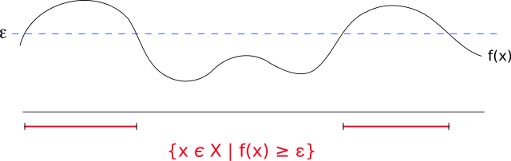

# 機率不等式

## Markov（馬可夫）不等式

> 隨機變數$$X$$為非負值，且$$t>0$$，則 $$P(X \geq t) \leq \frac{\operatorname{E}(X)}{t}$$
>
> Markov不等式給出了隨機變數的函數值大於等於某正數的機率的上界。

Markov不等式提供了$$f(x)$$超過某特定數值$$\epsilon$$ （圖中標示紅色線處）機率的上界，其上界包括了特定數值$$\epsilon$$ 及$$f$$的平均值。

例如不超過1/5的人口會有超過5倍於人均收入的收入。

$${\displaystyle {\begin{aligned}{ \textrm {E}}(X)&=\int _{-\infty }^{\infty }xdF(x)\\ &=\int _{0}^{\infty }x dF(x)\\ & = \int _{0}^{t }x dF(x)+ \int_t^{\infty} xdF(x) \\ &\geqslant \int _{t}^{\infty }xdF(x)\\  &\geqslant \int _{t}^{\infty }t dF(x)\\  &=t\int _{t}^{\infty } dF(x)\\ &=t{\textrm {P}}(X\geqslant t)\end{aligned}}}$$

## Chebyshev（柴比雪夫）不等式

> 隨機變數$$X$$的期望值$$\mu$$與變異數$$\sigma^2$$均為有限值（存在），$$k>0$$，則 $$P(|X - \mu| \geq k) \leq \frac{\sigma^2}{k^2}$$
>
> 或$$P(|X-\mu| \geq k\sigma^2) \leq \frac{1}{k^2}$$

> 對任何分布形狀的資料都適用，不等式顯示了隨機變數的「幾乎所有」值都會「接近」平均。
>
> 一般而言，柴比雪夫不等式給出的上界已無法改進。
>
> 當只求其中一邊的值的時候，有Cantelli不等式。

* 與平均相差2個標準差以上的值，數目不多於1/4
* 與平均相差3個標準差以上的值，數目不多於1/9
* 與平均相差4個標準差以上的值，數目不多於1/16
* 與平均相差$$k$$個標準差以上的值，數目不多於$$\frac{1}{k^2}$$

#### 使用Markov不等式得出

$$\because (X - \mu)^2 \geq 0$$，由Markov不等式得 $$P((X-\mu)^2 \geq k^2) \leq \frac{\textrm{E}(X-\mu)^2}{k^2} = \frac{\sigma^2}{k^2}$$--\(1\)

$$P((X-\mu)^2 \geq k^2) = P(|X-\mu| \geq k)$$--\(2\)

\(1\)\(2\)得 $$P(|X-\mu| \geq k) \leq \frac{\sigma^2}{k^2}$$\(QED\)

## Boole不等式

> $$P(\cup_{ i \in \mathbb{N}} E_i) \leq  \sum_{i \in \mathbb{N}} P(E_i)$$
>
> * 指對於全部事件的機率不大於單個事件的機率總和。
> * 在測度論中，不等式滿足$$\sigma$$次可加性。

使用數學歸納法可證明。

* 對於一個事件，$$P(E_1) \leq P(E_1)$$。
* 假設對$$n$$個事件不等式成立，即假設 $$P(\cup_{i=1}^n E_i) \leq \sum_{i=1}^n P(E_i)$$。
* 對於$$n+1$$個事件：
  * $$P(E \cup F) = P(E) + P(F) - P(E \cap F)$$
  * $$P(\cup_{i=1}^{n+1}E_i) = P(\cup_{i=1}^{n}E_i) + P(E_{n+1}) - P(\cup_{i=1}^{n}E_i \cap E_{n+1})$$
  * 因為機率大於等於0，所以 $$P(\cup_{i=1}^{n}E_i \cap E_{n+1}) \geq 0$$
  * 可得$$P(\cup_{i=1}^{n+1}E_i) \leq P(\cup_{i=1}^{n}E_i) + P(E_{n+1})$$
  * 再由歸納假設得 $$P(\cup_{i=1}^{n+1}E_i) \leq  \sum_{i=1}^n P(E_i) + P(E_{n+1}) =  \sum_{i=1}^{n+1} P(E_i)$$
  * \(QED\)

