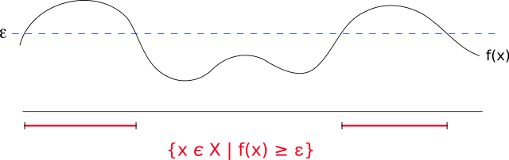

# 機率不等式

## Markov（馬可夫）不等式

> 隨機變數$$X$$為非負值，且$$t>0$$，則 $$P(X \geq t) \leq \frac{\operatorname{E}(X)}{t}$$
>
> Markov不等式給出了隨機變數的函數值大於等於某正數的機率的上界。

Markov不等式提供了$$f(x)$$超過某特定數值$$\epsilon$$ （圖中標示紅色線處）機率的上界，其上界包括了特定數值$$\epsilon$$ 及$$f$$的平均值。

例如不超過1/5的人口會有超過5倍於人均收入的收入。

$${\displaystyle {\begin{aligned}{ \textrm {E}}(X)&=\int _{-\infty }^{\infty }xdF(x)\\ &=\int _{0}^{\infty }x dF(x)\\ & = \int _{0}^{t }x dF(x)+ \int_t^{\infty} xdF(x) \\ &\geqslant \int _{t}^{\infty }xdF(x)\\  &\geqslant \int _{t}^{\infty }t dF(x)\\  &=t\int _{t}^{\infty } dF(x)\\ &=t{\textrm {P}}(X\geqslant t)\end{aligned}}}$$

## Chebyshev（柴比雪夫）不等式

> 隨機變數$$X$$的期望值$$\mu$$與變異數$$\sigma^2$$均為有限值（存在），$$k>0$$，則 $$P(|X - \mu| \geq k) \leq \frac{\sigma^2}{k^2}$$
>
> 或$$P(|X-\mu| \geq k\sigma^2) \leq \frac{1}{k^2}$$

> 對任何分布形狀的資料都適用，不等式顯示了隨機變數的「幾乎所有」值都會「接近」平均。
>
> 一般而言，柴比雪夫不等式給出的上界已無法改進。
>
> 當只求其中一邊的值的時候，有Cantelli不等式。

* 與平均相差2個標準差以上的值，數目不多於1/4
* 與平均相差3個標準差以上的值，數目不多於1/9
* 與平均相差4個標準差以上的值，數目不多於1/16
* 與平均相差$$k$$個標準差以上的值，數目不多於$$\frac{1}{k^2}$$

#### 使用Markov不等式得出

$$\because (X - \mu)^2 \geq 0$$，由Markov不等式得 $$P((X-\mu)^2 \geq k^2) \leq \frac{\textrm{E}(X-\mu)^2}{k^2} = \frac{\sigma^2}{k^2}$$--(1)

$$P((X-\mu)^2 \geq k^2) = P(|X-\mu| \geq k)$$--(2)

(1)(2)得 $$P(|X-\mu| \geq k) \leq \frac{\sigma^2}{k^2}$$(QED)

## Boole不等式（union bound）

> $$\displaystyle \mathrm{P}(\bigcup_{ i \in \mathbb{N}} E_i) \leq  \sum_{i \in \mathbb{N}} \mathrm{P}(E_i)$$
>
> * 指對於至少一事件發生的機率不大於單個事件發生的機率總和。
> * 在測度論中，不等式滿足$$\sigma$$次可加性。

#### 使用數學歸納法可證明。

* 對於一個事件，$$\mathrm{P}(E_1) \leq \mathrm{P}(E_1)$$。
* 假設對$$n$$個事件不等式成立，即假設 $$\mathrm{P}(\cup_{i=1}^n E_i) \leq \sum_{i=1}^n \mathrm{P}(E_i)$$。
*   對於$$n+1$$個事件：

    * $$\mathrm{P}(E \cup F) = \mathrm{P}(E) + \mathrm{P}(F) - \mathrm{P}(E \cap F)$$
    * $$\mathrm{P}(\cup_{i=1}^{n+1}E_i) = \mathrm{P}(\cup_{i=1}^{n}E_i) + \mathrm{P}(E_{n+1}) - \mathrm{P}(\cup_{i=1}^{n}E_i \cap E_{n+1})$$
    * 因為機率大於等於0，所以 $$\mathrm{P}(\cup_{i=1}^{n}E_i \cap E_{n+1}) \geq 0$$
    * 可得$$\mathrm{P}(\cup_{i=1}^{n+1}E_i) \leq \mathrm{P}(\cup_{i=1}^{n}E_i) + \mathrm{P}(E_{n+1})$$
    * 再由歸納假設得 $$\mathrm{P}(\cup_{i=1}^{n+1}E_i) \leq  \sum_{i=1}^n \mathrm{P}(E_i) + \mathrm{P}(E_{n+1}) =  \sum_{i=1}^{n+1} \mathrm{P}(E_i)$$
    * (QED)

#### 也可由Markov不等式證明

令$$X$$是各種事件$$E_{i}$$的發生次數的隨機變量（為非負值）。

可得 $$\textrm{E}(X) = \mathrm{P}(E_1)+\mathrm{P}(E_2)+\ldots +\mathrm{P}(E_n) = \sum_{i=1}^n \mathrm{P}(E_i)$$。

由Markov不等式取$$t=1$$得$$\mathrm{P}(X \geq 1) \leq \textrm{E}(X) = \sum_{i=1}^n \mathrm{P}(E_i)$$。

而$$\mathrm{P}(X \geq 1) = \mathrm{P}(\cup_{i=1}^n E_i)$$

所以$$\mathrm{P}(\cup_{i=1}^n E_i)= \sum_{i=1}^n \mathrm{P}(E_i)$$(QED)

## Bonferroni不等式

> * $$\mathrm{P}(E \cap F) \geq \mathrm{P}(E) + \mathrm{P}(F) -1$$
> * $$\mathrm{P}(E_1 \cap E_2 \cap \ldots \cap E_n) \geq \mathrm{P}(E_1) +\mathrm{P}(E_2) +\ldots + \mathrm{P}(E_n) - (n-1)$$

* $$\mathrm{P}((E \cap F)^c) = \mathrm{P}(E^c \cup F^c) \leq \mathrm{P}(E^c)+\mathrm{P}(F^c)$$
* $$\because \mathrm{P}((E \cap F)^c) = 1- \mathrm{P}(E\cap F)$$ and $$\mathrm{P}(E^c)=1-\mathrm{P}(E)$$, $$\mathrm{P}(F^c) = 1- \mathrm{P}(F)$$
* $$1-\mathrm{P}(E\cap F) \leq 1 - \mathrm{P}(E) + 1- \mathrm{P}(F)$$
* $$\therefore  \mathrm{P}(E \cap F) \leq \mathrm{P}(E) + \mathrm{P}(F) - 1$$ (QED)

## Hoeffding不等式

> 設有兩兩獨立的一系列隨機變量$$X_{1},\dots ,X_{n}$$。假設對所有的$$1\leq i\leq n$$}$$X_{i}$$都是幾乎有界的變量，即滿足$$\mathrm{P}(X_i \in [a_i, b_i])=1$$
>
> 那麼這$$n$$個隨機變量的經驗期望值：$${\overline {X}}={\frac {X_{1}+\cdots +X_{n}}{n}}$$滿足以下的不等式：
>
> * $${\displaystyle {\mathrm{P}} ({\overline {X}}-\mathrm {E} [{\overline {X}}]\geq t)\leq \exp \left(-{\frac {2t^{2}n^{2}}{\sum _{i=1}^{n}(b_{i}-a_{i})^{2}}}\right),\!}$$
> * $${\displaystyle {\mathrm{P}} (|{\overline {X}}-\mathrm {E} [{\overline {X}}]|\geq t)\leq 2\exp \left(-{\frac {2t^{2}n^{2}}{\sum _{i=1}^{n}(b_{i}-a_{i})^{2}}}\right),\!}$$
>
>

