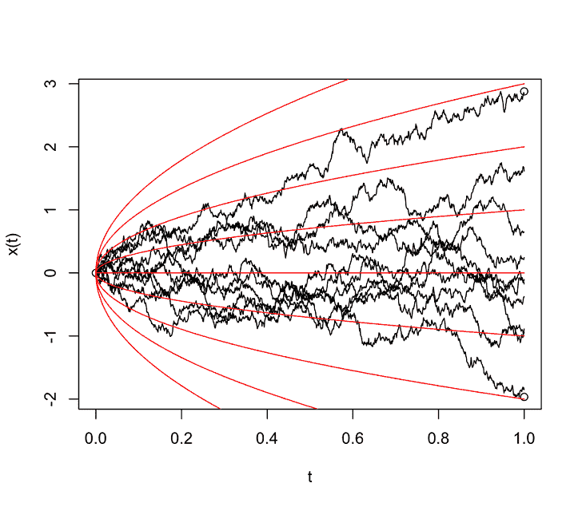

# 布朗運動(Brownian motion)

## 簡介

布朗運動是由Rober Brown(1828)首先觀察花粉分子存浮於液體內上下變動的一種物理過程。1990年時，Bachellier在他的博士論文中，將布朗運動運用在股價變動的模型。在1923年，由N.Wiener{維納）研究布朗運動的數學理論，嚴謹定義存在性，它是標度隨機漫步（scaled random walk）的極限隨機過程。因此布朗運動也稱為維納過程。Paul Samuelson（1970年諾貝爾經濟學獎得主）在1969年引入布朗運動研究財務經濟學的模型。

## Ｉ由隨機漫步到布朗運動

[股價的隨機漫步模型(binomial model)](brownian-motion.md#gu-jia-de-sui-ji-man-bu-mo-xing)

> 二項式股價隨機過程：$$\log S_t = \log S_0 + \sum_{i=1}^t \epsilon_t = \log S_0 + \mu t + \sigma W_t$$。
>
> 其中$$\epsilon_t = \log X_t = \begin{cases} \log u,& \text{ prob. p } \\ \log d,& \text{ prob. q = 1-p} \end{cases}$$為單期連續報酬率，$$1 \geq u < \infty, ~0<d < 1$$，$$X_t=\frac{S_t}{S_{t-1}}$$為相對價格。
>
> 則$$\mathrm{E}(\epsilon_t) = p \log u + q \log d \equiv \mu$$，$$\mathrm{Var}(\epsilon_t)= pq (\log u - log d)^2 \equiv \sigma^2$$。
>
> $$W_t = \sum_{i=1}^t Z_i$$，$$W_0=0$$，其中$$Z_t = \frac{\epsilon_t - \mu}{\sigma} \sim N(0,1)$$為獨立同標準常態分佈的變數。

#### <mark style="color:orange;">簡單隨機漫步模型</mark>

二項式分佈$$B(N,p)$$在試驗次數$$N$$足夠大，且機率$$p$$不變時，可近似常態分佈。

考慮時間步長為$$\Delta t$$，在每個時間點$$t = n \Delta t, ~ n \in \mathbb{N}$$的簡單隨機漫步$$S_t = S_{t-1}+\epsilon_t$$，初始條件$$S_0=0$$。

其中$$\epsilon_t$$為獨立同分佈的隨機變數，表示每一步的位移，假設：$$\epsilon_t =  \begin{cases} + \sqrt{\Delta t}, & \text{ prob. p=1/2} \\ - \sqrt{\Delta t}, & \text{ prob. q=1-p=1/2}  \end{cases}$$

則期望值$$\mathrm{E}(\epsilon_t)=0$$，變異數$$\mathrm{Var}(\epsilon)=\Delta x$$。

#### <mark style="color:red;">連續時間和空間的縮放</mark>

為了得到布朗運動，我們需要讓時間步長$$\Delta t \to 0$$，且空間步長$$\Delta x \to 0$$，並確保隨機漫步的行為在極限下收斂到連續過程。關鍵是選擇適當的縮放關係。

考慮時間區間$$[0,T]$$分為$$N$$步，則$$\Delta t = \frac{T}{N}$$。在時間$$t = n \Delta t$$時，隨機漫步的位置為$$S_t = \sum_{i=1}^t \epsilon_i$$。

<mark style="background-color:blue;">為了讓過程在極限下有意義，假設空間步長</mark>$$\Delta x$$<mark style="background-color:blue;">Δx和時間步長Δt 滿足某種關係</mark>。

布朗運動的特徵是其增量的變異數與時間成正比，因此我們要求：$$\mathrm{Var}(S_t)=n \cdot \mathrm{Var}(\epsilon_i)=n \Delta t$$。


<mark style="color:red;">布朗運動為獨立增量的高斯過程(Gaussian process)</mark>。

整理：

1. $$B_0=0$$
2. $$B_t-B_s \sim N(0, \sigma^2 (t-s))$$
3. $$\forall t>0, B_t \sim N(0, \sigma^2 t)$$
4. $$B(t)$$為時間的連續的函數。







```python
# https://scipy-cookbook.readthedocs.io/items/BrownianMotion.html
# 要注意給定的是標準差還是變異數
from scipy.stats import norm

# parameters
delta = 0.25    # standard deviation
dt = 0.1        # interval
n_step = 20

# initial condition
x = 0.0

for k in range(n_step):
    # https://docs.scipy.org/doc/scipy/reference/generated/scipy.stats.norm.html
    # scale為標準差
    x = x + norm.rvs(scale=delta**2*dt)
    print(x)
```



```python
"""
Standard Brownian Motion
W(t) = W(t-1) + sqrt(dt)*Z(t)
"""
import matplotlib.pyplot as plt
import numpy as np
import pandas as pd
import seaborn as sns

# Seed the random number generator
rng = np.random.default_rng(42)

# Determine the number of paths and points per path
points = 1000    #n步數
paths = 50       # 路徑數量

# Create the initial set of random normal draws
mu, sigma = 0.0, 1.0    #標準常態
Z = rng.normal(mu, sigma, (paths, points))

# Define the time step size and t-axis
interval = [0.0, 1.0]
dt = (interval[1] - interval[0]) / (points - 1)
t_axis = np.linspace(interval[0], interval[1], points)

# Use Equation 3.2 from [Glasserman, 2003] to sample 50 standard brownian motion paths
W = np.zeros((paths, points))    # 存儲路徑值

for idx in range(points - 1):
    # 以step進行迴圈，每一步均模擬所有路徑之值
    real_idx = idx + 1
    W[:, real_idx] = W[:, real_idx - 1] + np.sqrt(dt) * Z[:, idx]

# Plot these paths
fig, ax = plt.subplots(1, 1, figsize=(12, 8))
for path in range(paths):
    ax.plot(t_axis, W[path, :])
ax.set_title("Standard Brownian Motion sample paths")
ax.set_xlabel("Time")
ax.set_ylabel("Asset Value")
plt.show()

# Obtain the set of final path values
final_values = pd.DataFrame({'final_values': W[:, -1]})

# Estimate and plot the distribution of these final values with Seaborn
fig, ax = plt.subplots(1, 1, figsize=(12, 8))
sns.kdeplot(data=final_values, x='final_values', fill=True, ax=ax)
ax.set_title("Kernel Density Estimate of asset path final value distribution")
ax.set_ylim(0.0, 0.325)
ax.set_xlabel('Final Values of Asset Paths')
plt.show()

# Output the mean and stdev of these final values
print(final_values.mean(), final_values.std())

# Create a non-zero mean and non-unit standard deviation
mu_c, sigma_c = 5.0, 2.0

# Use Equation 3.3 from [Glasserman, 2003] to sample 50 brownian motion paths
X = np.zeros((paths, points))
for idx in range(points - 1):
    real_idx = idx + 1
    X[:, real_idx] = X[:, real_idx - 1] + mu_c * dt + sigma_c * np.sqrt(dt) * Z[:, idx]

# Plot these paths
fig, ax = plt.subplots(1, 1, figsize=(12, 8))
for path in range(paths):
    ax.plot(t_axis, X[path, :])
ax.set_title("Constant mean and standard deviation Brownian Motion sample paths")
ax.set_xlabel("Time")
ax.set_ylabel("Asset Value")
plt.show()
```



## 布朗運動

> 一個連續的隨機過程$$\{ B_t, 0 \leq t <\infty \}$$，在時間$$[0,\infty)$$稱為標準布朗運動（standard Brownian motion）必須滿足以下四個條件：
>
> 1. $$B_0=0$$，在起始點$$t=0$$時，其值為0。
> 2. \[獨立增量]，即在不相交的區間之下，其相互的增量是獨立的。
>    * 令$$0 \leq t_1  <t_2 <\ldots< t_n =T$$，增量為隨機變數$$B_{t_1}-B_{t_0}, B_{t_2}-B_{t_1}, \ldots, B_{t_n}-B_{t_{n-1}}$$是獨立的（可得相關係數為0）。
>    *
>
>        獨立增量指每一步的變化量彼此獨立，因此上一步與下一步無關，即$$\mathrm{P}(B_{t_i} -B_{t_{i-1}} |B_{t_{1}} - B_{t_{0}} , \ldots, B_{t_{i-1}} - B_{t_{i-2}}) = \mathrm{P}(B_{t_i} -B_{t_{i-1}})$$
> 3. \[平穩性]每一個隨機變數都是常態分佈，$$B_{t_i} - B_{t_{i-h}} \sim N(0, \sigma^2h)$$。當$$\sigma^2=1$$時，稱為標準布朗運動。
> 4. $$B_t$$是時間的幾乎確定連續函數，或者說$$B_t$$的樣本路徑幾乎確定連續。

第2點可弱化為獨立於區間$$[i, i+h)$$起始點$$i$$的布朗運動，$$B_{t_{i+h }} - B{t_i} \sim N(0, \sigma^2h)$$ 。

* 布朗運動為連續的函數，但處處（每一點）均不可微分。
* 由定義得在時間$$t$$，$$B_t - B_0 \sim N(0, \sigma^2t)$$，因此$$B_t \sim N(0,t)$$。
* <mark style="color:red;">可將一般布朗運動轉成標準布朗運動，</mark>$$W_t = \frac{B_t}{\sigma}$$。




## 布朗運動性質

> $$\{B_t \sim N(0, \sigma^2t), t \geq 0\}$$為布朗運動，$$0 < s < t$$，$$a,b, \in \mathbb{R}$$, 則：
>
> * $$\mathrm{Cov}(B_s, B_t)=\sigma^2 s$$。
> * $$\mathrm{Var}(B_t - B_s)=\sigma^2(t-s)$$。
> * $$\mathrm{Var}(aB_s + bB_t)=\sigma^2(a^2s+b^2t+2abs)$$。
> * $$\mathrm{Corr}(B_s, B_t)  =  \frac{\mathrm{Cov}(B_s, B_t)}{\sqrt{\mathrm{Var}(B_s)\mathrm{Var}(B_t)}}  = \frac{\sigma^2 s}{\sqrt{\sigma^2 s \sigma^2 t}}  =  \sqrt{\frac{s}{t}}$$

<details>

<summary>proof: 共變異數</summary>

$$\displaystyle  \begin{aligned} \mathrm{Cov}(B_s, B_t)  & = \mathrm{Cov}(B_s, B_s+ B_t - B_s) \\  & = \mathrm{Cov}(B_s, B_s) + \mathrm{Cov}(B_s, B_t - B_s) \\  & = \mathrm{Cov}(B_s, B_s) + 0 [\because \text{ 獨立增量 }]\\ & = \mathrm{Var}(B_s) \\   & = \sigma^2s   \end{aligned}$$

(QED)

</details>

<details>

<summary>proof: 變異數</summary>

$$\displaystyle  \begin{aligned} \mathrm{Var}(B_t - B_s)   & = \mathrm{Var}(B_t) + \mathrm{Var}(B_s) - 2 \mathrm{Cov}(B_t, B_s) \\ & = \sigma^2(t + s - 2s) \\ & = \sigma^2(t- s)  \end{aligned}$$

(QED)

$$\displaystyle  \begin{aligned} \mathrm{Var}(aB_s + bB_t)   & = a^2 \mathrm{Var}(B_s) + b^2 \mathrm{Var}(B_t) + 2ab \mathrm{Cov}(B_t, B_s) \\ & = \sigma^2(a^2 s + b^2 t + 2ab s)  \end{aligned}$$

(QED)

</details>


### 布朗運動的定數轉換

> \[scaling property] $$a>0$$, $$a\cdot W(\frac{t}{a^2})$$是布朗運動。

* $$\because \mathrm{E}(a W(\frac{t}{a^2})) = a\mathrm{E}(W(\frac{t}{a^2})) = a \mathrm{E}(W(\frac{t}{a^2}) - W(0))=0, ~W(0)=0$$
* $$\mathrm{Var} (aW(\frac{t}{a^2}))=a^2 \mathrm{Var}(W(\frac{t}{a^2}) - W_0)= a^2 \frac{t}{a^2} = t$$
* 因此$$aW(\frac{t}{a^2}) \sim N(0, t)$$，且其它三個條件均符合布朗運動，因此為布朗運動。(QED)

> \[time inversion] $$t\cdot W(\frac{1}{t})$$是布朗運動。

* $$\mathrm{E}(tW(\frac{1}{t})) = t \mathrm{E}(W(\frac{1}{t})- W(0)) = 0$$
* $$\mathrm{Var} (t W (\frac{1}{t})) = t^2 \mathrm{Var} (W(\frac{1}{t}) - W(0))= t^2 \frac{1}{t}= t$$
* 因此$$tW(\frac{1}{t}) \sim N(0, t)$$，且其它三個條件均符合布朗運動，因此為布朗運動。(QED)

> \[time homogeneity] $$W(t+h) - W(t), ~ t \geq 0$$是布朗運動。

## 股價的隨機漫步模型


## 參考資料

* [https://zhuanlan.zhihu.com/p/260675093](https://zhuanlan.zhihu.com/p/260675093)
* [https://www.zhihu.com/column/c\_1355638234190479360](https://www.zhihu.com/column/c_1355638234190479360)
* [https://zhuanlan.zhihu.com/p/383030923](https://zhuanlan.zhihu.com/p/383030923)
* [https://songhuiming.github.io/pages/2017/06/03/mai-ru-gu-piao-shi-mai-ru-jie-zhi-shao-she-wei-duo-shao-cai-neng-bao-zheng-you-jiu-cheng-de-ba-wo-zai-dang-tian-cheng-jiao/](https://songhuiming.github.io/pages/2017/06/03/mai-ru-gu-piao-shi-mai-ru-jie-zhi-shao-she-wei-duo-shao-cai-neng-bao-zheng-you-jiu-cheng-de-ba-wo-zai-dang-tian-cheng-jiao/)

