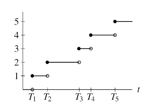

# 計數過程(counting process)

## 計數過程

泊松分佈（Poisson distribution）$$P(\lambda)$$是單位時間內隨機事件發生的次數（頻率）的離散機率分佈，是單位時間內事件發生的平均次數。

令隨機變數$$N(t)$$為時間$$0 \sim t$$ (包含時間$$t$$)時，已經發生的事件總數，則隨機過程$$\{N(t),t≥0\}$$稱為計數過程 (counting process)，其必須滿足以下條件：

* $$N(t) \in \mathbb{N}$$，已發生的事件總數為自然數。
* $$s \leq t$$，$$N(s) \leq N(t)$$，非遞減數列。
* $$s < t, N(t) - N(s)$$為發生在區間$$(s,t]$$的事件總數。

* 階梯狀的計數，表示次數逐漸增加(每計數一次就  +1 )。
* 時間$$t_i$$是隨機的，也就是計數過程隨機的部分是在於我們不知道某事件到底會在什麼時候發生。
* 計數過程是右連續 (簡單說就是上圖對任l意計數的右方逼近可以得到實黑點；在時間$$t_2$$ 計數為 2而不是1 )。
* 例如$$N(t_3 )−N(t_1 )=2為$$時間$$(t_1,t_3]$$內事件發生2次。

* 如果發生在不相交區間的事件數為獨立時，則稱計數過程有**獨立增量(independent increment)**。
  * 例如$$N(t)$$為發生在時間$$t$$之前的總事件數，其獨立於時間$$t$$至$$t+s$$的$$N(t+s)−N(t)$$發生事件數。
* **因此如果任意時間區內內發生的事件數分佈只與時間區度的長度有關時（同樣長度區間的機率分佈均相同），稱計數過程有平穩增量(stationary increment)**。
  *   例如若為平穩增量時，則$$(t_1+s,t_2+s]$$ 應與$$(t_1,t_2]$$內的發生事件數有相同分佈。

