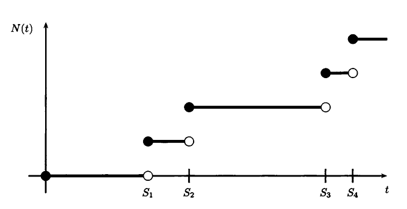

# 卜瓦松過程\(Poisson process\)

若一個計數過程$$\{N_t, t \geq 0\}$$  滿足以下三個條件時，稱為卜瓦松過程：

* $$N(0)=0$$，初始常數為0。
* $$s <t$$，計數增量（increment）$$N(t) - N(s)  \sim P(\lambda (t-s))$$為參數是$$\lambda(t-s)$$的卜瓦松隨機變數。
  * $$\mathrm{P}(N(t) - N(s) =k)= \frac{(\lambda(t-s))^ke^{-\lambda (t-s)}}{k!}, ~ k=0,1,2,\ldots$$
  * $$\mathrm{E}(N(t)  - N(s))=\lambda (t-s)$$
  * $$\mathrm{Var}(N(t) -N(s))=\lambda(t-s)$$
* 考慮不相交\(disjoint\)的時間區間$$(t_1,t_2 ], (t_2,t_3 ],\ldots ,(t_n,t_{n+1}]$$，則不相交區間的增量$$N({t_2})−N(t_1), N(t_3)-N(t_2),\ldots, N(t_{n+1}) - N(t_n)$$ 全為獨立，稱卜瓦松過程具有獨立增量。

> $$E(N(t)−N(s) )=\lambda(t−s)$$

*  \[Taylor series\] $$\displaystyle e^x = \sum_{k=0}^\infty \frac{x^k}{k!}=1+x+\frac{x^2}{2!}+\ldots = \sum_{k=1}^\infty \frac{x^{k-1}}{(k-1)!}$$
* $$\begin{aligned} \displaystyle \mathrm{E}(N(t)-N(s)) & =\sum_{k=0}^{\infty} k\cdot\mathrm{P}((N(t)-N(s))=k) \\ & = \sum_{k=0}^{\infty} k \frac{(\lambda(t-s))^ke^{-\lambda(t-s) }}{k!} \\ & =\lambda (t-s)e^{-\lambda (t-s)} \sum_{k=1}^\infty  \frac{\lambda ^{k-1}(t-1)^{k-1}}{(k-1)!} \\ & =\lambda (t-s)e^{-\lambda(t-s)}e^{\lambda(t-s)}\\ &= \lambda(t-s) \end{aligned}$$
*  \(QED\)

