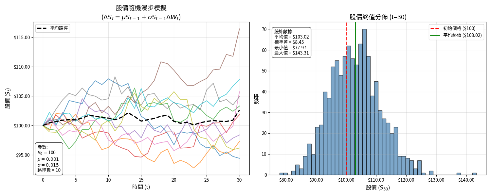

# 隨機漫步(random walk)

## 單一變數對稱隨機漫步

> $$X_0=0$$，$$X_t=\epsilon_1+\dots+\epsilon_t$$或者$$X_t=X_{t-1}+\epsilon_t$$
>
> 其中$$\mathrm{P}(\epsilon_t=1)=\mathrm{P}(\epsilon_t=-1)=\frac{1}{2}$$
>
> 且$$\epsilon_1, \dots, \epsilon_t$$獨立同分佈(i.i.d)。
>
> 滿足此條件的隨機過程$$X_t$$稱為單一變數對稱隨機漫步。

* $$\mathrm{E}(\epsilon_t)=0$$
* $$\mathrm{E}(\epsilon_t^2)=1$$
* $$\mathrm{Var}(\epsilon_t)=\mathrm{E}(\epsilon_t^2) - \mathrm{E}^2(\epsilon_t)=1$$

### 單一變數對稱隨機漫步的性質

1. $$\mathrm{E}(X_t)=0$$
2. $$\mathrm{Var}(X_t)=t$$
3. 若$$s <t$$，則$$X_s$$與$$X_t-X_s$$獨立。即$$\mathrm{P}(X_s, X_{t}-X_s)=\mathrm{P}(X_s) \mathrm{P}(X_{t}-X_s)$$
4. $$\displaystyle \mathrm{P}(X_t=k) = \begin{cases}  & \binom{t}{\frac{t+k}{2}} \left(\frac{1}{2}\right)^t ~&~ t+k \text{ is even and } -t \leq k \leq t \\ & 0   ~&~ t+k \text{ is odd or } |k| > t      \end{cases}$$\
   可視為丟$$t$$次公正銅板，出現$$u$$次正面，$$d$$次反面且$$u+d=t$$，$$u-d=k$$。


<details>

<summary>proof 期望值</summary>

$$\displaystyle  \begin{aligned} \mathrm{E}(X_t) & =\mathrm{E}(\epsilon_1 + \dots + \epsilon_t) \\     & = \mathrm{E}(\epsilon_1) + \dots + \mathrm{E}(\epsilon_t) \\     & = 0 + \dots 0 = 0   \end{aligned}$$

(QED)

</details>

<details>

<summary>proof: 變異數</summary>

$$\displaystyle  \begin{aligned} \mathrm{Var}(X_t) & =\mathrm{Var}(\epsilon_1 + \dots + \epsilon_t) \\     & = \mathrm{Var}(\epsilon_1) + \dots + \mathrm{Var}(\epsilon_t) ~ \because \epsilon_t \text{ independent }\\     & = 1 + \dots + 1 \\     & = t \end{aligned}$$

(QED)

</details>

<details>

<summary>proof: 增量獨立</summary>

$$X_s = \epsilon_1 + \dots +\epsilon_s$$

$$X_t - X_s = \epsilon_{s+1} + \dots +\epsilon_t$$

因為$$Y_i, Y_j, i \neq j$$獨立，所以$$X_s, ~X_t - X_s$$獨立。(QED)

</details>

## 單一變數非對稱隨機漫步

> $$X_0=0$$，$$X_t=\epsilon_1+\dots+\epsilon_t$$或者$$X_t=X_{t-1}+\epsilon_t$$
>
> 其中$$\mathrm{P}(\epsilon_t=1)=p, ~\mathrm{P}(\epsilon_t=-1)=1-p=q$$
>
> 且$$\epsilon_1, \dots, \epsilon_t$$獨立同分佈。
>
> 滿足此條件的隨機過程$$X_t$$稱為單一變數非對稱隨機漫步。

### 性質

* $$\mathrm{E}(\epsilon_t)=p-q$$。&#x20;
* $$\mathrm{E}(\epsilon^2)=p+q$$。
* $$\mathrm{Var}(\epsilon_t)=\mathrm{E}(\epsilon_t^2)-\mathrm{E}^2(\epsilon_t)=(p+q)-(p-q)^2=1-(p-q)^2$$
* $$\displaystyle \mathrm{E}(X_t)=\mathrm{E}(\epsilon_1+ \dots + \epsilon_t)=\sum_{i=1}^t \mathrm{E}(\epsilon_i)=t(p-q)$$。
* $$\displaystyle \mathrm{Var}(X_t)=\mathrm{Var}(\epsilon_1+ \dots + \epsilon_t)=\sum_{i=1}^t \mathrm{Var}(\epsilon_i) = t (1-(p-q)^2)$$
* \[增量獨立性]$$s < t$$，可得$$\mathrm{P}(X_s, X_{t-s})=\mathrm{P}(X_s)\mathrm{P}(X_{t-s})$$。

## 對稱隨機漫步為平賭過程

> $$X_t=X_{t-1}+\epsilon_t$$，
>
> $$\mathrm{P}(\epsilon_t=1)=, ~\mathrm{P}(\epsilon_t=-1)=1/2$$且$$\epsilon_1, \dots, \epsilon_t$$獨立同分佈。
>
> 則$$\displaystyle \mathrm{E}(X_{t+1} ~|~ \sigma(X_1, X_2, \dots, X_t)) = \mathrm{E}(X_{t+1} ~|~ X_1, X_2, \dots, X_t) = X_t$$

<details>

<summary>proof: 使用一般化的條件期望值定義</summary>

$$\displaystyle  \begin{aligned} \mathrm{E}(X_{t+1} ~|~ X_1, X_2, \dots, X_t)  &=  \mathrm{E}(X_t+ \epsilon_{t+1} ~|~ X_1, X_2, \dots, X_t) \\ & = \mathrm{E}(X_t~|~ X_1, X_2, \dots, X_t) + \mathrm{E}(\epsilon_{t+1} ~|~ X_1, X_2, \dots, X_t) \\ & = X_t + \mathrm{E}(\epsilon_{t+1}) \\ & = X_t + 0 \\ & = X_t   \end{aligned}$$

(QED)

</details>

### 平賭過程的期望值為常數

令集合$$I_t \equiv \{X_1, \dots, X_t\}$$，因為$$\mathrm{E}(X_{t+1}~|~ I_t)=X_t$$，由重覆期望值定理可得：$$\mathrm{E}(\mathrm{E}(X_{t+1}~|~I_t))=\mathrm{E}(X_{t+1}) = \mathrm{E}(X_t)$$。

依此遞迴下去可得$$\mathrm{E}(X_{t}) = \mathrm{E}(X_{t+1})=\dots = \mathrm{E}(X_{t+h}), ~ \forall t, h$$

移項可得$$\mathrm{E}(X_{t+h} -X_t)=0, h=1,2,\dots,$$

## 股價的隨機漫步模型(binomial model)

> $$\Delta S_t = \mu S_{t-1} + \sigma S_{t-1} \Delta W_t$$ <mark style="color:red;">為Black-Scholes股價模型的離散型式。</mark>
>
> $$W_t\sim \text{i.i.d}(0,1)$$為獨立同分佈，平均值為0，變異數為1的隨機變數(白噪音)。
>
> $$\mu, \sigma^2$$分別為股價漲跌比例的期望值與變異數。
>
> 連續型式為$$d S_t = \mu S_t dt + \sigma S_t dW_t$$。

令初始時的股價為$$S_0$$，時間$$t$$的股價為$$S_t$$，在時間$$t+1$$時股價上漲為$$uS_t, ~ u \geq 1$$ 的機率為$$p$$，下跌為$$dSt, 0 < d <1$$的機率為$$q=1-p$$。

> <mark style="color:blue;">假設每一期股價上漲與下跌的機率不變</mark>。

在時間$$t=1$$的股價為：$$\displaystyle S_0 \Rightarrow \begin{cases} \mathrm{P}(S_1=uS_0)=p \\ \mathrm{P}(S_1=dS_0)=1-p\equiv q \\ \end{cases}$$

定義Bernoulli隨機變數$$X_t = \begin{cases} u, & \text{ with prob. } p \\ d, & \text{ with prob } q \end{cases}$$，$$t=1,2,\dots$$$$u>1, d <1$$稱為<mark style="color:red;">相對價格數(price relative)</mark>。

因此時間$$t=1$$時股價可改寫為$$S_1=S_0X_1$$，且機率為$$\mathrm{P}(S_1=S_0u^rd^{1-r})=p^r q^{1-r}, ~r=0,1$$。

同理在$$t=2$$時，股價變動如下情境樹：

$$\displaystyle S_0 \Rightarrow \begin{cases} uS_0 \Rightarrow \begin{cases} u^2 S_0, \text{ with prob. } p^2 \\ ud S_0, \text{ with prob. } pq \\ \end{cases} \\ dS_0 \Rightarrow \begin{cases} ud S_0, \text{ with prob. } pq \\ d^2 S_0,\text{ with prob. } q^2  \\ \end{cases}  \\ \end{cases}$$

股價$$S_2=S_1X_2=S_0 X_1 X_2$$，且機率為$$\mathrm{P}(S_2=S_0u^rd^{2-r})=\binom{2}{r}p^r q^{2-r}, ~r=0,1,2$$。

<mark style="color:red;">以此類推可得股價在時間</mark>$$t$$<mark style="color:red;">價格與機率的通式</mark>：

$$\displaystyle S_t = S_0 \prod_{i=1}^n X_i$$，$$\mathrm{P}(S_t=S_0 u^r d^{t-r})=\binom{t}{r}p^r q^{t-r}, ~r=0,1,2,\dots, t$$。--(1)

#### <mark style="color:red;">將隨機變數</mark>$$\log X_t$$<mark style="color:red;">視為連續複利</mark>。

因為$$S_t=S_{t-1}X_t$$ 且$$S_t, S_{t-1} > 0$$，移項可得相對價格$$X_t=\frac{S_t}{S_{t-1}}$$，兩邊取對數得$$\log{X_t}=\log{S_t} - \log{S_{t-1}}$$得$$X_t$$為當期(連續)報酬率。

令連續報酬 $$\epsilon_t \equiv \log X_t=\begin{cases} \log u, \text{ with prob. } p \\ \log d, \text{ with prob. } q \end{cases}$$

則(1)可改寫為$$\displaystyle \log S_t = \log S_0 + \sum_{i=1}^t \epsilon_i$$ 或$$\log S_t = \log S_{t-1} + \epsilon_t$$。--(2)

由連續報酬$$\epsilon_t$$定義可得：

* $$\mathrm{E}(\epsilon_t)=p \log u + q \log d$$，與時間$$t$$無關。
* $$\mathrm{E}(\epsilon_t^2)=p (\log u)^2 + q (\log d)^2$$
* $$\mathrm{Var}(\epsilon_t)=\mathrm{E}(\epsilon_t^2) - \mathrm{E}^2(\epsilon_t)=pq(\log u - \log d)^2$$，與時間$$t$$無關

為了簡化符號，令連續報酬的期望值與變異數 $$\mathrm{E}(\epsilon_t)= \mu$$, $$\mathrm{Var}(\epsilon_t)=\sigma^2$$--(3)。

因為假設相對價格$$X_t$$為獨立同分佈的二項式變數，因此可得多期連續報酬 $$\displaystyle \mathrm{E}(\sum_{i=1}^t \epsilon_t)=\mu t$$，$$\displaystyle \mathrm{Var}(\sum_{i=1}^t \epsilon_t)= \sigma^2 t$$--(4)

#### 將正規化的連續報酬視為隨機變數且表示為隨機漫步

令$$z_t = \frac{\epsilon_t - \mu}{\sigma}$$，$$\epsilon_t = \mu + \sigma z_t$$，可得

* $$\mathrm{E}(z_t)=p \cdot \frac{\log u -( p \log u + q \log d) }{\sigma} + q \cdot \frac{\log u - (p \log u + q \log d) }{\sigma} =0$$
* $$\mathrm{Var}(z_t) = 1$$。

注意此處$$z_t$$為期望值0，變異數1的分佈，但不必為常態分佈。

<mark style="color:blue;">令</mark>$$W_0=0$$<mark style="color:blue;">，且</mark>$$W_t = W_{t-1} + z_t$$<mark style="color:blue;">為i.i.d.(0,1)的隨機變數</mark>$$z_t$$<mark style="color:blue;">經過</mark>$$t$$<mark style="color:blue;">期的隨機變數(此假設滿足</mark>$$S_t$$<mark style="color:blue;">為平賭過程，或者說</mark>$$z_t$$<mark style="color:blue;">也是隨機漫步模型)</mark>，可得：$$\displaystyle W_t = \sum_{i=1}^t z_t$$。

因此$$\displaystyle \sum_{i=1}^t {\epsilon_i} = \sum_{i=1}^t (\mu + \sigma z_t) = \mu t + \sigma \sum_{i=1}^t z_t=\mu t + \sigma W_t$$--(5)

由(2,5)得$$\log S_t = \log S_0 + \mu t + \sigma W_t$$

因此$$\log S_{t-1} = \log S_0 + \mu (t-1) + \sigma W_{t-1}$$，兩式相減得：

$$\Delta \log S_t = \mu + \sigma \Delta W_t$$--(6)

因為$$\Delta \log S_t = \log S_t - \log S_{t-1} = \log \frac{S_t}{S_{t-1}}= \log (1 + \frac{\Delta S_t}{S_{t-1}})\approx\frac{\Delta S_t}{S_{t-1}}$$，最後近似關係由連續複利性質得出。

<mark style="color:red;">因此(6)可改寫為：</mark>$$\Delta S_t = \mu S_{t-1} + \sigma S_{t-1} \Delta W_t$$。

<mark style="color:red;">連續型式為</mark>$$\frac{dS_t}{dt} = \mu S_t + \sigma S_t \frac{dW_t}{dt}$$<mark style="color:red;">，通常寫為</mark>$$d S_t = \mu S_t dt + \sigma S_t dW_t$$。

此處$$W_t$$為期望值0，變異數1的隨機漫步(通常假設為常態分佈)。



<figure><figcaption><p>初始價100，平均值0，標準差0.015的30期隨機漫步</p></figcaption></figure>



```python
# -*- coding: UTF-8 -*-
import numpy as np
import matplotlib.pyplot as plt
from matplotlib.ticker import FuncFormatter

# Windows 使用微軟正黑體
#plt.rcParams['font.sans-serif'] = ['Microsoft JhengHei']
plt.rcParams['font.sans-serif'] = ['Noto Sans CJK TC']  # Linux 使用 Noto Sans CJK

# 解決負號顯示問題（某些字型可能無法正確顯示負號）
plt.rcParams['axes.unicode_minus'] = False

import numpy as np
import matplotlib.pyplot as plt
from matplotlib.ticker import FuncFormatter

# 設定參數
S_0 = 100  # 初始股價
mu = 0.001  # 漂移參數 (每日預期報酬率)
sigma = 0.015  # 波動率參數
T = 30  # 模擬期數
num_paths = 10  # 模擬路徑數量

# 設定隨機數種子以確保結果可重複
np.random.seed(42)

# 創建多個價格路徑
all_paths = np.zeros((num_paths, T + 1))
all_paths[:, 0] = S_0  # 所有路徑的初始價格都是S_0

# 針對每條路徑進行模擬
for path in range(num_paths):
    S = np.zeros(T + 1)
    S[0] = S_0

    # 生成隨機漫步增量 (正態分佈)
    dW = np.random.normal(0, 1, T)

    # 模擬價格路徑
    for t in range(1, T + 1):
        # 計算價格變化 ΔS_t
        delta_S = mu * S[t - 1] + sigma * S[t - 1] * dW[t - 1]
        # 更新價格 S_t = S_{t-1} + ΔS_t
        S[t] = S[t - 1] + delta_S

    all_paths[path] = S

# 生成更多路徑以繪製終值分佈
num_paths_hist = 1000
final_prices = np.zeros(num_paths_hist)

for path in range(num_paths_hist):
    S = np.zeros(T + 1)
    S[0] = S_0
    dW = np.random.normal(0, 1, T)

    for t in range(1, T + 1):
        delta_S = mu * S[t - 1] + sigma * S[t - 1] * dW[t - 1]
        S[t] = S[t - 1] + delta_S

    final_prices[path] = S[T]

# 創建一個具有一列兩欄的子圖
fig, (ax1, ax2) = plt.subplots(1, 2, figsize=(15, 6))


# 定義貨幣格式化器
def currency_formatter(x, pos):
    return f'${x:.2f}'


formatter = FuncFormatter(currency_formatter)

# 第一個子圖：價格路徑
for path in range(num_paths):
    ax1.plot(range(T + 1), all_paths[path], linewidth=1.5, alpha=0.7)

# 添加平均路徑
mean_path = np.mean(all_paths, axis=0)
ax1.plot(range(T + 1), mean_path, 'k--', linewidth=2.5, label='平均路徑')

# 設定第一個子圖的格式
ax1.set_title('股價隨機漫步模擬\n($\Delta S_t = \mu S_{t-1} + \sigma S_{t-1} \Delta W_t$)',
              fontsize=14)
ax1.set_xlabel('時間 (t)', fontsize=12)
ax1.set_ylabel('股價 ($S_t$)', fontsize=12)
ax1.grid(True, alpha=0.3)
ax1.legend()
ax1.yaxis.set_major_formatter(formatter)

# 添加參數資訊文本框到第一個子圖
param_text = f'參數:\n$S_0 = ${S_0}\n$\mu = {mu}$\n$\sigma = {sigma}$\n路徑數 = {num_paths}'
ax1.annotate(param_text, xy=(0.02, 0.02), xycoords='axes fraction',
             bbox=dict(boxstyle="round,pad=0.5", fc="white", alpha=0.8))

# 第二個子圖：終值分佈直方圖
ax2.hist(final_prices, bins=50, alpha=0.7, color='steelblue', edgecolor='black')
ax2.axvline(S_0, color='r', linestyle='--', linewidth=2, label=f'初始價格 (${S_0})')
ax2.axvline(np.mean(final_prices), color='g', linestyle='-', linewidth=2,
            label=f'平均終值 (${np.mean(final_prices):.2f})')

# 設定第二個子圖的格式
ax2.set_title(f'股價終值分佈 (t={T})', fontsize=14)
ax2.set_xlabel('股價 ($S_{30}$)', fontsize=12)
ax2.set_ylabel('頻率', fontsize=12)
ax2.grid(True, alpha=0.3)
ax2.legend()
ax2.xaxis.set_major_formatter(formatter)

# 添加統計資訊文本框到第二個子圖
stats_text = f'統計數據:\n平均值 = ${np.mean(final_prices):.2f}\n標準差 = ${np.std(final_prices):.2f}\n最小值 = ${np.min(final_prices):.2f}\n最大值 = ${np.max(final_prices):.2f}'
ax2.annotate(stats_text, xy=(0.02, 0.95), xycoords='axes fraction',
             bbox=dict(boxstyle="round,pad=0.5", fc="white", alpha=0.8),
             va='top')

# 調整子圖間距
plt.tight_layout()
plt.show()


```



### 當連續報酬非獨立時，股價不是隨機漫步

> $$S_t = S_{t-1}+\epsilon_t$$，當連續報酬$$\epsilon_t$$不是獨立同分佈$$(0, \sigma^2)$$時，而且AR(1)過程$$\epsilon_t = \rho \epsilon_{t-1}+v_t, ~|\rho|<1, ~ v_t \sim \text{i.i.d.}(0, \sigma_v^2)$$時，則$$S_t$$不是隨機漫步。
