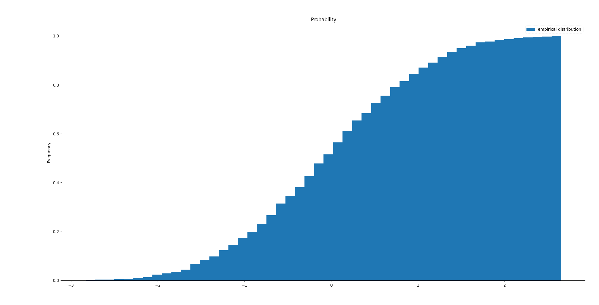
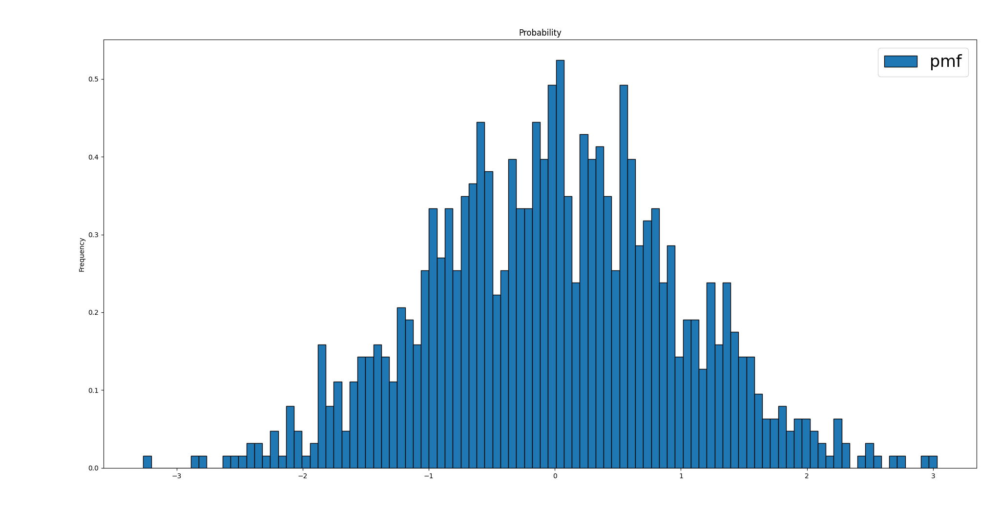

# 隨機變數（random variable）

## 機率空間(probability space)

<mark style="color:red;">機率空間</mark> $$(\Omega, \mathcal{F}, \mathrm{P})$$ 包含三個元素：

<mark style="color:red;">樣本空間</mark> $$\Omega =\{\omega_a, ~ a \in A\}$$為所有可能發生的結果(outcome) $$\omega_a$$形成的集合，$$A$$為結果的指標集合(可數或不可數)。

<mark style="color:red;">σ域</mark> $$\mathcal{F}$$為樣本空間$$\Omega$$特定子集合形成的集合族(family of set)，其內部的元素 (集合)必須滿足以下三個性質：

* \[宇集合為σ域的元素] $$\Omega \in \mathcal{F}$$。
* \[補集為σ域的元素]$$E \in \mathcal{F} \Rightarrow E^c \in \mathcal{F}$$。
* \[可數集合聯集為σ域的元素] $$\displaystyle E_i \in \mathcal{F} ~ i \in \mathbb{N} \Rightarrow \bigcup_{i=1}^\infty E_i \in \mathcal{F}$$。

<mark style="color:red;">機率測度</mark> $$\mathrm{P}: \mathcal{F} \rightarrow [0,1]$$必須滿足以下三個性質：

* $$\mathrm{P}(E) \geq 0, ~ \forall E \in \mathcal{F}$$
* \[**有限測度**] $$\mathrm{P}(\Omega)= 1$$
* \[可數可加性] $$E_i \in \mathcal{F}, i \in \mathbb{N}$$且$$E_i \cap E_j = \emptyset, ~ \forall i \neq j$$，則$$\displaystyle \mathrm{P}(\bigcup_{i=1}^\infty E_i) = \sum_{i=1}^\infty \mathrm{P}(E_i)$$

## 隨機變數（random variable）

> 隨機變數是一個由樣本空間$$\Omega$$(但不是$$\Omega$$的任意集合，而是σ-field)映射至實數集$$\mathbb{R}$$的實函數（real-valued function）。
>
> * 以函數的定義，隨機變數$$X$$的值$$x \in \mathbb{R}$$的前像$$X^{-1}(x) = \{ \omega \in \Omega | X(\omega) = x\}$$為一個在樣本空間$$\Omega$$的事件$$E$$。
> * 而在測度論中，要求事件$$E$$必須為σ域$$\mathcal{F}$$的元素，此時$$X$$稱為$$\mathcal{F}$$-可測函數（measurable function）。
> * $$X$$ 必須是可測函數，是為了避免在實數上任一點(或區間)的前像不存在於$$\mathcal{F}$$ 中沒有定義；反之如果$$X$$ 為可測函數，因為在$$\mathbb{R} >$$​中所有點的前像均存在於$$\mathcal{F}$$​，因此在求積分值的時候切割$$\mathbb{R}$$找對應的前像$$X^{-1}([a,b])$$​必為$$\mathcal{F}$$​的元素，因此可求值。
> * 把$$X$$在$$\Omega$$上的Lebesgue積分 $$\displaystyle \mathrm{E}(X)= \int_\Omega X d\mathrm{P}$$稱為$$X$$的期望值。

可測隨機變數$$X$$ 必須滿足任意實現值$$x$$的前像$$E \equiv X^{-1}(x)(\omega)$$必須是σ域的元素，是由值域反向要求定義域的特性。 而宇集合$$\Omega$$中任意元素的組合均可以得到事件集合$$E$$，而此集合對於$$X$$不一定可測。

不可測隨機變數通常須使用選擇性公理建構，而在一般的應用中的均為(可測)隨機函數。

隨機變數依值域可分為：

* 連續(continuous)隨機變數：若隨機變數之值為實區間上之任意部份集合，則稱之。
* 離散(discrete)隨機變數：若隨機變數之發生值為有限或無限可數，則稱之。
* 奇異(sigular)隨機變數(?)

### 隨機變數的值可將前像的宇集合切割

> 定義隨機變數$$X$$的值$$x \in \mathbb{R}$$的前像$$E_x=X^{-1}(\{x\}) = \{ \omega \in \Omega | X(\omega) = x\}$$在樣本空間$$\Omega$$。
>
> * 互不相交性 ：若$$x \neq y$$，則$$E_x \cap E_y = \emptyset$$。
>   * 因為若存在$$\omega \in E_x \cap E_y$$，則$$X(\omega)=x$$且$$X(\omega)=y$$不符合函數的定義。
> * 全覆蓋性：所有$$E_x$$的聯集為$$\Omega$$，即$$\bigcup_{x \in \mathbb{R}}E_x =\Omega$$。
>   * 因為對於任意的$$\omega \in \Omega$$，$$X(\omega)$$必為某個$$x_0 \in \mathbb{R}$$，即$$\omega \in E_{x_0}$$。

若$$X$$ 是離散的（取值為可數集合 $$\{x_1, x_2, \dots\}$$ )，則 $$\Omega$$ 被分割為可數個互不相交的事件$$E_{x_1}, E_{x_2}, \dots,$$且：$$\mathrm{P}(X=x_i)=\mathrm{P}(E_{x_i})$$。$$\Omega = \bigcup_{i \in \mathbb{N}} X^{-1}(\{x_i\})$$。

若$$X$$是連續的（如常態分佈），則對所有單點$$x$$，$$\mathrm{P}(E_x ​ )=0$$。此時分割依然存在，但需通過更複雜的結構（如密度函式）描述機率分佈。通常可用區間切割$$X^{-1}([a,b))=\{\omega \in \Omega~|~ a \leq X(\omega) < b\}$$再聯集得到宇集合的畫分。

### 非隨機變數範例

$$\Omega=\{1,2,3,4\}$$，$$\mathcal{F}=\sigma(\{1,2\}, \{3\}, \{4\})$$

令$$X(1)=2, X(2)=3, X(3)=4, X(4)=5$$。

因為$$\{X \leq 2\}=\{1\} \notin \mathcal{F}$$，因此$$X$$不是$$\mathcal{F}$$可測的隨機變數。

令$$Y(1)=Y(2)=2, Y(3)=10, Y(4)=-500$$

因為：

* $$r< -500, ~\{Y \leq r\} = \emptyset \in \mathcal{F}$$
* $$-500 \leq r < 2, ~\{Y \leq r\} = \{4\} \in \mathcal{F}$$
* $$2 \leq r < 10, ~ \{Y \leq r\} = \{1,2,4\} \in \mathcal{F}$$
* $$r \geq 10\}, \{Y \leq r\} = \Omega \in \mathcal{F}$$

因此$$Y$$為$$\mathcal{F}$$可測的隨機變數。

## 單變數隨機變數

> 隨機變數$$X$$在區間$$(a,b]$$發生的機率為$$P(a< X \leq b) = P(\omega \in \Omega | X(\omega) \in (a,b] )$$，則<mark style="color:red;">分佈函數（distribution function）</mark>為 $$F(x) = P(X \leq x)$$。

連續隨機變數恰好等於某數值$$c$$的機率為0，即$$P(X=c)=0$$，因此$$P(a < x \leq b) = P(a < X < b)=(a \leq X<b)=P(a \leq X \leq b)$$

但離散隨機變數無此性質。

## 分佈函數（distribution function）

$$F(x)$$為隨機變數$$X$$的分佈函數，須滿足以下條件：

* $$0 \leq F(x) \leq 1$$
* $$F(x)$$為非遞減（non-decreasing）函數。
* $$\displaystyle \lim_{h \rightarrow 0} F(x+h) = F(x)$$, 則稱$$F(x)$$為右連續（right continuous）函數。
* $$\displaystyle \lim_{x \rightarrow \infty} F(x)=1$$且 $$\displaystyle \lim_{x \rightarrow 0} F(x) = 0$$
* $$P(a < X \leq b) = F_X(b) - F_X(a)$$

也可定義為$$F(x) = \mathrm{P}(X \leq x)$$

### 經驗分佈函數(empirical distribution)

> 令$$X_1, X_2, \ldots$$為一組隨機樣本, 以$$F$$為共同分佈函數。令 $$F_n(x)=\frac{X_i \leq x}{n}, ~ \forall x \in \mathbb{R}$$，則$$F_n$$稱為此組樣本之經驗分佈函數，為一階梯函數。







```python
import numpy as np
from typing import Iterable
import matplotlib.pyplot as plt

def empirical_distribution(values: Iterable):
    ys = np.asarray(values)
    fig, ax = plt.subplots()
    n_bin = ys.size//10
    n, bins, patches = ax.hist(ys, bins=n_bin, density=True, 
        cumulative=True, label='empirical distribution')
    ax.set_ylabel('Frequency')
    ax.set_title('Probability')
    ax.legend()
    fig.tight_layout()
    plt.show()
    
if __name__ == '__main__':
    values = np.random.randn(1000)
    empirical_distribution(values)
```



如果離散隨機變數$$X$$，定義機率質量函數(pmf)$$P(x_i)\equiv P(X=x_i) \equiv P(\{ \omega \in \Omega | X(\omega \in x_i\})$$且滿足

* $$P(x_i ) \geq 0$$
* $$\displaystyle \sum_{x_i}P(x_i) =1$$

連續隨機變數的機率密度函數(pdf)$$f(x) = \frac{dF(x)}{dx}$$且滿足

* $$f(x) \geq 0$$, $$x \in \mathbb{R}$$
* $$\displaystyle \int_{-\infty}^{\infty} f(x)dx=1$$







```python
import numpy as np
from typing import Iterable
import matplotlib.pyplot as plt

def probability_mass_function(values: Iterable):
    ys = np.asarray(values)
    fig, ax = plt.subplots()
    n_bin = ys.size // 10
    n, bins, patches = ax.hist(ys, bins=n_bin, density=True, 
        cumulative=False, edgecolor='black', label='pmf')
    ax.set_ylabel('Frequency')
    ax.set_title('Probability')
    ax.legend(fontsize=24)
    fig.tight_layout()
    plt.show()
    
if __name__ == '__main__':
    values = np.random.randn(1000)
    probability_mass_function(values)
```



## 連續隨機變數的pdf變換

> 假設有一個連續隨機變數$$X$$，其機率密度函數(PDF)為 $$f_X(x)$$，定義在某個區間上。現在我們對$$X$$進行一個可逆的變換(1-1且onto的函數，因此存在反函數)，得到新的隨機變數 $$Y=g(X)$$，其中 $$g$$是一個單射（一一對應且可逆）的函數。我們希望得到$$Y$$的PDF，即$$f_Y(y)$$。
>
> 由於 $$X$$和$$Y$$之間存在函數關係，機率密度函數可由Jacobian矩陣的特性得出。

由機率守恆性質得$$\mathrm{P}(X \in dx) = \mathrm{P}(Y \in dy)$$。

由於$$Y=g(X)$$ ，兩邊對$$X$$微分得$$dy/dx = g^{'}(x)$$，移項得$$dx = \frac{dy}{|g^{'}(x)|}$$，取絕對值是因為區間長度必需為正值。

因為$$\mathrm{P}(X \in dx) = f_X(x) dx$$，將$$x=g^{-1}(y)$$代入得$$Y$$的pdf為$$f_Y(y)=f_X(g^{-1}(y))|\frac{dg^{-1}(y)}{dy}|$$。

由於$$dg^{-1}(y)/dy = 1/g^{'}(g^{-1}(y))$$，整理可得$$f_Y(y)=f_X(g^{-1}(y))\frac{1}{|g^{'}(g^{-1}(y))|}$$。

此處$$|dg(x)/dx|$$或其倒數就是一維情況下的Jacobian。

#### **為什麼需要Jacobian？**

* **體積調整**：在多維空間中，變換可能扭曲空間，導致原始的微小體積元素被拉伸或壓縮。Jacobian行列式的絕對值量化了這種變化，確保機率密度正確反映新的空間分佈。
* **機率守恆**：PDF的積分必須始終等於1，Jacobian保證了這種守恆性在變換後依然成立。

範例：

連續隨機變數$$X$$的pdf $$\displaystyle f_X(x) = \begin{cases} &1, ~ 0 < x < 1, \\ &0, \text{ otherwise}. \end{cases}$$

令$$Y = g(X)=  -2 \log X$$，可得$$0< x <1$$時，$$0 < y < \infty$$。

得$$g^{-1}(Y)=e^{-Y/2}$$，因此$$f_X(g^{-1}(y))=f_X(e^{-Y/2})$$且$$| dg^{-1}(y)/dy| =1/2 e^{-Y/2}$$

所以$$f_Y(y)=1\times 1/2 e^{-Y/2}=1/2 e^{-Y/2}$$ as $$0 < y < \infty$$。

