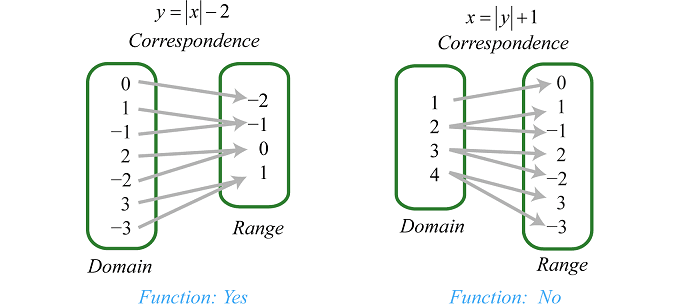

# 充分統計量

## 簡介

數理統計的本質是通過樣本來做推理母體的性質。而推理需要證據/資訊，這也就是充分統計量誕生的來源：統計量可不可以儘量少，並且包含樣本提供的我們感興趣的所有資訊？

<mark style="background-color:red;">簡單的說，知道了充分統計量就可以丟棄樣本，因為樣本裡的(分佈)資訊全都被包含在充分統計量裡面</mark>。

很明顯我們不可能說做加工不丟失資訊，但是我們完全可以做到保留所有我感興趣的資訊。比如說想求出樣本的均值，那麼不需要知道\[1,2,3]和\[3,2,1]是否是相同的樣本。如果我們只關心均值這個參數，那麼這兩個樣本是沒有差別的。

那麼假如說我們研究一個參數$$\theta$$ ，聯合密度函數寫為$$F_{\theta}(X)$$ ，如果給定統計量的值$$T(X)=t$$ ，所對應的條件分佈$$F_{\theta}(X~|~T(X)=t)$$ 是一個與$$\theta$$無關的分佈，那麼可以得到無論$$\theta$$ 如何變化，只要統計量$$T$$的值給定了，樣本機率密度就不會再變了。反過來說，這個時候只有$$T$$值變化，才能對$$\theta$$產生影響，這也就說明$$\theta$$ 的所有資訊都被$$T$$所抓住了，也就是我們說的充分統計量的含義了。

充分統計量(sufficient statistics)

> 假設隨機變數$$X$$之機率分佈與參數（向量）$$\theta$$有關。
>
> 若給定一統計量 $$T(X)$$之後，$$X$$之條件分佈與$$\theta$$無關（does not depend on $$\theta$$）， 則$$T(X)$$稱為$$\theta$$的一充分統計量。
>
>
>
> * $$\mathrm{P}(X=x|T(X)=t, \theta)=\mathrm{P}(X=x|T(X)=t)$$或
> * $$\mathrm{P} (\theta|T(X)=t, X=x) = \mathrm{P}(\theta|X=x)$$或
> * $$\mathrm{P}(\theta, X=x|T(X)=t)=\mathrm{P}(\theta|T(X)=t) \mathrm{P}(X=x|T(X)=t)$$

一個隨機變數的機率分佈，可能取決於一些分佈參數的值（如常態分佈取決於$$(\mu, \sigma^2)$$ ，Poisson分佈取決於$$\lambda$$，均為充分統計量）。**而**<mark style="background-color:red;">**充分統計量，則能夠完全捕捉這些參數所包含的關於分佈的信息**</mark>。也就是說，如果知道充分統計量的值，那麼這個隨機變數關於它的條件分佈，不再取決於原來參數的值。

&#x20;Fisher在1922年提出充分統計量的概念，其以估計的目的而言，充分統計量等價於原始的資料，因此好的估計量只須基於充分統計量。之後此概念擴充為不論是估計、檢定以及信賴區間等參數的推論，均只須基於充分統計量。

<mark style="background-color:red;">**參數分佈的充分統計量不唯一(可做1-1函數變換)但必定存在(取統計量為排序後的資料)**</mark><mark style="background-color:red;">。但對於任意有參數的分佈，其充分統計量必定存在</mark>。

知道充分統計量後，因為其完備保留資料的特性，因此不再需要其它資料（隨機變數的實現值）。
或者說某些統計量，可保留資料中有用的資訊，在去除掉不相干的資料後，不會影響對參數的推估；這類統計量可達到資料縮減（data reduction）的目的，並使資料不損失者，稱為充分統計量。

<mark style="background-color:purple;">若</mark>$$T(\cdot)$$<mark style="background-color:purple;">為</mark>$$\theta$$<mark style="background-color:purple;">的充分統計量，則知道</mark>$$T(X)$$<mark style="background-color:purple;">之後，</mark>$$X$$<mark style="background-color:purple;">的變化與</mark>$$\theta$$<mark style="background-color:purple;">無關，也就是樣本中不再含有更多關於</mark>$$\theta$$<mark style="background-color:purple;">的資料；剩餘的資料中，對於了解</mark>$$\theta$$<mark style="background-color:purple;">不具價值。</mark>

<mark style="color:red;">以資訊理論的說法就是給定</mark>$$T(X)$$<mark style="color:red;">之後，</mark>$$X$$<mark style="color:red;">與</mark>$$\theta$$<mark style="color:red;">的互資訊為0，即</mark>$$\mathrm{I}(X;\theta|T(X))=0$$。

由於充分統計量中仍可能保有多餘的資料，因此把多餘的資料刪去後，可得**最小充分統計量**。
將樣本加工成統計量要求越簡化越好，**最簡化的充分統計量叫最小充分統計量**。統計量的另一個重要的基本概念是完全統計量，**完全充分統計量是最小充分統計量**。

### 例：銅板出現正面的機率

假設要要估計一個銅板出現正面的機率，1表示成功，0表示失數，成功的機率以$$\theta$$表示。
經過$$N$$次試驗後，可得到一組獨立同分佈$$Ber(\theta)$$隨機變數$$X=\{X_1=x_1,X_2=x_2, \ldots,X_N=x_N \}$$。目標是找出一統計量$$T(X)$$可估計出$$\theta$$。

直觀上會認為如果知道$$x_1,\ldots,x_N$$ 中有幾個1，也就是知道$$\sum_{i=1}^N x_i$$  之和，即可得到$$\theta$$，不必知道那幾次試驗中得到1。
因此令$$T(X)=\sum_{i=1}^N X_i = t$$。

由排列組合知$$t=0,1,\ldots,N$$時，$$T(X)=t$$有$$\binom{N}{t}$$種可能的組合。

* 條件機率$$\mathrm{P}(X_1=x_1, \ldots, X_N=x_N | T(X)=t) = \frac{\mathrm{P}(x_1,\ldots, x_N)}{\mathrm{P}(T(X)=t)}$$
* 因為$$T(X) \sim Ber(N, \theta)$$
* 可得條件機率為 $$\frac{\prod_{i=1}^N \theta^{x_i} (1-\theta)^{1-x_i}}{\binom{N}{t} \theta^t (1-\theta)^{N-t}} = \frac{1}{\binom{N}{t}}$$，與參數$$\theta$$沒有關係。所以$$T=t$$對$$\theta$$提供了所有必要的資料。

以上的做法，是先給出統計量後，再去驗證其是否為充分統計量；因此還是必須先猜測統計量後才能驗證。

## 充分性原則(sufficiency principle)

> 若$$T(X)$$為參數$$\theta$$的充分統計量
> ，則對於任兩組觀察集合$$X_1, X_2$$，只要$$T(X_1)=T(X_2)$$，則不論觀察到$$X=X_1$$ 或$$X=X_2$$ 對$$\theta$$的推論(估計、檢定、信賴區間等)均相同。

雖然充分統計量提供了足夠的訊息估計$$\theta$$，但仍有部份好的統計量並非充分統計量。

充分統計量的存在性

> 任意有參數的分佈，其充分統計量必定存在。
>
> 對於任一組獨立同分佈的隨機變數$$X_1,X_2,⋯,X_N$$，且其與分佈的參數$$\theta$$有關。令$$T(X)=(X_1, X_2, \ldots, X_N)$$
> ，則$$T$$必為$$\theta$$的（自然）統計量。
>
> 由於充分統計量的目的是縮減資料，然的充分統計量的資料量和原始資料相同，因此性質並不好。

* 因為給定$$T(X)$$之後$$\mathrm{P}(X_1=x_1, X_2=x_2,\ldots, X_N=x_N | T(X)=(x_1,x_2,\ldots, x_N))=1$$與參數值$$\theta$$無關，因此為充份統計量。
* 而且對於$$(x_1^{'}, x_2^{'} ,\ldots, x_N^{'}) \neq (x_1, x_2, \ldots, x_N)$$，$$\mathrm{P}(X_1=x_1^{'}, X_2=x_2^{'},\ldots, X_N=x_N^{'} | T(X)=(x_1,x_2,\ldots, x_N))=0$$
* 所以給定$$T(X)$$之後，$$X_1,X_2,\ldots,X_N$$ 的條件充分與$$\theta$$無關。

但是可得到<mark style="color:red;">順序統計量</mark> $$T(X)=(X_{(1)},X_{(2)},\ldots, X_{(N)}  )$$<mark style="color:red;">必為</mark>$$\theta$$<mark style="color:red;">充分統計量</mark>。
因為$$X_1,X_2,\ldots,X_N$$ 有$$N!$$種排列組合，均會對應到$$X_{(1)},X_{(2}),\ldots,X_{(n)}$$  ，因此順序統計量有縮減資料的效果。

## 函數為另一函數的函數

> 函數$$f,g$$有相同的定義域$$D$$，則$$f$$為$$g$$的函數(值)（即存在函數$$h$$使得$$f(x)=h(g(x)), ~\forall x \in D$$）$$\Leftrightarrow$$若 $$g(x_1 )=g(x_2 )$$，則$$f(x_1 )=f(x_2 )$$， $$x_1,x_2 \in D$$
>
> 一統計量為(多維)樣本的函數，因為函數定義域中所有值都有對應的函數值，可能是一對一或多對一函數，因此只要不是一對一函數，則值域元素數量(勢)必定小於定義域元素數量(勢)，因此有資料縮減(降維)的功能。
>
> 函數定義：$$h: X \rightarrow Y$$為函數則$$\forall x \in X, ~ \exists !y \in Y \ni h(x)=y$$。
>
> 註：簡單的判斷法是若$$g \rightarrow f$$為降維或是多項式冪次方降低時，則$$f$$可能是$$g$$的函數。

一<mark style="color:red;">充分統計量是否較另一充分統計量能夠縮減資料，可使用此定理判斷。</mark>

<mark style="color:red;">但是要用此定理判斷是否為最小充分統計量仍不方便，因此必須要判斷</mark>$$f$$<mark style="color:red;">為所有的充分統計量</mark>$$g$$<mark style="color:red;">的函數。</mark>

proof

$$\Rightarrow$$ 已知$$f(x)=h(g(x))$$

令$$g(x_1)=y_1$$, $$g(x_2)=y_2$$, $$\forall x_1, x_2 \in D$$

若$$y_1 = y_2$$，根據函數的定義，定義域中每一個元素，只會唯一對應到值域中一個元素。因此$$h(y_1) = h(y_2)$$可得$$f(x_1)=f(x_2)$$。

$$\Leftarrow$$同樣的證法 (QED)。

#### 範例

例如$$f(x)=x^3$$, $$g(x)=x^2$$, $$\forall x \in \mathbb{R}$$

因為$$g(-2)=g(2)$$，但是$$f(-2)\neq f(2)$$，所以$$f$$不是$$g$$的函數\[g至f的多項式次方上升]。但$$g$$為$$f$$的函數，$$g(x)=(f(x))^{\frac{2}{3}}$$。

#### 範例

$$f(x)=x^3+3x^2+1, ~ g(x)=x^4-2x^2+1, x \geq 0$$，而$$f$$不是$$g$$的函數。

## 等價統計量(equivalent statistics)

> 給定二統計量$$T_1,T_2$$，若$$T_2=h(T_1)$$，且$$h$$為一對一函數
> ，則稱$$T_1$$ 與$$T_2$$ 等價。
>
> 即$$T_1$$為$$T_2$$的函數且$$T_1$$也為$$T_2$$的函數，因此可用函數為另一函數的函數判斷。
>
>
>

因為知道$$T_1$$可以唯一決定$$T_2$$，反之亦然，二統計量本質上沒有差別。
等價的統計量對參數提供同樣多的資訊，且達到相同程度的資料縮減程度。

因此兩統計量必定同時為充分統計量或是同時不為充分統計量，因此可知<mark style="color:red;">**充分統計量若存在時必不唯一**</mark><mark style="color:red;">(可透過一對一函數轉換)</mark>。

等價統計量滿足等價關係(反身性、對稱性與遞移性)。

#### 範例：二項式分佈

$$X \sim Ber(N,\theta)$$，則

* $$T(X)=\sum_{i=1}^N X_i$$
* $$S(X)=\frac{T(X)}{N}=\overline{X}_N$$
* $$U(X)=\frac{T(X)}{3}$$
* $$V(X)=2T(X)-3$$

均為$$\theta$$的充分統計量且等價。

#### 範例：常態分佈

$$X \sim N(0, \sigma^2)$$且樣本數$$n=1$$，則$$T_1(X)=X, ~ T_2(X)=X^2, T_3(X)=|X|$$均為$$\sigma^2$$的充分計量，且$$T_2, T_3$$均為$$\sigma^2$$的最小充分統計量。

#### 範例：動差非等價統計量

$$\displaystyle T_1=\sum_{i=1}^n X_i, ~ T_2=\sum_{i=1}^n X_i^2, ~ T_3=\sum_{i=1}^n X_i^3$$，則此3統計量(動差)不互相等價。

使用函數為另一函數的函數判斷，取$$n=2$$。

則$$T_2(\{1,-1\})=1+1=T_2(\{1,1\})$$，但是$$T_1(\{1,-1\})=0 \neq 1=T_1(\{1,1\})$$，因此$$T_2$$不是$$T_1$$的函數。

同理$$T_3(\{7,6\})=T_3(\{9,2\})=85$$，但是$$T_1(\{7,6\})\neq T_1(\{9,2\})$$.&#x20;

$$T_2(\{12,1\})=T_2(\{10,9\})$$，但是$$T_3(\{12,1\})\neq T_3(\{10,9\})$$。

### 資料縮減的兩種做法

1. 維度減少$$(X_1,⋯,X_N ) \Rightarrow \sum_{i=1}^N X_i$$，由$$N$$維變為1維(或降維)。
2. 經由多對一，而非一對一的(函數)變換。

而二個等價統計量縮減資料的能力是相同的(因此不唯一)。
為了縮減資料，存在各種統計量縮減資料，但是不能夠過度縮減(下限為最小充分統計量)，否則留下來的資料不夠多無法推論母體資訊。

## 最小充分統計量 (minimum sufficient statistics)

> 假設有一充分統計量$$T(X)$$
> ，若對每一個充分統計量$$T_S (X)$$， $$T(X)$$皆為$$T_S (X)$$的函數，
> 即存在函數$$f$$使得 $$T(X)=f(T_S(X))$$，則稱$$T$$為最小充分統計量。

只考慮值域時，因為函數依定義可為對多一或是一對一函數，因此$$T(X)$$集合的勢小於等於$$T_S(X)$$的勢。因此若充分統計量$$T_S$$ 無法再縮小（即$$f$$為一對一函數），則其值域之充分統計量$$T$$為最小的充分統計量。

由充分統計量的存在性，可得知每個充分統計量縮減資料的能力不全相同，因此可**定義最能夠縮減資料的充分統計量為最小的充分統計量**。

###

> $$X=(X_1,  X_2\ldots, X_N)$$的聯合機率分佈為$$f(X|\theta)$$，若存在一函數$$T(X)$$使得對任意兩個樣本點$$x,y$$，$$\frac{f(x|\theta)}{f(y|\theta)}$$與$$\theta$$無關 $$\Leftrightarrow$$$$T(x)=T(y)$$
>
> 則$$T(X)$$為$$\theta$$的最小充分統計量。

Proof: Casella and Berger (1990), pp 255-256.

Fisher-Neyman 分解定理(factorization theorem)

由充分統計量原始定義知，要證明一統計量是否為充分，必須先猜出某一充分統計量，且再證明兩統計量等價，過程麻煩，因此使用分解定理可簡化過程。

> 令$$f(X|\theta)$$為$$X$$的聯合機率密度函數。
>
> $$T(X)$$為$$\theta$$的充分統計量 $$\Leftrightarrow$$存在函數$$g(T(X)|\theta) \geq 0$$且$$h(X) \geq 0$$使得對於所有的樣本點$$x$$與參數$$\theta$$均滿足$$f(x|\theta)=g(T(x)|\theta)h(x)$$
>
> * $$g(T|\theta)$$不必為$$T$$的機率密度函數。但若$$T(X)$$為$$\theta$$的充分統計量 且$$T(X)$$的機率密度函數存在，則$$g$$可取為$$T$$的機率密度函數。
> * $$h(x)$$為與參數$$\theta$$無關的函數。
>
> 若樣本隨機變數的聯合機率密度函數$$f$$可分解成某統計量的（密度）函數$$g$$與某一完全不含參數的函數$$h$$之乘積，那麼該統計量必是該參數的充分統計量，反之亦然。
>
> 可解釋為因為$$T(X)$$為充分統計量，因此$$T$$包含了所有關於參數$$\theta$$的資料，所以可寫成$$g(T(x)|\theta)$$的形式；因為函數有縮減資料的功能，且$$g(T(X)|\theta)$$已把包含所有關於參數$$\theta$$的資訊納入，所以剩下與參數無關的部份$$h(x)$$。

## 指數族（exponential family）

指數分布族是一系列分布的統稱，包含連續和離散的相關分布。例如，常態分布(Gaussian)、泊松分布（Poisson）、二項分布(Bernoulli)、指數分布(exponential)、Gamma分布、多項式分布(multivariate)等。

指數族的分佈可很容易找到充分統計量。

> $$k$$個參數的指數族
>
> * 令隨機變數$$X_1, X_2, \ldots, X_N$$來自於於指數分佈族，其機率密度函數為$$\displaystyle f(X|\theta)=h(X)c(\theta)\exp\big\{  \sum_{j=1}^k w_j(\theta) t_j(x)\big\} \mathrm{I}_A(X)$$
> * $$h(X) \geq 0$$, $$c(\theta) \geq 0$$, $$\mathrm{I}_A$$與#$$\theta$$無關，$$k$$為充分統計量的個數，則$$\displaystyle T(X)=(\sum_{i=1}^N t_1(X_i), \ldots, \sum_{i=1}^N t_k(X_i))$$為$$\theta$$的充分統計量。

充分統計量的必要條件

如果可使用指數族或是分解定理時，可容易找出充分統計量；除此之外只能用以下三個必要條件判定是否為充分統計量。
&#x20;Proposed by Sampson and Spencer (1976)。

### 支撐集(support set)

> 給定隨機向量$$X=(X_1, X_2,\ldots, X_N)$$與其機率密度函數$$f(X|\theta)$$，則支撐集 $$SP(f)=\{ x| f(x|\theta) > 0, \text{ for some } \theta\}$$

例如：

* $$X\sim N(\mu, \sigma^2)$$, $$\theta=(\mu, \sigma^2)$$, $$SP(f)=\mathbb{R}$$
* $$X \sim U(0, \theta)$$, $$\theta > 0$$, $$SP(f)= (0, \theta)$$

### theorem: 充分統計量必要條件1

> 給定一統計量$$T(X)$$，若存在$$\theta_1,  \theta_2$$以及$$x,y \in SP(f)$$使得
>
> * $$T(x)=T(y)$$
> * $$f(x|\theta_1)f(y|\theta_2) \neq f(x|\theta_2) f(y| \theta_1)$$
>
> 則$$T(X)$$不為$$\theta$$的充分統計量。

### theorem: 充分統計量的必要條件2

> $$S(X)$$為最小充分統計量，$$T(X)$$為一統計量。若存在$$x,y \in SP(f)$$使得 $$T(x)=T(y)$$且$$S(x) \neq S(y)$$，則$$T(X)$$不為充分統計量。

### theorem: 最小充分統計量的必要條件

> $$S(X), T(X)$$為兩個充分統計量。若存在$$x,y \in SP(f)$$使得$$S(x)=S(y)$$且$$T(x) \neq T(y)$$。則$$T(X)$$不為最小充分統計量。
