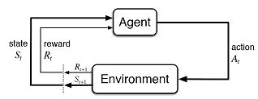
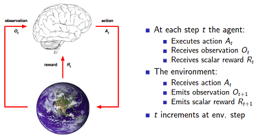

# Markov decision process (MDP)

## 簡介

MDP為強化學習(reinforcement learning, RL)的核心理論。

馬可夫決策過程，也稱為隨機動態程序或隨機控制問題，是在結果不確定時進行順序決策的模型。馬可夫決策過程模型由決策階段、狀態、行動、獎勵和轉移概率組成。在一個狀態中選擇一個動作將生成一個獎勵，並通過一個轉移概率函數確定下一個決策元的狀態。政策(policy)或策略(strategy)是在未來任何決策時期，在任何不預測情況下選擇行動的處方。決策者尋求某種意義上最優的政策。

模型的分析包括：

* 提供易於實現的最佳條件。
* 決定如何識別這些策略。
* 開發和改進計算它們的算法。
* 分析這些算法的收斂性。

> definition: Markov property
>
> 狀態$$S_t$$有馬可夫性質 $$\Leftrightarrow$$$$P(S_{t+1} \vert S_t) = P(S_{t+1} \vert S_t, S_{t-1}, S_{t-2}, \ldots, S_1)$$
>
> * 當前的狀態可反應過去所有歷史狀態的訊息，因此只要知道當前的狀態$$S_t$$，不再需要其它的歷史資料$$S_{t-1}, S_{t-2}, \ldots,S_1$$。也就是說，我們所求的機率，可以捨去過去的所有狀態，只專注於眼前的狀態。這大大幫助我們減少計算量，且能夠用簡單的迭代法來求出結果。
> * 數理統計中也稱具有馬可夫性質$$S_t$$為未來狀態的充分統計量(sufficient statistics)。

**不是所有RL的問題都滿足Markov Property，但是我們可以假設問題滿足Markov Property來達到近似的結果**。

在強化學習中，有三個基本元素：狀態(State)、行動(Action)、報酬(Reward)。
這三個元素就是我們的代理人(Agent)與環境(Environment)互相溝通的訊息，而代理人可以透過MDP選擇行動改變下一期的狀態，以提高報酬。

$$\{r_t, s_t\}$$, $$a_t$$, $$\{ r_{t+1},  s_{t+1}\}$$, $$a_{t+1}$$$$\{ r_{t+2}, s_{t+2} \}$$, $$\ldots$$

* **大寫的字母表示隨機變數，小寫的字母表示為某一實現值**。
* 如果決策圖中出現狀態->狀態的轉移時，表示兩個狀態間有一個決定性的行動(deterministic action)，即執行此行動後必定會轉移至下一個固定的狀態，而非是機率式的轉移。
* 行動之後必定是狀態，因此不會有行動至行動的情形出現。
* **在加入狀態進入模型後，代理人考慮的是全局最佳解的行動序列，即最大化**$$f(R_{t+1}, R_{t+2}, \ldots)$$**；而非局部最佳解(即只考慮**$$f(R_{t+1})$$**)**。

## RL問題假設

多強化學習都基於一種假設，即代理人(agent)與環境的交互作用可用一個MDP來表示。

* 可將代理人和環境表示為同步的有限狀態自動機；
* 代理人和環境在離散的時間內交互作用；
* 代理人態感知到環境的狀態，並做出反應性動作；
* 代理人執行完動作後，環境的狀態會發生變化；
* 在代理人執行完動作後，會得到某種回報；

也可以把代理人和環境的互動，以賽局理論(game theory)中的雙人賽局來分析的性質。

> definition: Markov decision process
>
> 4-tuple $$(S, A, P, R)$$
>
> * $$S$$: 環境狀態集合 (有限或無限)。
> * $$A$$: 代理人行動集合(有限或無限)。
> * $$P: S \times A \times S \rightarrow [0,1]$$，狀態轉移函數。$$P(s^{'} \vert s, a)$$，即在目前的狀態$$s$$，決定行動$$a$$之後，轉移到狀態$$s^{'}$$的機率。
> * $$R: S\times A \rightarrow \mathbb{R}$$，報酬函數 $$r(s,a)$$，在目前的狀態$$s$$，決定行動$$a$$後，會得到報酬。
>   * 報酬可能也是隨機的，即$$P(r \vert s,a)$$。
>   *
> * 也可將$$P, R$$寫在一起得 $$P(s^{'}, r \vert s, a) \equiv P(S_{t+1}=s^{'}, R_{t+1}=r \vert S_t =s, A_t =a)$$。
>   * $$P(s^{'} |s,a) = \sum_{r \in \mathbb{R}} P(s^{'}, r \vert s,a)$$
>   * $$P(r  \vert s,a) = \sum_{s^{'} \in S} P(s^{'}, r \vert s,a)$$
>   * 且 $$\sum_{s^{'} \in S} \sum_{r \in \mathbb{R}} P(s^{'}, r|s, a) = 1, \ \forall s \in S, a \in A(s)$$

* MDP中，所有的過程(狀態，行動等)都有隨機性，下一個狀態轉移只與現在這個狀態有關。
* MDP假設環境在某個時刻$$t$$的狀態為$$s$$，則代理人在時間$$t$$採取行動$$a$$後，會使狀態轉變到下一狀態為$$s^{′}$$ 的機率為$$p(s^{′} \vert s,a)$$，且代理人得到的立即報酬為$$r(s,a)$$，只依賴於當前的狀態$$s$$與其選擇的行動$$a$$，而與歷史狀態和歷史動作無關。可**解釋為將來與現在的選擇有關，而與過去無關**。
* **RL重視在轉移函數**$$P$$**與報酬函數**$$R$$**未知的條件下，學習算法如何獲得最佳行動策略**$$\pi : S \rightarrow A$$**。**$$\pi(s_t)=a_t$$。
* 強化學習關注的是智慧體如何在環境中採取一系列行為，從而獲得最大的累積回報。因此所有的RL方法共同的特點就是通過與環境的交互(試誤, trial-and-error)，來選擇適當的行動。
* RL是用不確定環境的報酬來發現最佳行動策略 ，不需事先是供訓練樣本，因此為online learning，與監督式學習為offline learning相異。

## 參考資料

* Martin L. Puterman,  "Markov decision processes: discrete stochastic dynamic programming." John Wiley & Sons, 2014.
* 劉克，曹平，"馬爾可夫決策過程理論與應用"，科學出版社，2015。
