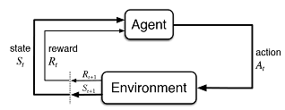
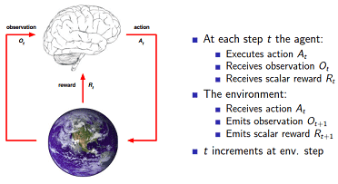

# Markov decision process (MDP)

簡介

MDP為強化學習(reinforcement learning, RL)的核心理論。

<mark style="color:blue;">MDP是順序決策的經典形式化，在這種情況下，行動不僅影響眼前的回報，而且影響隨後的情況，或狀態，並通過這些影響未來的報酬</mark>。因此，MDP涉及延遲獎勵，<mark style="color:red;">需要權衡即時和延遲獎勵</mark>。

在多臂老虎機問題中，我們估算每個動作$$a$$ 的價值$$q_{*}(a)$$，而在 MDP 中，我們估算每個狀態中每個動作$$a$$ 在每個狀態$$s$$的價值$$q_{*}(s,a)$$，或者我們估算在每個狀態下，給定最佳動作選擇價值 $$v_{*}(s)$$。

MDP是強化學習問題在數學上的一種理想化形式，對它可以做出精確的理論陳述。我們介紹了該問題數學結構的關鍵要素，如收益(payoff)、價值函數和Bellman方程式。我們試圖表達可以被表述為有限MDP的廣泛的應用。正如所有的人工智慧一樣，在適用性的廣度和數學的可操作性之間存在著矛盾。

馬可夫決策過程，也稱為隨機動態程序或隨機控制問題，是在結果不確定時進行順序決策的模型。<mark style="color:red;">馬可夫決策過程模型由決策階段、狀態、行動、獎勵和轉移概率組成</mark>。在一個狀態中選擇一個動作將生成一個獎勵，並通過一個轉移概率函數確定下一個決策元的狀態。策略(policy or strategy)是在未來任何決策時期，在任何不預測情況下選擇行動的方法。決策者尋求某種意義上最優的策略。

模型的分析包括：

* 提供易於實現的最佳條件。
* 決定如何識別這些策略。
* 開發和改進計算它們的算法。
* 分析這些算法的收斂性。

### 馬可夫性質(Markov property)

> definition: Markov property
>
> (資訊)狀態$$S_t$$有馬可夫性質 $$\Leftrightarrow$$$$\mathrm{P}(S_{t+1} \vert S_t) = \mathrm{P}(S_{t+1} \vert S_t, S_{t-1}, S_{t-2}, \ldots, S_1)$$
>
> * <mark style="color:red;">當前的狀態可反應過去所有歷史狀態的訊息</mark>，因此只要知道當前的狀態$$S_t$$，不再需要其它的歷史資料$$S_{t-1}, S_{t-2}, \ldots,S_1$$。
> * 也就是說，我們所求的機率，可以捨去過去的所有狀態，只專注於眼前的狀態。這大大幫助我們減少計算量，且能夠用簡單的迭代法來求出結果。
> * 數理統計中也稱具有馬可夫性質$$S_t$$為未來狀態的充分統計量(sufficient statistics)。

**不是所有RL的問題都滿足Markov Property，但是我們可以假設問題滿足Markov Property來達到近似的結果**。

## 代理人-環境介面(agent-environment interface)

MDP是指對從互動中學習以實現目標的問題的一種直接框架。

* <mark style="color:red;">學習者和決策者被稱為代理人(agent)。</mark>
* <mark style="color:red;">與它互動的東西，包括代理人之外的一切，被稱為環境</mark>。

它們不斷地相互作用，代理人選擇行動，環境對這些行動作出反應，並向代理人提供新的狀態。 環境也產生了獎勵。<mark style="background-color:red;">代理人通過選擇行動尋求長期最大化的目標值</mark>。

<mark style="color:red;">因此在強化學習中，有三個基本元素：狀態(State)、行動(Action)、報酬(Reward)。</mark>
這三個元素就是我們的代理人(Agent)與環境(Environment)互相溝通的訊息，而代理人可以透過MDP選擇行動改變下一期的狀態，以提高報酬。

* 代理人在狀態$$S_t \in \mathcal{S}$$時，選擇行動$$A_t \in \mathcal{A}(s)$$後，會從環境得到報酬$$R_{t+1} \in \mathcal{R} \subset \mathbb{R}$$且到達下一個狀態$$S_{t+1}$$。
* 因此可得<mark style="color:red;">軌跡(trajectory)</mark>如$$S_0, A_0, R_1, S_1, A_1, R_2, S_2, A_2, R_3, \dots$$，此此是用隨機變數序列表示，實務上每次得到的軌跡都相異。
* 在<mark style="color:red;">有限的MDP</mark>中，狀態的集合$$\mathcal{S}$$、行動的集合$$\mathcal{A}$$、報酬的集合$$\mathcal{R}$$三者均為有限集合。因此報酬和狀態的隨機變數$$R_t$$​和$$S_t$$​有只依賴於前一狀態或行動的離散機率分佈。

* **大寫的字母表示隨機變數，小寫的字母表示為某一實現值**。
* <mark style="color:red;">如果決策圖中出現狀態->狀態的轉移時，表示兩個狀態間有一個決定性的行動(deterministic action)</mark>，即執行此行動後必定會轉移至下一個固定的狀態，而非是機率式的轉移。
* 行動之後必定是狀態，因此不會有行動至行動的情形出現。
* **在加入狀態進入模型後，代理人考慮的是全局最佳解的行動序列，即最大化**$$f(R_{t+1}, R_{t+2}, \ldots)$$**；而非局部最佳解(即只考慮**$$f(R_{t+1})$$**)**。

## RL問題假設

強化學習都基於一種假設，即代理人(agent)與環境的交互作用可用一個MDP來表示。

* 可將代理人和環境表示為同步的有限狀態自動機；
* 代理人和環境在離散的時間內交互作用；
* 代理人態感知到環境的狀態，並做出反應性動作；
* 代理人執行完動作後，環境的狀態會發生變化；
* 在代理人執行完動作後，會得到某種回報；

<mark style="color:red;">也可以把代理人和環境的互動，以賽局理論(game theory)中的雙人賽局(玩家與環境)來分析</mark>。但要注意賽局理論只有考慮行動，沒有考慮狀態，因此雙人賽局是RL在狀態數為1的特例。

### 馬可夫決策過程(MDP)的符號定義

<figure><figcaption>
MDP範例。圓圈表示狀態，方向箭頭上的小黑點為行動。狀態可採取的行動為流出的方向箭頭。而(狀態，行動)對的轉移機率總合為1。而在狀態s中選擇行動a的(策略, policy)機率也為1。
</figcaption></figure>

> definition: finite Markov decision process
>
> 4-tuple $$(\mathcal{S, A, P, R})$$
>
> * $$\mathcal{S}=\{s_0,s_1,\dots, s_N\}$$: 環境狀態集合 (有限集合)。
> * $$\mathcal{A}(s) =\{ a_0, a_1,\dots, a_K\}$$: 代理人行動集合(有限集合)。這邊行動的集合依狀態相異。注意行動數量$$K$$隨狀態$$s$$而異，即$$K \equiv K(s)$$。
> * <mark style="color:red;">\[3維轉移函數]</mark> $$\mathrm{P}: \mathcal{S \times A \times S }\rightarrow [0,1]$$，狀態轉移機率函數。
>   * 簡寫為$$p(s^{'}|s, a) \equiv \mathrm{P}(S_{t+1}=s^{'} \vert S_t=s, A_t=a)$$，即在目前的狀態$$s$$，決定行動$$a$$之後，轉移到狀態$$s^{'}$$的機率。
>   * 因為在現實中，無法預測未來會發現什麼事，即使在時間點$$t$$，依據狀態$$s$$執行行動$$a$$，也無法保證一定會轉移到狀態$$s^{'}$$。
>   * $$\displaystyle p(s^{'} |s,a) = \sum_{r \in \mathcal{R}} p(s^{'}, r \vert s,a)$$
>   * <mark style="background-color:orange;">MDP和一般Markov chain的區別在於轉移矩陣不是狀態->狀態，而是狀態->行動->狀態</mark>。
> * \[期望報酬函數]，定義期望報酬函數$$r: S\times A \rightarrow \mathbb{R}$$
>   * 簡寫為 $$\displaystyle r(s,a) \equiv \mathrm{E}(R_{t+1} ~|~ S_t=s, A_t=a)$$，在目前的狀態$$s$$，決定行動$$a$$後，所得到期望報酬。此處$$R_{t+1}$$為隨機變數。
>   * 如果只考慮狀態，行動的期望報酬時，用此法定義較為簡單。而將隨機報酬也寫入轉移函數的定義更為詳細，但也較複雜。

### 合併轉移與報酬函數的定義(RL中採用此定義)

<mark style="color:red;">\[4維轉移函數]</mark> RL中將報酬分佈併入狀態轉移中，因此$$\mathrm{P}: \mathcal{S \times R \times A \times S }\rightarrow [0,1]$$。

* 簡寫為$$p(s^{'}, r|s, a) \equiv \mathrm{P}(S_{t+1}=s^{'}, R_{t+1}=r \vert S_t=s, A_t=a)$$，即決定在目前狀態決定當期行為後，轉移到狀態$$s^{'}$$與得到報酬$$r$$的機率。
* 此處$$(s^{'}, r)$$為二維值，即採取行動$$a$$後，即使轉移到狀態$$s^{'}$$，也是有可能的到相異的報酬$$r_i$$與$$r_j$$。比如說$$s_t \rightarrow s_{t+1}$$為車輛由起點到終點的狀態，而報酬$$R_{t+1}$$為節省的油量，在每一次測試中，$$R_{t+1}$$的值不會完全相同，但最後可以得到平均報酬$$\overline{R}_{t+1}$$。
* $$\displaystyle \sum_{s^{'} \in \mathcal{S}} \sum_{r \in \mathcal{R}} p(s^{'}, r|s, a) =1, ~ \forall s \in \mathcal{S}, ~ a \in \mathcal{A}(s)$$。此定義是對於每一個狀態$$s$$採取特定行動$$a$$之後的轉移狀態與報酬的機率總和為1。
* 前一狀態狀態與行動的組合數有$$|\mathcal{S}| \times |\mathcal{A}(s)|$$個，而玩家有可能處於其中任一組(狀態，行動)，從當時(狀態，行動)組合中採取行動後，會進到下一個狀態與隨機的報酬，其總和機率為1。
* <mark style="color:red;">3維狀態轉移函數</mark> $$\displaystyle p(s^{'} |s,a) = \sum_{r \in \mathcal{R}} p(s^{'}, r \vert s,a)$$。由目前的(狀態，行動)對中，進到下一狀態$$s^{'}$$的機率為所有狀態$$s^{'}$$下相異報酬的機率總合(邊際函數)。
* <mark style="color:red;">期望報酬函數(狀態-行動對)</mark>$$\displaystyle r(s,a) \equiv \mathrm{E}(R_{t+1} ~|~ S_t=s, A_t=a) =  \sum_{r \in \mathcal{R}} r \sum_{s^{'} \in \mathcal{S}}  p(s^{'}, r|s, a)$$。
* <mark style="color:red;">期望報酬函數(狀態-行動-下一狀態三元組)</mark>&#x20;
* $$\displaystyle r(s,a, s^{'}) \equiv \mathrm{E}(R_{t+1} ~|~ S_t=s, A_t=a, S_{t+1}=s^{'}) =  \sum_{r \in \mathcal{R}} r \frac{ p(s^{'}, r|s, a)}{ p(s^{'}|s, a)}$$

> - \[<mark style="color:red;">Markov property</mark>] $$\mathrm{P}(S_t|S_{t-1}, S_{t-2}, \dots, S_0) = \mathrm{P}(S_t|S_{t-1})$$，現在的狀態包含著過去經歷過的所有狀態的資訊。也就是說，我們所求的機率，可以捨去過去的所有狀態，只專注於眼前的狀態。這大大幫助我們減少計算量，且能夠用簡單的迭代法來求出結果。

### MDP的機率分佈

以下是 MDP 中涉及的主要機率分佈：

* <mark style="color:red;">\[狀態轉移的隨機性]</mark> 狀態(行動)轉移機率分佈$$p(s^{'}|s,a)$$：描述在當前狀態$$s$$下採取行動$$a$$後,轉移到下一個狀態$$s'$$的(條件)機率。
* <mark style="color:red;">\[行動選擇的隨機]</mark> 策略分佈 $$\pi(a|s)$$：描述在狀態$$s$$下選擇行動$$a$$的機率。
* <mark style="color:red;">\[初始狀態的可能性]</mark> 初始狀態分佈 $$p(s₀)$$：描述系統初始狀態的機率分佈。
* <mark style="color:red;">\[報酬的隨機性]</mark> 獎勵分佈 $$R(s,a)$$或$$R(s,a, s^{'})$$：描述在狀態$$s$$採取行動$$a$$後獲得獎勵$$r$$的機率，如$$\mathrm{P}(R|s,a)=N(\mu, \sigma^2)$$，通常簡化為確定性函式。
* <mark style="color:red;">\[累積報酬的分佈的隨機性]</mark> 折扣因子分佈(較少見)：某些變體中考慮折扣因子γ可能是隨機的，常假設為固定值(如0.9或0.99)。

### MDP的解釋

* <mark style="color:red;">MDP中，所有的過程(狀態，行動等)都有隨機性，下一個狀態轉移只與現在這個狀態有關</mark>。
* MDP假設環境在某個時刻$$t$$的狀態為$$s$$，則代理人在時間$$t$$採取行動$$a$$後，會使狀態轉變到下一狀態為$$s^{′}$$ 的機率為$$\mathrm{P}(s^{′} \vert s,a)$$，且代理人得到的立即報酬為$$r(s,a)$$，只依賴於當前的狀態$$s$$與其選擇的行動$$a$$，而與歷史狀態和歷史動作無關。<mark style="color:red;">可</mark><mark style="color:red;">**解釋為將來的報酬與現在的選擇有關，而與過去無關**</mark>。

MDP框架是抽象的、靈活的，可以用許多不同的方式應用於許多不同的問題。

* 例如，時間步驟不需要是指實時的固定時間間隔；它們可以是指決策和行動的任意連續的階段。
* 行動可以是低層次的控制，如應用於機器人手臂馬達的電壓，或高層次的決定，如是否吃午飯或去讀研究生。
* 同樣地，狀態也可以採取多種形式。它們可以完全由低層次的感覺決定，比如直接的感測器讀數，或者它們可以更高層次和抽象，比如對房間裡物體的符號描述。
* <mark style="color:blue;">構成狀態的一些內容可以基於對過去感覺的記憶，甚至完全是心理或主觀的</mark>。例如，一個代理人可以處於不確定一個物體在哪裡的狀態，或者處於在某種明確定義的意義上剛剛被驚奇的狀態。
* <mark style="color:blue;">同樣地，有些行動可能是完全精神的或計算的</mark>。例如，一些行動可能會控制代理人選擇思考什麼，或將注意力集中在哪裡。

<mark style="color:red;">一般來說，行動可以是我們想要學習如何做出的任何決定，而狀態可以是我們能夠知道的任何可能對做出這些決定有用的東西</mark>。

特別是，代理和環境之間的邊界通常與機器人或動物身體的物理邊界不同。通常情況下，邊界是比這更接近於代理人的。例如，機器人的電機和機械連線以及它的感測硬體通常應被視為環境的一部分，而不是代理人的一部分。

同樣，如果我們將MDP框架應用於人或動物，肌肉、骨架和感覺器官應被視為環境的一部分。獎勵也應該是在自然和人工學習系統的物理機構內計算的，但被認為是代理人的外部。

<mark style="color:red;">我們遵循的一般規則是，任何不能被代理人任意改變的東西都被認為是在它之外的，因此是其環境的一部分</mark>。<mark style="color:blue;">我們並不假設環境中的一切對代理人來說都是未知的</mark>。例如，代理往往知道相當多的關於它的獎勵是如何計算的，作為其行動和採取這些行動的狀態的函式。但是，我們總是認為獎勵的計算對代理人來說是外部的，因為它定義了代理人面臨的任務，因此必須超出其任意改變的能力。事實上，在某些情況下，代理可能知道關於其環境如何工作的一切，但仍然面臨著困難的強化學習任務，就像我們可能確切地知道像魔方這樣的拼圖如何工作，但仍然無法解決它。

<mark style="color:red;">代理人-環境邊界代表了代理人絕對控制的極限，而不是其知識的極限。</mark>代理人與環境的邊界可以位於不同的地方，用於不同的目的。在一個復雜的機器人中，許多不同的代理可能同時運作，每個代理都有自己的邊界。例如，一個代理可能會做出高級決策，這些決策構成了執行高級決策的低階代理所面臨的部分狀態。在實踐中，一旦人們選擇了特定的狀態、行動和獎勵，並因此確定了感興趣的具體決策任務，就可以確定代理-環境的邊界。

MDP框架是對目標導向的互動學習問題的一個相當大的抽象化。<mark style="color:red;">無論感覺、記憶和控制裝置的細節如何，無論人們試圖實現什麼目標，任何目標導向行為的學習問題都可以簡化為在代理人和環境之間來回傳遞的三個訊號</mark>：

* 一個訊號代表代理人做出的選擇（行動），
* 一個訊號代表做出選擇的基礎（狀態），
* 以及一個訊號定義代理人的目標（獎勵）。

這個框架可能不足以有效地表示所有的決策學習問題，但它已被證明是廣泛有用和適用的。當然，特定的狀態和行動在不同的任務之間有很大的不同，如何表示這些狀態和行動可以強烈地影響效能。

* **RL重視在轉移函數**$$P$$**與報酬函數**$$R$$**未知的條件下，學習算法如何獲得最佳行動策略**$$\pi : S \rightarrow A$$**。**$$\pi(s_t)=a_t$$。
* 強化學習關注的是智慧體如何在環境中採取一系列行為，從而獲得最大的(未來)累積回報。因此所有的RL方法共同的特點就是通過與環境的交互(試誤, trial-and-error)，來選擇適當的行動。
* RL是用不確定環境的報酬來發現最佳行動策略 ，不需事先是供訓練樣本，因此為在線學習(online learning)，與監督式學習為offline learning相異。

### 範例：今年是否釣鮭魚

我們需要決定在特定區域一年內捕撈的鮭魚比例是多少，以最大限度地提高長期回報。每條鮭魚都可賣出固定數量的美元。但如果捕撈較多的的鮭魚時，那麼明年的產量就會較低。我們需要找到最佳的鮭魚捕撈量，以便在很長一段時間內最大限度地提高回報。

*   狀態：當年該地區可獲得的鮭魚數量。假設只有四種狀態；空、低、中、高。

    * 空-> 沒有鮭魚可用；
    * 低-> 可用的鮭魚數量低於某個閾值 t1；
    * 中 -> 可用的鮭魚數量在 t1 和 t2 之間；
    * 高 -> 可用鮭魚數量超過 t2。

* 動作：為簡單起見，假設只有兩個動作；捕魚(fish)和不捕魚(not to fish) 。捕魚意味著捕獲一定比例的鮭魚。對於空狀態，唯一可能的動作是不捕魚。
* 獎勵：在特定狀態釣魚會產生獎勵，假設在低、中、高狀態釣魚的獎勵分別為 $5K、$50K 和 $100k。如果採取行動達到空狀態，那麼獎勵非常低 - 20 萬美元，因為它需要重新培育新的鮭魚，這需要時間和金錢。
* 狀態轉移：在一個狀態捕魚有較高的機率轉移到鮭魚數量較少的狀態。類似地，不捕魚動作有更高的機率移動到鮭魚數量較多的狀態（高狀態除外）。

<figure><figcaption>
捕撈鮭魚 MDP 的轉變圖。大圓圈是狀態節點，小實心黑色圓圈是動作節點。一旦採取行動，環境就會做出獎勵並過渡到下一個狀態。
</figcaption></figure>

### 範例：學生上課

* 初始狀態為第一堂課：結束狀態為睡覺。
* 第一堂課狀態：50%會滑 FB; 50%上第二堂課。
* 第二堂課狀態：20%睡著zz；80%上第二堂課。
* 第三堂課狀態：60%參加考試；40%跑去pub玩。
* Pub玩狀態：20%上第一堂課；40%上第二堂課；40上第三堂課。
* 滑Fb狀態：90%會繼續滑；10%回去上第一堂課。
* 加考試狀態：100%通過後回去睡覺。

<figure><figcaption>
學生上課問題
</figcaption></figure>

<figure><figcaption>
狀態轉移矩陣，row加起來總合為1。
</figcaption></figure>

獎勵(Reward)以及衰減係數(Discount factor)：

* $$R_{ss^{'}}=\mathrm{E}(R_{t+1}|S_t=s)$$。
* $$G_t=R_{t+1}+\gamma R_{t+2}+\dots = \sum_{k=0}^\infty \gamma^{k} R_{t+k+1}$$
  *   $$\gamma$$接近 0 ; 代表我們看待這問題比較需要近視利益。

      若$$\gamma$$係數接近1 ; 代表我們需要比較宏觀看待利益。
* 計算狀態的價值函數$$V(s)=\mathrm{E}(G_t|S_t=s)$$

<figure><figcaption>
短視利益時的狀態價值
</figcaption></figure>

<figure><figcaption>
重視長期利益時的狀態價值
</figcaption></figure>

### 範例：生物反應器

假設強化學習被應用於確定生物反應器（用於生產有用化學品的營養物和細菌的大桶）的即時溫度和攪拌率。在這樣的應用中，行動可能是目標溫度和目標攪拌率，它們被傳遞給下級控制系統，反過來直接啟用加熱元件和電機以達到目標。狀態可能是熱電偶和其他感測器讀數，也許經過過濾和延遲，加上代表大桶中的成分和目標化學品的符號輸入。獎勵可能是對生物反應器生產有用化學品的速度的即時測量。注意，這裡的每個狀態都是感測器讀數和符號輸入的列表或向量，而每個動作都是由目標溫度和攪拌速度組成的向量。強化學習任務的典型特徵是，狀態和行動都有這樣的結構化表示。另一方面，獎勵總是實數值。

### 範例：取放機器人&#x20;

考慮使用強化學習來控制重復性取放任務中的機器人手臂的運動。如果我們想學習快速而流暢的動作，學習代理必須直接控制電機，並擁有關於機械連線的當前位置和速度的低延遲資訊。在這種情況下，動作可能是應用於每個關節的電機的電壓，而狀態可能是關節角度和速度的最新讀數。每成功拿起和放置一個物體，獎勵可能是+1。為了鼓勵平穩的運動，在每個時間步驟中，可以給一個小的、負的獎勵，作為運動的瞬間 "抖動 "的函式。

### 範例：回收機器人

一個移動機器人的工作是在辦公室環境中收集空的汽水罐。它有檢測罐子的感測器，還有一個手臂和抓手，可以撿起罐子並把它們放在機載垃圾箱中；它用可充電電池執行。

該機器人的控制系統有解釋感官資訊、導航和控制手臂和抓手的元件。關於如何搜尋罐子的高級決策是由一個強化學習代理根據電池的當前充電水平做出的。

為了做一個簡單的例子，我們假設只有兩個充電水平可以區分，包括一個小的狀態集$$\mathcal{S}=\{high, low\}$$。在每個狀態下，代理人可以決定是否：

1. 在一定時間內積極尋找一個罐子，
2. 保持靜止，等待有人給它帶來一個罐子，或者
3. 回到它的大本營為它的電池充電。

當能量水平很高時，充電是愚蠢的行動，所以我們不把它包括在這個狀態的行動集中。因此行動集合就是$$\mathcal{A}（high）=\{search, wait\}$$和$$\mathcal{A}（low）=\{search, wait, recharge\}$$。

獎勵在大多數時候都是0，但當機器人找到一個空罐子時，獎勵就變成了正數，如果電池全部耗盡，獎勵就變成了負數。

尋找罐子的最好方法是主動搜尋，但這將耗盡機器人的電池，而等待則不會。每當機器人在搜尋時，它的電池就有可能被耗盡。在這種情況下，機器人必須關閉並等待救援（產生低獎勵）。如果能量水平很高，那麼一段時間的主動搜尋總是可以完成的，而不會有耗盡電池的風險。

一個以高能量水平開始的搜尋期，以$$\alpha$$的機率使能量水平處於高位，以$$1-\alpha$$的機率將其降至低位。另一方面，在能量水平較低時進行的一段時間的搜尋會使能量水平以$$\beta$$的機率降低，以$$1-\beta$$的機率耗盡電池。

在後一種情況下，機器人必須被救出來，然後電池被重新充電到高位。機器人收集的每一個罐子都算作一個單位的獎勵，而每當機器人必須被救援時，獎勵就為-3。讓$$r_{search}$$和$$r_{wait}$$（$$r_{search}>r_{wait}$$）分別表示機器人在搜尋和等待時將收集的罐子的預期數量（以及預期獎勵）。

最後，假設在回家充電的過程中不能收集罐子，而且在電池耗盡的步驟中也不能收集罐子。那麼這個系統就是一個有限的MDP，我們可以寫下過渡機率和預期獎勵，動態如下表所示。

<figure><figcaption>
回收機器人MDP
</figcaption></figure>

有些$$(s,a,s^{'})$$的組合機率為0，因此不需考慮這些組合的期望報酬。

右邊顯示的是另一種總結有限MDP動態的有用方法，即轉移圖(transition graph)。有兩種型別的節點：<mark style="color:red;">狀態節點和行動節點</mark>。每個可能的狀態都有一個狀態節點（一個用狀態名稱標注的大的開放圓圈），每個狀態-行動對都有一個行動節點（一個用行動名稱標注的小的實心圓圈，用一條線連線到狀態節點）。從狀態$$s$$開始，採取行動$$a$$，你就會沿線從狀態節點$$s$$到行動節點$$(s,a)$$。然後，環境通過離開行動節點$$(s,a)$$的一個箭頭響應到下一個狀態節點的過渡。每個箭頭都對應一個三元組$$(s, s^{'}, a)$$，其中$$s^{'}$$是下一個狀態，我們用轉移機率$$p(s^{'} |s, a)$$和該轉移的預期報酬$$r(s, a, s^{'})$$來標記箭頭。請注意，<mark style="color:red;">標記離開行動節點的箭頭的轉移機率總和為1</mark>。

## 參考資料

* Martin L. Puterman,  "Markov decision processes: discrete stochastic dynamic programming." John Wiley & Sons, 2014.
* 劉克，曹平，"馬爾可夫決策過程理論與應用"，科學出版社，2015。
* [Richard Suttion and Andrew G. Barto, "Reinforcement Learning: An Introduction," 2nd, 2018](http://incompleteideas.net/sutton/book/the-book.html).
