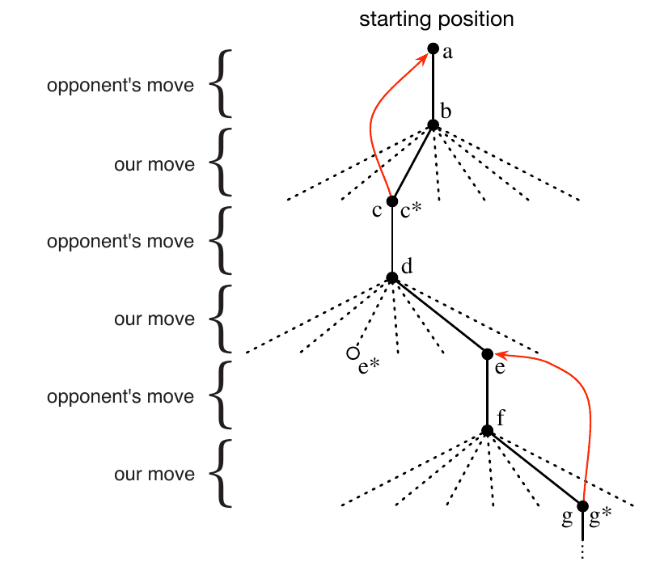

# 強化學習介紹

## 簡介

<mark style="color:blue;">當我們思考學習的本質時，我們可能首先想到的是通過與環境的互動來學習</mark>。<mark style="color:blue;">從互動中學習是幾乎所有學習和智慧理論的基礎思想</mark>。

我們用動力系統理論的思想來正式確定強化學習的問題，<mark style="color:red;">具體來說，就是對不完全已知的馬可夫決策過程(MDP)的最佳控制</mark>。基本的想法是簡單地捕捉一個學習代理所面臨的實際問題的最重要方面，隨著時間的推移與環境互動以實現目標。<mark style="color:blue;">一個學習型代理必須能夠在某種程度上感知其環境的狀態，並且必須能夠採取影響狀態的行動。代理人還必須有一個或多個與環境狀態有關的目標</mark>。MDP旨在包括這三個方面：<mark style="color:red;">**感覺、行動和目標**</mark>，以其最簡單的形式，而不使其中任何一個瑣碎化。任何適合解決此類問題的方法，我們都認為是一種強化學習方法。

### 與監督式學習(supervised learning)的區別

<mark style="color:blue;">監督學習是指從一個有知識的外部監督者提供的有標簽的例子的訓練集中學</mark>習。每個例子都是對一種情況的描述，以及系統對這種情況應該採取的正確行動的說明--標簽，這通常是為了確定該情況所屬的類別。

這種學習的目的是讓系統推斷或概括其反應，以便在訓練集中不存在的情況下正確行事。這是一種重要的學習方式，但僅憑這一點還不足以從互動中學習。在互動問題中，要獲得既正確又能代表代理人必須採取行動的所有情況的期望行為的例子往往是不實際的。在未知的領域--人們期望學習是最有益的--<mark style="color:red;">代理人必須能夠從它自己的經驗中學習</mark>。

### 與非監督式學習(unsupervised learning)的區別

強化學習也不同於無監督學習，後者通常是尋找隱藏在未標記資料集合中的結構。雖然人們可能會認為強化學習是一種無監督學習，因為它不依賴於正確行為的例子，<mark style="color:red;">但強化學習是試圖使獎勵訊號最大化，而不是試圖找到隱藏的結構</mark>。

### 探索和利用(exploration and exploitation)的平衡

強化學習中出現的一個挑戰，是探索和利用之間的權衡。<mark style="color:blue;">為了獲得大量的獎勵，強化學習代理必須傾向於它在過去嘗試過的行動，並且發現這些行動在產生獎勵方面是有效的。但為了發現這些行動，它必須嘗試以前沒有選擇過的行動</mark>。代理人必須利用它已經經歷過的東西來獲得獎勵，但它也必須探索，以便在未來做出更好的行動選擇。

無論是探索還是利用，都不能完全追求，否則就會失敗的任務。代理人必須嘗試各種行動，並逐步傾向於那些似乎是最好的行動。在一個隨機的任務中，每個行動都必須被多次嘗試，以獲得對其預期回報的可靠估計。數學家們對探索-開發困境進行了幾十年的深入研究，但仍未得到解決。平衡探索和利用的整個問題沒有出現在監督和無監督學習的正規型式中。

### 代理人(agent)

強化學習的另一個關鍵特徵是，<mark style="color:blue;">它明確考慮了目標導向的代理人與不確定環境互動的整個問題</mark>。這與許多考慮子問題而不解決它們如何融入大局的方法形成對比。例如，我們已經提到，許多機器學習研究關注的是監督學習，而沒有明確說明這種能力最終將如何發揮作用。其他研究人員開發了具有一般目標的規劃理論，但沒有考慮規劃在實時決策中的作用，也沒有考慮規劃所需的預測模型從何而來的問題。盡管這些方法產生了許多有用的結果，但它們對孤立的子問題的關注是一個重要的限制。

強化學習採取了相反的做法，從一個完整的、互動的、尋求目標的代理人開始。<mark style="color:blue;">所有的強化學習代理人都有明確的目標，可以感知其環境的各個方面，並可以選擇行動來影響其環境。此外，通常從一開始就假設代理人必須在它所面臨的環境有很大不確定性的情況下進行操作</mark>。

### 強化學習的應用

* 一個國際象棋高手如何走下一步。這種選擇既是通過規劃預測可能的回應和反饋，也是通過對特定位置和步驟的可取性的直接、直觀的判斷。
* 一個自適應控制器實時調整一個工廠的執行引數。該控制器在指定的邊際成本基礎上，最佳化產量/成本/質量的權衡，而不嚴格遵守工程師最初建議的設定點。
* 一隻小羚羊在出生幾分鐘後就掙扎著站起來。半小時後，它就 以每小時20英裡的速度奔跑。
* 掃地機器人決定它是應該進入一個新的房間尋找更多的垃圾來收集，還是開始嘗試找到回到電池充電站的路。它做出決定的依據是其電池當前的充電水平，以及它在過去能多快多容易地找到充電站。

這些例子的共同特點是非常基本的，以至於很容易被忽視。<mark style="color:red;">所有的例子都涉及到一個主動決策的代理人和它的環境之間的互動，在這種互動中，盡管環境不確定，但代理人仍試圖實現一個目標</mark>。

<mark style="color:red;">代理人的行動被允許影響環境的未來狀態（例如，下一個棋子的位置、煉油廠的儲油罐水平、機器人的下一個位置和其電池的未來充電水平），從而影響代理人在以後可利用的行動和機會</mark>。正確的選擇需要考慮到<mark style="color:blue;">行動的間接、延遲的後果</mark>，因此可能需要預知或計畫。同時，在所有這些例子中，行動的影響不能被完全預測；因此，代理人必須經常監測其環境並作出適當的反應。

<mark style="color:red;">所有這些例子涉及的目標都是明確的，即代理人可以根據它能直接感知的東西來判斷其目標的進展</mark>。棋手知道他是否贏了，煉油廠控制器知道正在生產多少石油，小羚羊知道它什麼時候跌倒，移動機器人知道它的電池什麼時候用完。

<mark style="color:red;">在所有這些例子中，代理人可以利用其經驗隨著時間的推移提高其效能</mark>。棋手完善了他用來評估位置的直覺，從而改善了他的棋藝；羚羊小腿提高了它的奔跑效率。

## 強化學習的重要元素

除了<mark style="color:red;">代理人(agent)</mark>和環境之外，我們可以確定強化學習系統的四個主要子元素：

* <mark style="color:red;">策略(policy)</mark>
* <mark style="color:red;">獎勵訊號(reward signal)</mark>
* <mark style="color:red;">價值函式(value function)</mark>
* <mark style="color:red;">環境模型(model of environment)(非必要)</mark>

<mark style="color:red;">策略定義了代理人在特定時間的行為方式</mark>。粗略地說，策略是一種從環境的感知狀態到處於這些狀態時要採取的行動的對映。它對應於心理學中所謂的一組刺激-反應規則或關聯。在某些情況下，策略可能是一個簡單的函式或查詢表，而在其他情況下，它可能涉及廣泛的計算，如搜尋過程。策略是強化學習代理的核心，因為它本身就足以決定行為。一般來說，策略可能是隨機的，每個行動有不同的機率。

<mark style="color:red;">獎勵訊號定義了強化學習問題的目標</mark>。在每個時間步驟中，環境向強化學習代理傳送一個稱為獎勵的單一數字。代理人的唯一目標是使其在長期內收到的<mark style="color:blue;">總獎勵最大化</mark>。因此，獎勵訊號定義了什麼是代理的好事件和壞事件。在一個生物系統中，我們可以認為獎勵類似於快樂或痛苦的體驗。它們是代理人所面臨的問題的直接和決定性特徵。獎勵訊號是改變策略的主要依據；如果策略所選擇的行動之後的獎勵很低，那麼就可以改變策略，在未來那種情況下選擇其他行動。一般來說，獎勵訊號可能是環境狀態和改採取的行動的隨機函式。

<mark style="color:red;">獎賞訊號表明什麼是眼前的好事(短期)，而價值函式則規定什麼是長期的好事</mark>。粗略地說，一個狀態的價值是一個代理人從該狀態開始，在未來可以期望積累的獎勵總量。獎勵決定了環境狀態的直接的、內在的可取性，而價值則表明了在考慮到可能會出現的狀態和這些狀態中可獲得的獎勵後，狀態的長期可取性。例如，一個狀態可能總是產生低的即時獎勵，但仍然有高的價值，因為它經常被其他產生高獎勵的狀態所跟隨。或者相反的情況也可能是真的。

獎勵在某種意義上是主要的，而作為對獎勵的預測，價值是次要的。沒有獎賞就沒有價值，而估計價值的唯一目的是為了獲得更多的獎賞。然而，<mark style="color:red;">在做決定和評估決定時，我們最關心的還是價值</mark>。行動選擇是基於價值判斷而做出的。<mark style="color:red;">我們尋求能夠帶來最高價值狀態的行動，而不是最高的回報，因為這些行動從長遠來看能夠為我們獲得最大的回報</mark>。

不幸的是，<mark style="color:blue;">確定價值比確定獎勵要難得多。獎勵基本上是由環境直接給予的，但價值必須從代理人在其整個生命週期中的觀察序列中進行估計和重新估計</mark>。事實上，我們所考慮的幾乎所有強化學習演算法的最重要組成部分是一種有效估計數值的方法。價值估計的核心作用可以說是過去六十年來人們在強化學習方面學到的最重要的東西。

一些強化學習系統的最後一個要素是一個環境模型。這是一種模仿環境行為的東西，或者更廣泛地說，它允許對環境的行為方式進行推斷。例如，給定一個狀態和行動，模型可以預測結果的下一個狀態和下一個獎勵。模型被用於規劃，我們指的是在實際經歷之前通過考慮未來可能的情況來決定行動方案的任何方式。<mark style="color:blue;">解決使用模型和規劃的強化學習問題的方法被稱為基於模型的方法，與之相對的是更簡單的無模型方法，後者是明確的試錯學習者，被視為幾乎與規劃相反</mark>。現代強化學習跨越了從低層次的試錯學習到高層次的慎重規劃的范圍。

### 限制與範圍

強化學習在很大程度上依賴於<mark style="color:red;">狀態(state，描述一個物理系統在某一時刻全部資訊的集合)</mark>的概念，它是策略和價值函式的輸入，同時也是模型的輸入和輸出。<mark style="color:red;">非正式地講，我們可以把狀態看作是一個訊號，它向代理人傳達了某一特定時間的 "環境如何 "的感覺</mark>。然而，更廣泛地說，把狀態看作是代理人可以得到的關於其環境的任何資訊。實際上，我們假設狀態訊號是由一些預處理系統產生的，這些預處理系統在名義上是代理人環境的一部分。

我們不涉及構建、改變或學習狀態訊號的問題。採取這種方法並不是因為我們認為狀態表示是不重要的，而是為了充分關注決策問題。換句話說，我們<mark style="color:blue;">關注的不是設計狀態訊號，而是決定根據現有的任何狀態訊號採取何種行動</mark>。

我們在本書中考慮的大多數強化學習方法都是圍繞著<mark style="color:red;">估計價值函式(value function)</mark>而展開的，但嚴格來說，解決強化學習問題並不需要這樣做。例如，遺傳演算法、遺傳程式設計、模擬退火和其他最佳化方法等解決方法從不估計價值函式。<mark style="color:blue;">這些方法應用多個靜態策略，每個策略都在很長一段時間內與環境的單獨例項相互作用。獲得最多獎勵的策略，以及它們的隨機變化，被帶到下一代政策中，這個過程不斷重復</mark>。我們稱這些為進化方法，因為它們的操作類似於生物進化產生具有熟練行為的生物體的方式，即使它們在各自的生命中沒有學習。如果策略的空間足夠小，或者可以結構化，以便好的策略是常見的或容易找到的，或者如果有大量的時間可用於搜尋，那麼進化方法可以是有效的。

此外，進化方法在學習代理不能感知其環境的完整狀態的問題上也有優勢。我們的重點是強化學習方法，這些方法在與環境互動的同時進行學習，而進化方法不這樣做。在許多情況下，能夠利用個體行為互動的細節的方法比進化方法要有效得多。進化方法忽略了強化學習問題的許多有用的結構：他們沒有利用他們正在尋找的策略是一個從狀態到行動的函式這一事實；他們沒有注意到個體在其生命週期中經過哪些狀態，或者它選擇哪些行動。在某些情況下，這種資訊可能會產生誤導（例如，當狀態被誤解時），但更多的時候，它應該能使搜尋更有效率。雖然進化和學習有許多共同的特點，並且自然地一起工作，但我們認為進化方法本身並不特別適合強化學習問題。

## 範例：井字游戲

考慮一下我們熟悉的兒童游戲井字游戲。兩個玩家輪流在一個三乘三的棋盤上玩。一個人玩X，另一個人玩O，直到有一個人在水平、垂直或對角線上連放三個標記即贏得比賽。如果棋盤填滿了，雙方都沒有連續得到三個標記，那麼游戲就是平局。因為一個熟練的棋手可以做到永遠不輸，讓我們假設我們是在和一個不完美的棋手對弈，他的下法有時是不正確的，而讓我們贏。

事實上，就目前而言，讓我們認為平局和輸棋對我們同樣不利。我們如何構建一個能夠發現對手棋局中的不完美之處，並學會將其獲勝的機會最大化的棋手？雖然這是一個簡單的問題，但它不能輕易地通過經典技術得到滿意的解決。

* 例如，賽局理論中的經典 "最小化 "解決方案在這裡是不正確的，因為它假定了對手的一種特定的游戲方式。例如，一個最小化的玩家永遠不會達到一個可能會輸的游戲狀態，即使事實上它總是因為對手的不正確游戲而從該狀態中獲勝。
* 順序決策問題的經典最佳化方法，如動態規劃，可以計算出任何對手的最優解，但需要輸入該對手的完整規格，包括對手在每個棋盤狀態下的每一步棋的機率。

讓我們假設這個問題沒有先驗的資訊，因為絕大多數的實際問題都沒有這種資訊。另一方面，這種資訊可以從經驗中估計出來，在這種情況下，可以通過與對手下許多棋來估計。<mark style="color:blue;">在這個問題上，我們能做的最好的事情就是首先學習一個對手的行為模型，達到一定的置信度，然後應用動態規劃來計算一個給定的近似對手模型的最優解</mark>。這與我們研究的一些強化學習方法沒有什麼區別。

應用於這個問題的進化方法將直接在可能的策略空間中搜尋一個具有高機率贏得對手的政策。在這裡，策略是一個規則，它告訴棋手在游戲的每一種狀態下應該走什麼棋。對於所考慮的每一個策略，通過與對手進行一些游戲，可以獲得對其獲勝機率的估計。然後，這一評估將指導下一步考慮哪種或哪幾種策略。一個典型的進化方法將在策略空間中爬坡，連續生成和評估策略，試圖獲得增量改進。

下面是如何用價值函式的方法來處理井字游戲問題的。首先，我們將建立一個數字表，每個游戲的可能狀態都有一個表。每個數字都是對我們在該狀態下獲勝機率的最新估計。我們將這一估計值視為該狀態的價值，而整個表格就是所學的價值函式。

假設我們總是玩X，那麼對於所有連續有三個X的狀態，獲勝的機率是1，因為我們已經贏了。同樣地，對於所有連續有三個Os的狀態，或者被填滿的狀態，正確的機率是0，因為我們不能贏得遊戲。我們將所有其他狀態的初始值設為0.5，代表我們有50%的獲勝機會的猜測。然後我們與對手進行多次遊戲。為了選擇我們的棋步，我們檢查我們每一步可能的棋步所產生的狀態（棋盤上的每個空白處都有一個），並在表中查詢它們的當前值。大多數時候，我們都是貪婪地下棋，選擇有最大價值的狀態的棋步，也就是說，具有最高的估計獲勝機率。然而，偶爾我們也會從其他棋子中隨機選擇。這些被稱為探索性的行動，因為它們使我們體驗到我們可能永遠不會看到的狀態。

當我們在游戲時，我們會改變我們在游戲中發現自己所處的狀態的值。我們試圖使它們對獲勝的機率有更準確的估計。為了做到這一點，我們在每次貪婪行動後將狀態的值 "回升 "到行動前的狀態，如下圖中的紅色箭頭所示。更確切地說，早期狀態的當前值被更新為更接近後期狀態的值。

令$$S_t$$, $$S_{t+1}$$為貪婪行動前、後的狀態，則$$S_t$$​的價值函數更新如下：

* $$V(S_t) \leftrightarrow V(S_t) + \alpha [V(S_{t+1})- V(S_t)]$$
* $$\alpha$$為步長(step size)參數。
* 此為時序差分學習(temporal-difference learning)方法

此方法在這個任務上表現得相當好。例如，如果步長參數隨著時間的推移而適當減少，那麼對於任何固定的對手，這個方法都會收斂到我們的棋手在每個狀態下的真實獲勝機率。此外，隨後採取的棋步（除了探索性棋步）實際上是對這個（不完美）對手的最佳棋步。換句話說，該方法收斂到了與該對手對弈的最優策略上。如果步長參數沒有隨著時間的推移一直減少到零，那麼這個棋手在面對慢慢改變其下棋方式的對手時也會下得很好。

這個例子說明了進化方法和學習價值函數的方法之間的區別。為了評估一個策略，進化方法將策略固定下來，與對手進行許多游戲，或使用對手的模型模擬許多游戲。勝利的頻率給出了對使用該政策獲勝的機率的無偏估計，並可用於指導下一次策略選擇。

但是，每一個策略的改變都是在很多場比賽之後才進行的，<mark style="color:blue;">而且只使用每場比賽的最終結果：比賽期間發生的事情被忽略了</mark>。例如，如果棋手贏了，那麼它在游戲中的所有行為都會被計入，而不考慮具體的棋步可能對贏棋有多大影響。甚至對從未發生過的動作也給予獎勵。與此相反，<mark style="color:red;">價值函數方法允許對個別狀態進行評估</mark>。

最後，進化方法和價值函數方法都在搜尋策略空間，但學習價值函數需要利用游戲過程中的可用資訊。這個簡單的例子說明了強化學習方法的一些關鍵特徵。

* 首先，強調的是在與環境互動時的學習，在這種情況下是與對手棋手互動。
* 其次，有一個明確的目標，<mark style="color:red;">考慮到一個人的選擇所帶來的延遲影響，正確的行為需要規劃或預見</mark>。例如，簡單的強化學習棋手會學會為目光短淺的對手設置多步陷阱。強化學習解決方案的一個顯著特點是，它可以在不使用對手模型和不對未來狀態和行動的可能序列進行明確搜尋的情況下實現計劃和展望的效果。

雖然井字游戲是一種雙人遊戲，<mark style="color:red;">但強化學習也適用於沒有外部對手的情況，即 "與自然的游戲 "的情況</mark>。強化學習也不侷限於行為被分解成不同的情節的問題，就像井字游戲一樣，只有在每個情節結束時才有獎勵。當行為無限期地持續下去，並且在任何時候都能得到不同程度的獎勵時，它也同樣適用。強化學習也適用於連續時間問題，盡管理論變得更加復雜，我們在這個介紹性章節中省略了它。

在這個井字游戲的例子中，學習開始時除了游戲規則外沒有任何先驗知識，但強化學習決不意味著對學習和智力的諱莫如深。相反，<mark style="color:red;">先驗資訊可以通過各種方式納入強化學習，這對高效學習至關重要</mark>。

在井字游戲的例子中，我們也可以獲得真實的狀態，而當部分狀態被隱藏時，或者當不同的狀態在學習者看來是相同時，強化學習也可以被應用。最後，井字棋手能夠預見未來，知道它的每一個可能的動作會產生什麼狀態。要做到這一點，它必須有一個游戲模型，使它能夠預見環境將如何對它可能永遠不會採取的行動作出反應。許多問題都是這樣的，但在其他問題中，甚至缺乏一個關於行動影響的短期模型。<mark style="color:blue;">強化學習可以適用於這兩種情況。不需要模型，但如果有模型或能學到模型，就可以很容易地使用</mark>。

另一方面，<mark style="color:red;">有一些強化學習方法根本不需要任何種類的環境模型。無模型的系統甚至不能考慮它們的環境將如何對一個單一的行動做出反應而變化</mark>。在這個意義上，井字棋手對其對手是無模型的：它沒有任何形式的對手模型。由於模型必須相當精確才有用，<mark style="color:blue;">當解決問題的真正瓶頸是難以構建足夠精確的環境模型時，無模型方法比更復雜的方法更有優勢</mark>。無模型方法也是基於模型的方法的重要構件。

## 小結

強化學習是一種理解目標導向的學習和決策並使之自動化的計算方法。<mark style="color:red;">它與其他計算方法的區別在於，</mark><mark style="color:red;">**它強調代理人從與環境的直接互動中學習，而不需要示範性的監督或環境的完整模型**</mark>。

強化學習是第一個認真解決從與環境的互動中學習以實現長期目標的計算問題的領域。<mark style="color:red;">強化學習使用馬可夫決策過程的正式框架，以</mark><mark style="color:red;">**狀態、行動和獎勵**</mark><mark style="color:red;">的方式定義學習代理人與環境之間的互動</mark>。這個框架旨在成為代表人工智慧問題基本特徵的一種簡單方式。這些特徵包括<mark style="color:blue;">因果關系，不確定性和非確定性</mark>，以及明確目標的存在。

<mark style="color:red;">價值(value)和價值函數</mark>的概念是我們在本書中所考慮的大多數強化學習方法的關鍵。我們的立場是，價值函數對於在策略空間中的有效搜尋非常重要。價值函數的使用將強化學習方法與進化方法區分開來，後者直接在策略空間中以整個策略的評估為指導進行搜尋。

## 強化學習的早期歷史

強化學習的早期歷史有兩條主線，既漫長又豐富，它們在現代強化學習中交織在一起之前是獨立追求的。一條主線是關於通過<mark style="color:red;">試驗和錯誤的學習</mark>，它起源於動物學習的心理學。這條主線貫穿了人工智慧領域的一些最早的工作，並導致了強化學習在20世紀80年代初的復興。

第二條主線是關於<mark style="color:red;">最優控制(optimal control)的問題及其使用價值函數和動態規劃的解決方案</mark>。在大多數情況下，這條主線並不涉及學習。這兩條主線大多是獨立的，但在某種程度上，圍繞著第三條不太明顯的主線，即關於時序差分的方法，如本章中的井字游戲的例子，變得相互關聯。所有這三條線索在20世紀80年代末匯聚在一起，形成了現代強化學習領域。

專注於試錯學習的主線是我們最熟悉的，也是我們在這段簡短歷史中最有發言權的。然而，在這之前，我們先簡要地討論一下最優控制。術語 "最優控制 "是在20世紀50年代末出現的，用來描述設計一個控制器來最小化或最大化一個動態系統在一段時間內的行為的問題。這種方法使用動態系統的狀態和價值函數或 "最優報酬函數(optimal return ufnction) "的概念來定義一個函數方程，現在通常稱為Bellman方程。通過求解這個方程來解決最優控制問題的一類方法被稱為動態規劃（Bellman, 1957a）。Bellman（1957b）還介紹了最優控制問題的離散隨機版本，即馬可夫決策過程（MDPs）。Ronald Howard（1960）設計了MDPs的策略迭代方法。所有這些都是現代強化學習的理論和演算法的基本要素。

<mark style="color:red;">動態規劃被廣泛認為是解決一般隨機最優控制問題的唯一可行的方法</mark>。<mark style="color:red;">它受到Bellman所說的 "維度詛咒(curse of dimensionality) "的影響，也就是說，它的計算要求隨著狀態變量數量的增加而呈指數級增長，但它仍然比任何其他一般方法更有效、更廣泛地適用。</mark>自20世紀50年代末以來，動態規劃得到了廣泛的發展，包括對部分可觀察的MDP的擴展（由Lovejoy, 1991調查），許多應用（由White, 1985, 1988, 1993調查），近似方法（由Rust, 1996調查），以及異步方法（Bertsekas, 1982, 1983）。許多優秀的動態規劃現代處理方法都可以得到（例如，Bertsekas，2005，2012；Puterman，1994；Ross，1983；和Whittle，1982，1983）。Bryson（1996）提供了一個權威的最優控制的歷史。

最佳控制和動態規劃與學習之間的聯系被緩慢地認識到。我們不能確定是什麼原因造成了這種分離，但其主要原因可能是相關學科之間的分離和它們不同的目標。還有一個原因可能是人們普遍認為動態規劃是一種主要依靠精確的系統模型和Bellman方程的分析解來進行的精細計算。<mark style="color:blue;">此外，最簡單的動態規劃是一種在時間上向後進行的計算，因此很難看到它如何參與到一個必須向前進行的學習過程中</mark>。一些最早的動態規劃工作，如Bellman和Dreyfus（1959）的工作，現在可能被歸類為遵循學習方法。Witten（1977）的工作（在下文中討論）當然也可以說是學習和動態規劃思想的結合。Werbos（1987年）明確主張動態規劃和學習方法的更大的相互關系，以及動態規劃與理解神經和認知機制的相關性。對我們來說，動態規劃方法與在線學習的完全結合直到1989年Chris Watkins的工作才發生，他用MDP形式主義對強化學習的處理已經被廣泛採用。此後，這些關系被許多研究者廣泛發展，特別是Dimitri Bertsekas和John Tsitsiklis（1996），他們創造了 "神經動態規劃 "這一術語來指代動態規劃和人工神經網絡的結合。目前使用的另一個術語是 "近似動態規劃"。這些不同的方法強調了該主題的不同方面，但它們都與強化學習一樣，對規避動態規劃的經典缺點感興趣。

<mark style="color:blue;">我們把強化學習方法定義為解決強化學習問題的任何有效方法，現在很明顯，這些問題與最優控制問題密切相關，特別是隨機最優控制問題，如那些被表述為MDP的問題</mark>。因此，我們必須把最優控制的解決方法，如動態規劃，也看作是強化學習方法。因為幾乎所有的傳統方法都需要對要控制的系統有完整的瞭解，所以說它們是強化學習的一部分感覺有點不自然。另一方面，許多動態規劃演算法是增量的和迭代的。像學習方法一樣，它們通過連續的逼近逐漸達到正確的答案。完全知識和不完全知識情況下的理論和解決方法是如此密切相關，以至於我們覺得必須把它們作為同一主題的一部分來考慮。

現在讓我們回到導致現代強化學習領域的另一條主要線索，即以試錯學習思想為中心的線索。我們在這裡只觸及主要的聯系點。根據美國心理學家R.S.Woodworth（1938）的說法，試錯學習的思想最早可以追溯到19世紀50年代Alexander Bain對 "摸索和實驗 "學習的討論，更明確的是英國倫理學家和心理學家Conway Lloyd Morgan在1894年用這個詞來描述他對動物行為的觀察。也許第一個簡明扼要地表達試錯學習作為一種學習原則的本質的是Edward Thorndike。

> 在對同一情況作出的幾種反應中，那些伴隨著或緊隨其後的動物滿意的反應，在其他條件不變的情況下，將與該情況有更牢固的聯系，因此，當它再次出現時，它們將更有可能再次出現；那些伴隨著或緊隨其後的動物不舒服的反應，在其他條件不變的情況下，它們與該情況的聯系將被削弱，因此，當它再次出現時，它們將更不可能出現。滿意或不舒服的程度越大，紐帶的加強或削弱就越大。(Thorndike, 1911, p. 244)

<mark style="color:red;">Thorndike把這稱為 "效果法則( law of effect)"，因為它描述了強化事件對選擇行動的傾向的影響</mark>。Thorndike後來對該定律進行了修改，以更好地解釋後來的動物學習數據（如獎勵和懲罰的影響之間的差異），該定律的各種形式在學習理論家中引起了相當大的爭議（例如，見Gallistel, 2005; Herrnstein, 1970; Kimble, 1961, 1967; Mazur, 1994）。盡管如此，效果法則在某種形式上被廣泛認為是許多行為的基本原則（例如，Hilgard和Bower, 1975；Dennett, 1978；Campbell, 1960；Cziko, 1995）。它是Clark Hull（1943年，1952年）的有影響力的學習理論和B. F. Skinner（1938年）有影響力的實驗方法的基礎。

在動物學習的背景下，<mark style="color:red;">"強化 "一詞是在Thorndike表達效果法則之後開始使用的</mark>，第一次出現在這個背景下（據我們所知）是在1927年Pavlov關於條件反射的專著的英譯本。<mark style="color:blue;">Pavlov把強化描述為由於動物接受刺激--強化物--與另一個刺激或反應有適當的時間關系而導致的行為模式的強化</mark>。一些心理學家把強化的概念擴展到包括行為的減弱和加強，並把強化物的概念擴展到可能包括刺激的省略或終止。要被認為是強化物，強化或削弱必須在強化物撤走後持續存在；僅僅吸引動物的注意力或激發其行為而不產生持久變化的刺激物將不被認為是強化物。

在計算機中實現試錯學習的想法出現在關於人工智慧可能性的最早的想法中。在1948年的一份報告中，Alan Turing描述了一個 "<mark style="color:blue;">快樂-痛苦系統</mark> "的設計，該系統按照效果法則運作。

> 當達到一個動作未定的配置時，對缺失的數據進行隨機選擇，並在描述中暫定適當的條目，並加以應用。當疼痛刺激發生時，所有暫定的條目都被取消，而當快樂刺激發生時，它們都被永久化。(Turing, 1948)

許多巧妙的電動機械被建造出來，展示了試錯學習。最早的可能是Thomas Ross製造的機器（1933年），它能夠在一個簡單的迷宮中找到自己的路，並通過開關的設置記住路徑。1951年，W.Grey Walter建造了一個版本的 "機械烏龜"（Walter, 1950），能夠進行簡單形式的學習。1952年，Claude Shannon展示了一隻名為Theseus的跑迷宮的老鼠，它利用試驗和錯誤來尋找通過迷宮的方法，迷宮本身通過其地板下的磁鐵和繼電器來記住成功的方向（另見Shannon，1951）。J. A. Deutsch (1954)根據他的行為理論（Deutsch, 1953）描述了一種解迷宮的機器，它與基於模型的強化學習有一些共同的屬性。Marvin Minsky在他的博士論文中討論了強化學習的計算模型，並描述了他建造的模擬機器，該機器由他稱為SNARC（隨機神經模擬強化計算器）的部件組成，旨在類似於大腦中可修改的突觸連接。cyberneticzoo.com網站上有大量關於這些和其他許多電子機械學習機的資訊。

建立機電式學習機讓位於對數字計算機的程式，以執行各種類型的學習，其中一些實現了試錯式學習。Farley和Clark（1954年）描述了一個通過試錯學習的神經網路學習機的數位模擬。但他們的興趣很快就從試錯學習轉移到了泛化和模式識別，即從強化學習到監督學習（Clark和Farley，1955）。這就開始了對這些學習類型之間關係的混亂模式。許多研究人員似乎認為他們在研究強化學習，而實際上他們是在研究監督學習。例如，人工神經網路的先驅，如Rosenblatt（1962）和Widrow和Ho（1960）顯然是受強化學習的激勵--他們使用了獎懲的語言，但他們研究的系統是適用於模式識別和感知學習的監督學習系統。即使在今天，一些研究人員和教科書也盡量減少或模糊了這些類型的學習之間的區別。例如，一些人工神經網路教科書用 "試錯 "一詞來描述從訓練樣本中學習的網絡。這是一個可以理解的混淆，因為這些網絡使用錯誤資訊來更新連接權重，但這忽略了試錯學習的基本特徵，即根據評價性反饋來選擇行動，而不依賴於對正確行動的瞭解。

部分由於這些混淆，在20世紀60年代和70年代，對真正的試錯學習的研究變得很少，盡管有一些明顯的例外。在20世紀60年代，"強化 "和 "強化學習 "這兩個詞第一次在工程文獻中被用來描述試錯學習的工程應用（例如，Waltz和Fu，1965；Mendel，1966；Fu，1970；Mendel和McClaren，1970）。特別有影響的是 Minsky的論文《邁向人工智慧》（Minsky, 1961），其中討論了與試錯學習相關的幾個問題，包括預測、期望和他所說的復雜強化學習系統的基本信用分配問題。你如何在許多可能參與產生成功的決定中分配成功的功勞？

在接下來的幾段中，我們將討論在20世紀60年代和70年代相對忽視對真正的試錯學習的計算和理論研究的其他一些例外和部分例外。一個例外是紐西蘭研究員John Andrea的工作，他開發了一個叫做STeLLA的系統，在與環境的互動中通過試錯學習。這個系統包括一個內部的世界模型，後來還包括一個 "內部獨白 "來處理隱藏狀態的問題（Andreae, 1963, 1969a, b）。Andreae後來的工作（1977年）更強調從教師那裡學習，但仍然包括通過試驗和錯誤學習，產生新的事件是該系統的目標之一。這項工作的一個特點是 "回漏過程"，在Andreae（1998）中得到了更充分的闡述，它實現了一種類似於我們所描述的備份更新操作的信用分配機制。不幸的是，他的開創性研究並不為人所知，也沒有對後來的強化學習研究產生很大影響。最近的總結可參考（Andreae，2017a，b）。

更有影響力的是Donald Michie的工作。在1961年和1963年，他描述了一個簡單的試錯學習系統，用於學習如何玩井字游戲（或九宮格游戲），稱為MENACE（火柴盒可教育九宮格引擎）。它由每個可能的游戲位置的火柴盒組成，每個火柴盒包含一些彩色的珠子，不同的顏色代表該位置的每個可能的動作。通過從對應於當前游戲位置的火柴盒中隨機抽出一顆珠子，就可以確定MENACE的行動。當游戲結束時，珠子被新增到游戲過程中使用的盒子中或從盒子中取出，以獎勵或懲罰MENACE的決定。Michie和Chambers(1968)描述了另一個叫GLEE(游戲學習期望值引擎)的井字形強化學習器和一個叫BOXES的強化學習控制器。他們將BOXES應用於學習如何平衡一根鉸接在可移動小車上的桿子的任務，其依據是只有在桿子倒下或小車到達軌道末端時才會出現失敗信號。這項任務改編自Widrow和Smith（1964）的早期工作，他們使用監督學習方法，假設教師已經能夠平衡桿子。Michie和Chambers的平衡桿版本是不完全知識條件下強化學習任務的早期最佳例子之一。它影響了後來的強化學習工作，首先是我們自己的一些研究（Barto, Sutton, and Anderson, 1983; Sutton, 1984）。Michie一直強調試錯和學習的作用是人工智慧的重要方面（Michie, 1974）。

Widrow、Gupta和Maitra（1973）修改了Widrow和Ho（1960）的最小均方（LMS）演算法，產生了一個強化學習規則，可以從成功和失敗信號中學習，而不是從訓練實例中學習。他們稱這種學習形式為 "選擇性引導適應"，並將其描述為 "與批評家(critic)一起學習 "而不是 "與老師一起學習"。他們分析了這個規則，並展示了它是如何學會玩21點的。這是Widrow對強化學習的一次孤立的嘗試，他對監督學習的貢獻要大得多。我們對 "批評家 "一詞的使用來自於Widrow, Gupta, and Maitra的論文。Buchanan、Mitchell、Smith和Johnson（1978年）在機器學習的背景下獨立使用了批判者這個術語（也見Dietterich和Buchanan，1984年），但對他們來說，批判者是一個能夠做得比評估效能更多的專家系統。

關於學習自動機的研究對導致現代強化學習研究的試錯線索有更直接的影響。這些方法用於解決一個非關聯性的、純粹的選擇學習問題，通過與老虎機或 "單臂老虎機 "的類比，被稱為k臂老虎機，但有k個槓桿。學習型自動機是簡單的、低記憶體的機器，用於提高這些問題中獎勵的機率。學習型自動機起源於俄羅斯數學家和物理學家M.L.Tsetlin及其同事在20世紀60年代的工作（在Tsetlin, 1973中追述），此後在工程中得到了廣泛的發展（見Narendra和Thathachar, 1974, 1989）。這些發展包括對隨機學習自動機的研究，它是在獎勵信號基礎上更新行動機率的方法。雖然不是在隨機學習自動機的傳統中發展起來的，但Harth和Tzanakou（1974）的Alopex演算法（模式提取演算法）是一種用於檢測行動和強化之間相關性的隨機方法，影響了我們早期的一些研究（Barto, Sutton, and Brouwer, 1981）。隨機學習自動機被心理學的早期工作所預示，從William Estes (1950)對學習的統計理論的嘗試開始，並由其他人進一步發展（例如，Bush和Mosteller, 1955；Sternberg, 1963）。

在心理學中發展起來的統計學習理論被經濟學研究者採用，導致該領域中出現了一條專門研究強化學習的線索。這項工作始於1973年，Bush和Mosteller的學習理論被應用於一系列經典的經濟模型（Cross，1973）。這項研究的一個目標是研究比傳統的理想化經濟代理更像真人的人工代理（Arthur，1991）。這種方法擴展到賽局理論背景下的強化學習研究。經濟學中的強化學習在很大程度上獨立於人工智慧中強化學習的早期工作，盡管賽局理論仍然是兩個領域都感興趣的話題（超出了本書的范圍）。Camerer（2011）討論了經濟學中的強化學習傳統，Nowé、Vrancx和De Hauwere（2012）從我們在本書中介紹的方法的多代理人擴展的角度對該主題進行了概述。賽局理論背景下的強化是一個與用於玩井字棋、跳棋和其他娛樂游戲的程式中的強化學習大不相同的課題。例如，見Szita（2012）對強化學習和游戲這方面的概述。

John Holland（1975）概述了一個基於選擇原則的適應性系統的一般理論。他的早期工作主要涉及非關聯形式的試錯，如進化方法和k臂老虎機。1976年和1986年，他更全面地介紹了分類器系統，真正的強化學習系統包括關聯和價值函數。Holland的分類器系統的一個關鍵組成部分是用於信用分配的 "桶隊演算法"，它與我們的井字游戲例子中使用的、在第六章中討論的時序差分演算法密切相關。另一個關鍵部分是遺傳演算法，這是一種進化方法，其作用是進化出有用的表徵。分類器系統已經被許多研究者廣泛開發，形成了強化學習研究的一個主要分支（Urbanowicz和Moore，2009年回顧），但是遺傳演算法--我們不認為它本身是強化學習系統--已經得到了更多的關注，就像其他進化計算方法一樣（例如Fogel, Owens and Walsh, 1966, and Koza, 1992）。

在人工智慧領域，對恢復強化學習的試錯線索負有最大責任的人是Harry Klopf（1972, 1975, 1982）。Klopf認識到，由於學習研究人員幾乎只關注有監督的學習，適應性行為的基本方面正在丟失。<mark style="color:red;">Klopf認為，所遺失的是行為的享樂方面，即從環境中獲得某種結果的驅動力，即控制環境朝向期望的目的並遠離不期望的目的。這就是試錯學習的基本思想</mark>。Klopf的思想對作者的影響特別大，因為我們對他們的評估（Barto and Sutton, 1981a）導致了我們對監督學習和強化學習之間的區別的欣賞，並導致我們最終對強化學習的關注。我們和同事們早期完成的大部分工作都是為了證明強化學習和監督學習確實是不同的（Barto, Sutton, and Brouwer, 1981; Barto and Sutton, 1981b; Barto and Anandan, 1985）。其他研究表明強化學習如何解決人工神經網絡學習中的重要問題，特別是如何產生多層網絡的學習演算法（Barto, Anderson, and Sutton, 1982; Barto and Anderson, 1985; Barto, 1985, 1986; Barto and Jordan, 1987; 見第15.10節）。

現在我們來看看強化學習歷史的第三條線索，即關於時序差分學習。<mark style="color:red;">時序差分學習方法的獨特之處在於，它是由對同一數量的時間性連續估計之間的差異所驅動的</mark>--例如，在井字棋的例子中，對獲勝機率的估計。這條主線比其他兩個主線要小，也不那麼明顯，但它在該領域發揮了特別重要的作用，部分原因是時序差分方法對強化學習來說似乎是新的和獨特的。

時序差分學習的起源部分來自於動物學習心理學，特別是次級強化物的概念。次要強化物是指與主要強化物（如食物或疼痛）配對的刺激物，因此，它具有類似的強化特性。Minsky（1954）可能是第一個意識到這個心理學原理對人工學習系統很重要的人。Arthur Samuel（1959年）是第一個提出並實施了包括時序差分學習方法的人，作為他著名的跳棋游戲程式的一部分（第16.2節）。

Samuel沒有提到Minsky的工作或與動物學習的可能聯系。他的靈感顯然來自於Claude Shannon（1950年）的建議，即計算機可以被編寫程式為使用一個評估函數來下棋，並且它可能能夠通過在線修改這個函數來改進它的游戲。(Shannon的這些想法有可能也影響了Bellman，但我們不知道這方面的證據)。Minsky（1961）在他的 "Steps "論文中廣泛地討論了Samuel的工作，提出了與自然和人工的二次強化理論的聯系。正如我們所討論的，在Minsky和Samuel的工作之後的十年裡，很少有關於試錯學習的計算工作，而且顯然也沒有關於時序差分學習的計算工作。1972年，Klopf將試錯學習與時序差分學習的一個重要組成部分結合起來。克洛普夫對能夠擴展到大型系統中的學習的原則很感興趣，因此對區域性強化的概念很感興趣，即整個學習系統的子部件可以相互強化。他提出了 "廣義強化 "的概念，即每個組件（名義上是每個神經元）都以強化的方式看待其所有輸入：興奮性輸入為獎勵，抑制性輸入為懲罰。這與我們現在所知道的時序差分不是同一個概念，而且回過頭來看，它比Samuel的工作更無關離。另一方面，Klopf將這一想法與試錯學習聯繫起來，並將其與動物學習心理學的大量經驗數據庫聯繫起來。

Sutton（1978a,b,c）進一步發展了Klopf的思想，特別是與動物學習理論的聯系，描述了由時間上連續的預測變化驅動的學習規則。他和Barto完善了這些觀點，並發展了一個基於時間連續學習的古典條件的心理學模型（Sutton and Barto, 1981a; Barto and Sutton, 1982）。隨後，還有其他幾個有影響力的基於時序差分方法的古典條件反射的心理學模型（例如，Klopf，1988；Moore等人，1986；Sutton和Barto，1987，1990）。此時開發的一些神經科學模型很好地解釋了時序差分學習（Hawkins和Kandel，1984；Byrne，Gingrich和Baxter，1990；Gelperin，Hopfield和Tank，1985；Tesauro，1986；Fristo等人，1994），盡管在大多數情況下沒有歷史聯系。我們早期關於時序差分學習的工作受到了動物學習理論和Klopf工作的強烈影響。與Minsky的 "Steps "論文和Samuel的跳棋選手的關系是後來才認識到的。然而，到了1981年，我們已經完全意識到上述所有先前的工作，作為時序差分關系和試錯線的一部分。在這個時候，我們開發了一種使用時序差分學習與試錯學習相結合的方法，稱為演員-批評(actor-critic)結構，並將這種方法應用於Michie和Chambers的平衡桿問題（Barto, Sutton, and Anderson, 1983）。這個方法在Sutton（1984）的博士論文中得到了廣泛的研究，並在Anderson（1986）的博士論文中擴展到使用反向傳播神經網絡。大約在這個時候，Holland（1986）以他的Bucket-brigade演算法的形式將時序差分時間-思想明確地納入他的分類器系統。Sutton（1988）邁出了關鍵的一步，他將時序差分學習從控制中分離出來，將其視為一種一般的預測方法。該論文還介紹了TD( $$\lambda$$)演算法並證明了它的一些收斂特性。

當我們在1981年完成我們的行為准則架構的工作時，我們發現了Ian Witten（1977, 1976a）的一篇論文，這似乎是最早發表的時序差分學習規則。他提出的方法，我們現在稱之為表格TD(0)，作為解決MDP的自適應控制器的一部分使用。這項工作在1974年首次提交給期刊發表，也出現在Witten 1976年的博士論文中。Witten的工作是Andreae對STeLLA和其他試錯學習系統的早期實驗的後裔。因此，Witten1977年的論文跨越了強化學習研究的兩條主線--試錯學習和最優控制--同時對時差學習做出了獨特的早期貢獻。

<mark style="color:blue;">1989年，隨著Chris Watkins對Q-learning的開發，時序差分和最優控制這兩條線被完全結合起來。這項工作擴展並整合了強化學習研究中所有三條主線的前期工作</mark>。Paul Werbos（1987年）通過論證1977年以來試錯學習和動態規劃的收斂性，為這種整合做出了貢獻。到沃特金斯工作的時候，強化學習研究已經有了巨大的發展，主要是在人工智慧的機器學習子領域，但也在人工神經網絡和更廣泛的人工智慧領域。1992年，Gerry Tesauro的雙陸棋游戲程式TD-Gammon的顯著成功給該領域帶來了更多關注。

## 表格法(tabular method)

強化學習演算法的所有核心思想的最簡單形式：<mark style="color:red;">即狀態和行動空間足夠小，近似的價值函數可以表示為表格</mark>。在這種情況下，這些方法通常可以找到精確的解決方案，也就是說，它們通常可以准確地找到最優價值函數和最優策略。這與<mark style="color:blue;">近似方法形成對比，後者只能找到近似解，但反過來可以有效地應用於更大的問題</mark>。

有限馬可夫決策問題的三類基本方法：<mark style="color:red;">動態規劃、蒙特卡洛方法和時序差分學習</mark>。每一類方法都有其優勢和劣勢。

* 動態規劃方法在數學上有很好的發展，但需要一個完整和准確的環境模型。
* 蒙特卡洛方法不需要模型，在概念上也很簡單，但不太適合分步遞增的計算。
* 最後，時序差分方法不需要模型，是完全增量的，但分析起來更復雜。

## 參考資料

* Richard Suttion and Andrew G. Barto, "Reinforcement Learning: An Introduction," 2nd, 2018, chapter 1.
