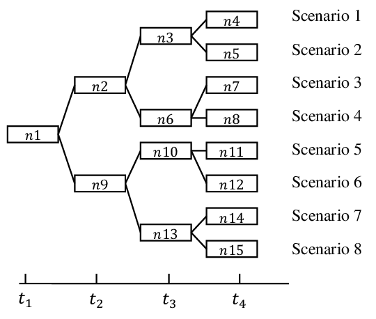

# 二元樹模型

## 股票價格動態

股票在時間$$t$$的價格為$$p_{s,t}$$為隨機變數，取值為正實數$$(0, \infty)$$，因此$$p_{s,t}$$為機率空間$$(\Omega, \Sigma, \mathrm{P})$$上的隨機變數(可測函數)。

價格集合$$\Omega$$中的元素稱為情境(wcenario) $$\omega \in \Omega$$。在時間$$t$$，若市場狀態為$$\omega$$，則用$$p_{s,t}(\omega)$$表示在時間$$t$$的價格。

$$t=0$$時股票價格$$p_{s,0}>0$$為已知的常數(隨機變數退化成只有一個實現值)，而$$t>0$$時，未來的價格$$p_{s,t}$$均為非常數隨機變數，即至少有兩個情境$$\omega_1, \omega_2 \in \Omega \ni p_{s,t}(\omega_1) \neq p_{s,t}(\omega_2)$$。

假設時間是依離散時段(discrete time step)推移，$$t=n\tau, ~ n \in \{0\} \cup \mathbb{N}$$，$$\tau$$為固定長度的時段，一般為天、周、月、季、半年或一年，通常取一年為單位即$$t=1$$為一年，天為$$\frac{1}{365}$$，周為$$\frac{1}{52}$$、月為$$\frac{1}{12}$$等。

為了簡化符號，常用$$p_{s,0}, p_{s,1}, p_{s,2}, \dots$$代替$$p_{s,0}, p_{s,\tau}, p_{s,2\tau}, \dots$$.。

<figure><figcaption>
4時段，8情境的情境樹
</figcaption></figure>

### 簡單報酬

* <mark style="color:red;">簡單\[單期]報酬</mark>：$$r_{s,t}^{(simple)}=\frac{p_{s,t}}{p_{s,{t-1}}}-1$$。
* <mark style="color:red;">簡單\[多期]報酬</mark>：$$r_{s, t_1:t_2}^{(simple)}=\frac{p_{s,t_2}}{p_{s, t_1}}-1$$。

注意簡單報酬不滿足加法性，即$$r_{s,t:t+2}^{(simple)}  \neq r_{s, t+1}^{(simple)}+r_{s,t+2}^{(simple)}$$，<mark style="color:red;">因此在計算平均報酬時，如果使用簡單報酬，在市場波動大時會高估平均報酬(可改用連續報酬)</mark>。

但是$$(1+r_{s,t:t+2}^{(simple)})= (1+ r_{s, t+1}^{(simple)}) \times (1+ r_{s,t+2}^{(simple)})$$

可得$$p_{s,t}=p_{s, t-1} (1+r_{s,t}^{(simple)})$$。

### 連續報酬

* 連續\[單期]報酬：$$r_{s,t}=\ln \frac{p_{s,t}}{p_{s,t-1}}$$。
* 連續\[多期]報酬 $$r_{s:t_1:t_2}=\ln \frac{p_{s, t_2}}{p_{s, t_1}}$$。

連續報酬滿足加法性，即$$r_{s,t:t+n}=r_{s,t+1}+\dots+r_{s,t+n}$$。

因為$$\displaystyle \begin{aligned}  r_s, t:t+n & =\ln \frac{p_{s,t+n}}{p_{s,t}} \\     & = \ln \left( \frac{p_{s,t+1}}{p_{s,t}} \times \frac{p_{s,t+2}}{p_{s,t+1}} \times \dots \times \frac{p_{s,t+n}}{p_{s,t+n-1}}  \right) \\     & = \ln  \frac{p_{s,t+1}}{p_{s,t}} + \ln \frac{p_{s,t+2}}{p_{s,t+1}} + \dots + \ln \frac{p_{s,t+n}}{p_{s,t+n-1}} \\     & = r_{s, t+1} + r_{s,t+2} + \dots + r_{s, t+n} \end{aligned}$$

可得$$p_{s,t}=p_{s,t-1}e^{r_{s,t}}$$。

### 期望報酬

如果簡單報酬率$$r^{(simple)}$$在某一時刻的分佈已知，則可計算期望報酬$$\mathrm{E}(r^{(simple)})$$。

如果$$\mathrm{E}(r_{t+1}^{(simple)}), \dots, \mathrm{E}(r_{t+n}^{(simple)})$$不相關，則$$(1+\mathrm{E}(r_{t:t+n}^{(simple)}))=(1+\mathrm{E}(r_{t+1}^{(simple)}))(1+\mathrm{E}(r_{t+2}^{(simple)}))\dots (1+\mathrm{E}(r_{t+n}^{(simple)}))$$

如果使用連續報酬率$$r$$時，在給定任意$$\mathrm{E}(r_{t+1}), \dots \mathrm{E}(r_{t+n})$$(可相關甚至相依)，可得$$\mathrm{E}(r_{t:t+n})=\mathrm{E}(r_{t+1}) + \mathrm{E}(r_{t+2}) + \dots + \mathrm{E}(r_{t+n})$$。

## 二元樹模型

由於以下討論均為股價的變動，因此省略變數下標的$$s$$。

令$$p_t$$為時間$$t$$的股價，假設時間$$t+1$$股價上漲至$$(1+u)p_t=h\cdot p_t$$的機率為$$p$$，且股價下跌至$$(1+u) p_t=l \cdot  p_t$$的機率為$$q=1-p$$，且$$-1<d<u$$或$$0 < l < h,~0< p < 1$$。

其中$$u, d$$為簡單報酬率$$r_t^{(simple)}$$的可能實現值，而$$h,l$$為相對價格(price relative)$$x_t$$的可能實現值，兩者關係為$$r_t^{(simple)}=\frac{p_t}{p_{t-1}}-1 = x_t -1$$。以下用簡單報酬率討論。

初始時，$$p_0$$為已知常數，在$$t=1$$時，股價可能為$$\displaystyle  \begin{cases} &\mathrm{P}(p_1 = (1+u) p_0) \equiv \mathrm{P}(p_1 = h \cdot p_0) = p \\ & \mathrm{P}(p_1 = (1+d) p_0) \equiv \mathrm{P}(p_1 =  l \cdot p_0)= q \end{cases}$$，可寫成：$$\displaystyle \mathrm{P}(p_1 = u^r d^{1-r}p_0)=p^rq^{1-r}, ~r \in \{0, 1\}$$

令隨機變數$$\displaystyle X_t =  \begin{cases}  \mathrm{P}(X_t =1+u ) = p \\  \mathrm{P}(X_t =1+d ) = q \\ \end{cases}$$，當$$X_t$$與$$p_t$$獨立時，可寫成$$p_{1}=p_0X_1$$。

時間2時，股價的可能性為：$$\displaystyle  \begin{cases} \mathrm{P}(p_2 = (1+u)p_1) = p \\  \mathrm{P}(p_2 = (1+d)p_1)= q \end{cases}$$， 擴展開得$$\displaystyle  \begin{cases} \mathrm{P}(p_2 = (1+u)^2 p_0) &= p^2 \\ \mathrm{P}(p_2 = (1+u)(1+d)p_0) &= 2pq \\  \mathrm{P}(p_2 = (1+d)^2p_0) &= q^2 \end{cases}$$，可寫成二項式分佈為：$$\displaystyle \mathrm{P}(S_2 = h^rl^{2-r}S_0)=\binom{2}{r}p^rq^{2-r}, ~r \in \{0, 1, 2\}$$

可寫成$$S_2=S_1X_2=S_0X_1X_2$$

時間$$t$$時，可寫成$$\displaystyle \mathrm{P}(S_t = h^rl^{t-r}S_0)=\binom{t}{r}p^rq^{t-r}, ~r \in \{0, 1, \dots, t\}$$

股價$$\displaystyle S_t = S_0 \prod_{i=1}^t X_i$$--(s1)

因為$$X_t$$的意義為相對價格，即$$X_t=\frac{S_{t}}{S_{t-1}}$$，因此取對數時為(連續)報酬，即$$\displaystyle r_t = \log X_t = \log S_{t}- \log S_{t-1} = \left\{ \begin{aligned} & \mathrm{P}(\log X_t =\log h ) = p \\ & \mathrm{P}(\log X_t =\log l ) = q \\ \end{aligned} \right.$$

因此$$\displaystyle \log S_{t} = \log S_{t-1} + r_t = \log S_0 + \sum_{i=1}^t r_i$$--(s2)

可得報酬的期望值與變異數如下：

* $$\mathrm{E}(r_t)=p \log h +q \log l = \mu$$ --(r1)
* $$\mathrm{Var}(r_t) = p (\log h)^2 + q (\log l)^2=\sigma^2$$ --(r2)

因為$$r_t$$為獨立隨機變數，因此

* $$\displaystyle \mathrm{E}(\sum_{i=1}^t r_i)=\mu t$$ --(r3)
* $$\displaystyle \mathrm{Var}(\sum_{i=1}^t r_i)=\sigma^2 t$$ --(r4)

將$$r_t$$正規化:

* 令$$\omega_t = \frac{r_t - \mu}{\sigma}$$-- (w1)
* 令$$W_t = W_{t-1} + \omega_t, ~W_0=0$$--(w2)

可得$$\mathrm{E}(\omega_t)=0$$且$$\mathrm{Var}(\omega_t)=1$$--(w3)

整理後可得$$\displaystyle \sum_{i=1}^t r_t = \sum_{i=1}^t (\mu + \sigma \omega_t)=\mu t + \sigma \sum_{i=1}^t \omega_i$$

由於$$\displaystyle \log S_{t} = \log S_{t-1} + r_t = \log S_0 + \sum_{i=1}^t r_i$$，代入後可得

$$\displaystyle \log S_{t} = \log S_0 + \mu t + \sigma W_t$$

可得 $$\log S_{t-1} = \log S_0 + \mu (t-1) + \sigma W_{t-1}$$

上兩式相減得 $$\Delta \log S_t = \mu + \sigma (\Delta W_t)$$--(1)

因為$$\displaystyle \Delta \log S_{t} = \log S_t - \log S_{t-1} = \log \frac{S_{t}}{S_{t-1}} = \log \frac{S_{t-1} + \Delta S_t }{S_{t-1}} = \log \left( 1 + \frac{\Delta S_t}{S_{t-1}} \right) \approx \frac{\Delta S_t}{S_{t-1}}$$--(2)

由(1,2)得$$\Delta S_t = \mu S_{t-1} + \sigma S_{t-1}\Delta W_t$$--(3)

(3)的連續型式為股價隨機微分方程式(SDE)：$$dS=\mu Sdt+\sigma SdW$$。

### 股價隨機微分方程為平賭過程

考慮(s2) $$\displaystyle \log S_{t} = \log S_{t-1} + r_t$$，在上述平賭過程推導中，假設$$r_t \sim WN(\mu, \sigma^2)$$為獨立同分佈(i.i.d)。

如果$$r_t=a r_{t-1} + e_t, ~ e_t \sim WN(0, \sigma_e^2)~|a|<1$$為AR(1)過程時，此時$$S$$不是隨機漫步，且非平賭過程.

## 資產以複利計算時為指數增長

若將取樣週期縮短，時間步長記為$$\Delta t$$，則報酬率均值與時間步長成比例。令瞬時報酬$$\mu$$為常數，則可得$$r = \mu \Delta t$$--(1)。

考慮日報酬，則可得$$\frac{S_{t+1}-S_t}{S_t} = \mu \Delta t$$，因此$$S_{t+1}=S_t(1+\mu \Delta t)$$。

相差2個時間步時長時可得$$S_{t+2}=S_t(1+\mu\Delta t)^2$$。

因此相差$$m$$個時間步長時可得$$S_{t+m}=S_t(1+ \mu \Delta t)^m$$。

當$$m \rightarrow \infty$$時，可得$$\displaystyle S_{t+m}=\lim_{m \rightarrow \infty} S_t(1+\mu \Delta t)^m \approx S_0e^{\mu m \Delta t}=S_te^{\mu T}$$，其中$$T$$為總時間長度，步數$$m=\frac{T}{\Delta t}$$，當步長$$\Delta t \rightarrow 0$$時，上式近似成立。也可用多期投資投資組合資產增長方式得到相同結論。

#### 多期投資組合資產增長

令$$\mathbf{b}_t \in \mathbb{R}_{+}^n, s.t. ~\mathbf{b}_t^{\top} \mathbf{1}=1~,t=1,2,\dots, T$$為第$$t$$期時，投資$$n$$筆資產的資金權重，每期資產權重總和均為1。

令$$\mathbf{x}_t=\frac{\mathbf{s}_t}{\mathbf{s}_{t-1}} \in \mathbb{R}_{+}^n$$為$$n$$筆資產的相對價格。

令期初的資產為$$S_0$$，則$$T$$期後，使用投資組合(權重序列)$$\mathbf{b}_1^T=\{\mathbf{b}_1, \mathbf{b}_2, \dots, \mathbf{b}_T\}$$的資產為$$\displaystyle S_T(\mathbf{b}_1^T)= S_0 \prod_{t=1}^T \mathbf{b}_t^{\top} \mathbf{x}_t = S_0 \prod_{t=1}^T \sum_{i=1}^n b_{t,i}x_{t,i}$$

令$$S_0=1$$，則兩側取對數再除以$$T$$可得到平均報酬率為$$\displaystyle \frac{1}{T}\log S_T(\mathbf{b}_1^T) = \frac{1}{T} \sum_{t=1}^T \log (\mathbf{b}_t^{\top} \mathbf{x}_t)$$

其中$$\displaystyle \log( \mathbf{b}_t^{\top} \mathbf{x}_t) \approx r_t^{(p)}$$為投資組合第$$t$$期的報酬率。

此結果可得以下重要結論：

1. <mark style="color:red;">**在沒有任何隨機性時，資產呈指數增長(連續複利)**</mark>。
2. <mark style="color:red;">**必須是使用**</mark>$$\Delta t$$<mark style="color:red;">**乘以瞬間報酬**</mark>$$\mu$$<mark style="color:red;">**才能得到此結論，使用其它方法無此結果**</mark>。

再來考慮瞬時標準差，當$$\Delta t \rightarrow 0$$，總共有$$m=\frac{T}{\Delta t} \rightarrow \infty$$筆資料，為了保證報酬標準差為有限值，其收斂速度應為$$O(\Delta \sqrt{t})$$才為有限值。

令瞬時標準差$$\sigma$$為常數，可得$$\hat{\sigma}=\sigma\sqrt{\Delta t}$$--(2)

由資產報酬公式$$\displaystyle r_t = \frac{s_{t+1} - S_t}{S_t}$$、(1,2)和報酬率為常態分佈的假設可得資產價格隨機變數如下：

$$\displaystyle r_t = \frac{S_{t+1} - S_t}{S_t}=\mu \Delta t + \sigma z \sqrt{\Delta t},~ z \sim N(0,1)$$

整理後可得：

$$\displaystyle S_{t+1} - S_t = \mu S_t \Delta t + \sigma S_t z \sqrt{\Delta t}$$。

* $$\mu$$為漂移率(drift rate)、預期報酬(expected return)或是資產的增長率(growth rate)。此值很難計算，因為與均值成比例的$$\Delta t$$通常很小，可以下式估算$$\mu = \frac{1}{M\Delta t}\sum_{t=1}^M R_t$$，時間單位為年計算，此以$$\mu$$以年化增長率表示。
* 在傳統選擇權定價理論，漂移率用處不大，所以不算出來也沒關係。

波動率

常用估計式為$$\displaystyle \sqrt{\frac{1}{(M-1)\Delta t} \sum_{t=1}^M (r_t - \overline{r})^2}$$，通常也用年化值表示。

對於很小的$$\Delta t$$，也可用估計式：$$\displaystyle \sqrt{\frac{1}{(M-1)\Delta t} \sum_{t=1}^M ( \log S_t - \log S_{t-1})^2}$$

<mark style="color:red;">波動率是衍生性商品中最重要(計算風險)也最難估計的量之一</mark>。

因為漂移率和波動率都和時間成比例，對資產價格路徑會產生不同的影響。若時間區間很短，漂移率作用不明顯，波動率會產生主導作用。

波動率通常不是常數，變化的經濟環境、季節性等因素經常會導致波動率隨時間變化，因此計算當日的波動率，必定會使用到歷史資料，因此會有偏差。
