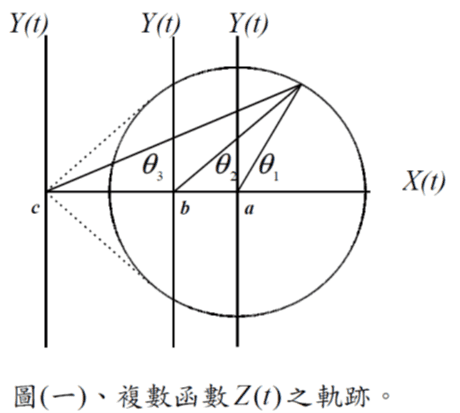
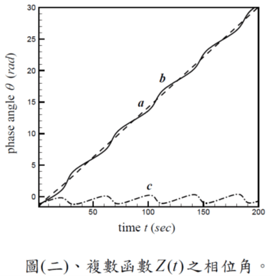

# Hilbert-Huang transform (HHT)

## 簡介

**一般自然和物理界中所觀察到的振盪訊號多半呈現出非穩態(non-stationary）及非線性（nonlinear）之特性**。傳統傅立葉（Fourier）分析法僅能求得整段訊號之平均振盪頻率；且傅立葉頻譜（Fourier spectrum）中之眾多諧和模態（harmonic modes） 乃是傅立葉解析(Fourier decomposition）過程中將訊號展開成固定頻率諧和函數(harmonic functions）組合之產物，其與訊號本身之振動型態並無直接對應之物理關聯。**對於振動頻率及振幅隨時都在改變之非穩態時間訊號而言，傅立葉頻譜無法提供訊號瞬時振動頻率變化及其相關訊息**。

瞬時頻率頻譜分析法（instantaneous frequency-time analysis）分析從自然界或生物體中所記錄的一些訊號。此法主要分成兩個步驟：

1. 首先將訊號分解成一系列非固定頻率之本質模態函數之組合（intrinsic mode functions, IMF）；
2. 接下來再將這些函數經希爾伯特（Hilbert）轉換以求得各個模態函數之瞬時頻率（instantaneous frequency）與振幅（amplitude）隨時間變化之關係。

**藉由此種方式所獲得之希爾伯特頻譜代表著原始訊號所含能量於頻域和時域上的分佈狀態。**&#x76F8;較於傅立葉頻譜僅能提供訊號平均能量之分佈，瞬時頻率頻譜更提供了訊號振盪頻率和能量隨時間變化之情形。**由於此法是根據訊號局部時間尺度來將原始訊號分解成各個不同的模態函數**，因此可用於分析處理非穩態之時間序列

### 傅立葉轉換的缺點

傅立葉頻譜分析是將數據資料經由傅立葉轉換展開成一序列固定頻率諧和函數（harmonic functions）的線性組合，各個不同頻率諧和函數的大小與頻率間之關係則可視為數據訊號所含能量分佈於各個不同頻率的情形。

**對於一個振盪訊號而言，傅立葉頻譜中出現峰值之處即代表原始訊號之主要（平均）振盪頻率。**&#x4E00;般而言，傅立葉頻譜分析法之主要缺失有下述兩方面：

1. 由於建構原始資料訊號的基本函數為固定頻率之諧和函數，**傅立葉頻譜僅適用於分析呈穩（定）態分佈之時間序列－亦即資料分佈的各個統計值（譬如數據平均值與自我關聯函數等）不隨時間變化的序列。**&#x5C0D;於一個非穩態形式的時間序列，傅立葉頻譜充其量僅提供了數據訊號於整段取樣時間內之平均振盪頻率和平均能量分佈，此平均資訊並未確切反應出訊號的特性。
2. 由於傅立葉轉換是將原始資料訊號展開成特定諧和函數的組合，**因此用之分析非線性系統中常見之非諧和振盪訊號時，傅立葉頻譜會出現許多額外的峰值於諧和頻率（harmonic frequencies）處，在線性波分析中稱之為波形的諧和扭曲（harmonic distortion）現象**。此額外的頻率與原訊號之間並無直接對應的物理意義，純粹只是因為傅立葉展開過程中需疊加許多高頻之諧和函數來模擬被扭曲之波形。

## 時間-頻率分析

根據上述的論點，以傅立葉頻譜分析非穩態或非線性系統所產生之數據易導致錯誤或無意義的解讀。於是，就有了所謂之時間－頻率分析法（time-frequency analysis）的發展；亦即將能量頻譜隨時間之變化也納入考量的一種分析法。

現行主要之時間－頻率分析法大致有三
種：

*   Spectrogram，又稱又稱為短時傅立葉分析（Short-Time Fourier

    Analysis ）或Windowed Fourier Analysis。
* 小波轉換（Wavelet Transform）：將訊號與（自訂）小波函數內積。
*   Wigner-Ville distribution：先
    定義訊號之時間－頻率自我相關函數

    (time-frequency autocorrelation function) ， 然
    後再將此函數作時間和頻率雙重之傅立葉轉
    換(2-D Fourier transform)。

上述三種方法有一共同缺點，亦即在頻
譜解析上皆是以固定頻率與振幅之函數作為
基本模態函數。例如Spectrogram 及Wigner-
Ville distribution 是以固定頻率與振幅之諧和
函數作傅立葉轉換。

小波轉換中一
系列代表不同尺度（頻率）的子波（wavelets）亦
是由預先選定的母函數來決定；因此，用之
於分析非線性時間序列上仍有著上述諧和扭曲之缺失。除此之外，上述三種方法皆無法明確定
義訊號之瞬時振盪頻率。

## 希爾伯特-黃轉換

> Huang, Norden E., et al. “The Empirical Mode Decomposition and the Hilbert Spectrum for Nonlinear and Non-Stationary Time Series Analysis.” Proceedings of The Royal Society A: Mathematical, Physical and Engineering Sciences, vol. 454, no. 1971, 1998, pp. 903–995.
>

Huang et al.將其所提出之經驗模態分
解法應用於一些特定的訊號例子上，結果驗
證了此方法確實較傳統的傅立葉及小波分
析法更具物理意義。

## 經驗模態分解法（empirical mode decomposition）

### 直接用希爾伯特轉換的問題

傳統上有許多定義訊號瞬時頻率
（instantaneous frequency） 的方法， 其中以
希爾伯特轉換最適用。

給定任一時間序列$$X_t$$，其希爾伯特轉換為$$Y_t = \int_{-\infty}^{\infty} \frac{X_{\tau}}{t - \tau} d \tau$$。

結合$$X_t$$與$$Y_t$$可定義複數時間序列 $$Z_t= X_t + i Y_t =a_t e^{i \theta_t}$$。

* $$a_t = (X_t^2+Y_t^2)^{\frac{1}{2}}$$為複數訊號的振幅。
* $$\theta_t = {\tan}^{-1} ( \frac{Y_t}{X_t})$$為訊號振蘯的相位。
* 兩者均為時間的函數。

由相位角$$\theta_t$$，可定義時間序列$$X_t$$的瞬時振盪頻率$$\omega_t = \frac{d\theta_t}{dt}$$。但此定義法有問題：

1.  在任一時刻僅
    定義了唯一的一個頻率值，此與一般複雜訊

    號是由多個不同振盪頻率所組成之概念不
    符。
2. 若將原始訊號$$X_t$$做直接希爾伯特轉換，所得到的瞬時頻率$$\omega_t$$在很多情況下不具物理意義。

例如有固定振盪頻率的時間函數$$X_t=\sin(t)$$，經希爾伯特轉換後得$$Y_t = -\cos(t)$$。兩者所組成的複數函數$$Z_t$$在複數平面上為一中心位於座標原點之圓形軌跡。而相位角$$\theta_t$$隨時間線性遞增。根據瞬時振盪頻率的定義可得 $$\omega_t$$為一定值。與原函式相同。

但是相同的函數加上一常數值，即$$Xt=\alpha + \sin(t)$$，即頻率不變，但振盪平均值不為0時，則得出的$$\omega_t$$不再是定值，甚至不具物理意義。

* 如$$0< \alpha < 1$$時，$$Z_t$$的軌跡為一偏心圓，相角$$\theta_t$$不再是一條直線，得到的瞬時頻率$$\omega_t$$也不是應有的定值。
* $$\alpha > 1$$時，瞬時頻率甚至成了負值。

### EMD

從上例中，Huang et. al.獲得一結論。一個具備符合瞬時頻率物理意義的
時間序列必須滿足兩個條件：

1. 此時間序列
   於任兩相鄰局部極值（local extremes）之間必須
   通過一零點(zero point)；
2. 此時間序列的局
   部平均值（local mean）必須為零。

原始的$$X_t$$通常不滿足上述兩條件，因此要先進行前處理如下：

1. 先將$$X_t$$的局部極大值、極小值以cubic spline法連成上、下二封包線（envelopes），再求取二封包線的平均曲線，稱為$$m_{11}$$。
2. 求出$$X_t$$與$$m_{11}$$的差值，稱為$$d_{11}$$。
3. 如果$$d_{11}$$大致滿足上述兩條件，則停止，否則重複第1、2步得$$m_{12}$$，再求出$$d_{11}$$與$$m_{12}$$的差值$$d_{12}$$。
4. 經$$k$$次後，得$$d_{1k} = d_{1, k-1} - m_{1k}$$。

如果$$d_{1k}$$已滿足上述兩條件，則將$$d_{1k}$$視為本質模態函數（intrinstic mode function, IMF），以符號$$M_1$$表示之。由分解過程可得知$$M_1$$代表訊號所含最小時間尺度（time scale），亦即最高頻率部份的訊息。

將$$M_1$$自$$X_t$$分離，得$$r_1 = X_t - M_1$$。

由於序列$$r_1$$仍含有許多中低頻之資訊待分解出，因此多次重複上述步驟之後，
可將代表訊號各個不同時間尺度訊息之模態
函數$$M_2$$、$$M_3$$.. 篩選出。$$r_1 - M_2 = r_2$$，$$r_2 - M_3 = r_3$$，…，$$r_{n-1} - M_n = r_n$$。

此篩選程序一直進行至最終之殘餘序列不
$$r_n$$再含任何振盪訊息為止，此殘餘序列即為
非穩態訊號之趨勢（trend）。

將所有本質
模態函數以及最後之趨勢迭加，則可得回原
訊號$$X_t = \sum_{i=1}^n M_i + r_n$$。

如同傅立葉分解，HHT將一訊號展
開成$$n$$個代表不同局部時間尺度訊息之經驗
模態函數的組合。

由於模態函數$$M_1, \ldots, M_n$$本上皆已滿
足定義瞬時頻率所需具備的二條件，因此經希爾伯特轉換可得各模態函數的瞬時振盪頻率$$\omega_{j, t}$$與振幅$$a_{j,t}$$。

而原始訊號可改寫為 $$X_t = \text{Re} \{ \sum_{j=1}^n a_{j,t} \exp (i \int \omega_{j,t}) \}$$。此式中，如果將$$a_j$$表為時間$$t$$和頻率$$\omega_j$$的函數，則可得到瞬時頻率頻譜或簡稱為希爾伯特頻譜$$H(\omega, t)$$，代表訊號$$X_t$$之能量在任一時刻$$t$$分佈於不同頻率上的情形。

